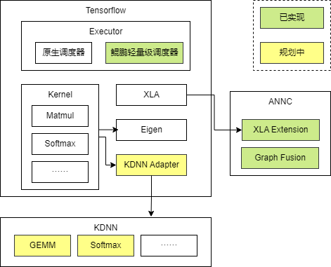

**鲲鹏Tensorflow扩展**
===============================

鲲鹏Tensorflow是基于开源Tensorflow的高性能推理加速扩展，聚焦于搜推广推理场景下的高效执行。通过在图优化、算子、Runtime等方面进行了深度的性能增强，显著提升了模型推理的吞吐量和时延表现，为AI应用提供基于鲲鹏CPU极致性能。

主要特性包括：
* 图优化：识别Embedding常见子图进行融合，减少图执行开销；
* 算子优化：针对核心算子提供鲲鹏亲和实现，结合鲲鹏硬件底层指令集提升计算效率；
* 运行时优化：引入轻量化调度器，提升并发执行效率。

## 架构

* Executor层：运行时优化。

* Kernel层：自定义算子，基于KDNN提供鲲鹏高性能DNN算子。

* XLA层：基于ANNC提供鲲鹏图编译器。

## 安装

### 硬件要求

鲲鹏Tensorflow扩展提供对鲲鹏CPU的支持。

### 软件依赖

鲲鹏AI编译器：ANNC。

### 安装方式:

#### 源码构建
1、拉取代码
~~~
git clone -b {tensorflow_tag} https://gitcode.com/boostkit/tensorflow.git
~~~
其中，tensorflow_tag需要替换为release版本的tag点。

2、环境准备

（1）硬件环境

鲲鹏920系列处理器

（2）操作系统

openEuler 22.03 LTS SP3，Kernel=5.10.0

（3）软件要求

GCC/G++：10.3.1

Bazel：6.5.0

Python 3.9

3、编译

（1）编译pip包

~~~
bazel build --config=opt //tensorflow/tools/pip_package:build_pip_package
~~~

（2）编译libtensorflow_cc.so

~~~
bazel build --config=opt //tensorflow/libtensorflow_cc.so
~~~

如果在编译过程中遇到任何问题，可参考以下文档：

[TensorFlow 移植指南](https://www.hikunpeng.com/document/detail/zh/SRA/ecosystemEnable/TensorFlow/kunpengtensorflow_02_0001.html)

[TensorFlow 安装](https://tensorflow.google.cn/install/source?hl=zh-cn)

### 支持的版本

| Kunpeng Tensorflow  | Stock TensorFlow |
| -------             | -----------      |
| v2.15.0             | 2.15             |

## 特性说明

### 线程调度优化特性

#### 简介

为提升TensorFlow Serving（以下简称TF Serving）推理性能，鲲鹏BoostKit提出了TensorFlow Serving线程调度优化方案。传统TensorFlow使用算子间的线程池并行计算不同的算子，虽可实现没有数据依赖的算子的并发执行，但在高并发场景下，多Session共享算子间线程池会导致任务抢占，严重降低整图计算效率。针对这一痛点，鲲鹏BoostKit改进了算子调度算法，并加入了其他线程管理优化，有效提升了高并发场景下的模型推理吞吐量。

#### 详细说明
参考：[TensorFlow Serving线程调度优化](https://www.hikunpeng.com/document/detail/zh/SRA/accelFeatures/TFTSO/kunpengsra_tfserving_20_0002.html)

### ANNC特性

#### 简介

鲲鹏BoostKit提出了Tensorflow Serving ANNC优化方案。ANNC是专注于加速神经网络计算的编译器，聚焦于通过计算图优化，高性能融合算子生成和对接技术，高效代码生成和优化能力，加速推荐的推理性能。ANNC作为基于开源OpenXLA的扩展加速套件，发布在openEuler组织的ANNC开源仓，具有鲲鹏亲和的优化特性，包括Tensorflow图融合、XLA图融合、算子优化能力。

#### 详细说明
参考：[Tensorflow Serving ANNC](待发布)

#### 版本兼容性
v2.15

## 支持
如果使用过程中有任何问题，或者需要反馈特性需求和bug报告，可以提交[isssues](https://gitcode.com/BoostKit/tensorflow/issues)联系我们。

## 许可协议
[Apache License 2.0](LICENSE)
通过下载并使用此源码及其附带的软件，您即同意遵守软件许可协议中的条款和条件。
