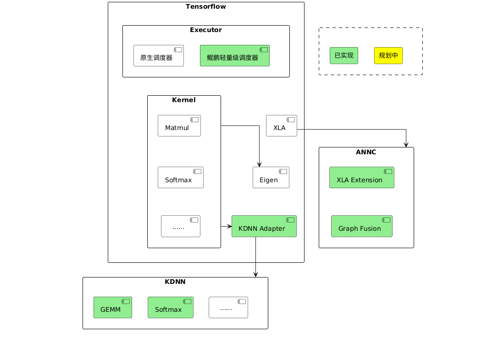

# 鲲鹏TensorFlow介绍

## 最新消息

- \[2026.09.30\]：新增kembedding自定义算子库，提供EmbeddingTableLookup算子；新增KDNN SparseMatmul多线程优化。
- \[2026.06.30\]：新增TensorFlow ANNC静态图融合特性, 适配鲲鹏950 7592C处理器，支持KPFusedGather、KPFusedSparseReshape等算子；TensorFlow ANNC图编译优化特性新增常量折叠优化，适配鲲鹏950 7592C处理器。
- \[2026.03.30\]：新增TensorFlow KDNN线程直通特性, 支持batchmatmul、concat、softmax等算子对接KDNN。
- \[2025.09.30\]：新增TensorFlow ANNC图编译优化特性，提供计算图优化，高性能融合算子生成与对接等优化技术。
- \[2025.06.30\]：TensorFlow Serving线程调度优化特性首次发布。

## 项目介绍

鲲鹏TensorFlow是基于开源TensorFlow的高性能推理加速扩展，聚焦于搜推广推理场景下的高效执行。通过在图优化、算子、Runtime等方面进行了深度的性能增强，显著提升了模型推理的吞吐量和时延表现，为AI应用提供基于鲲鹏CPU的极致性能。

- Executor层：运行时优化。
- Kernel层：自定义算子，基于KDNN提供鲲鹏高性能DNN算子。
- XLA层：基于ANNC提供鲲鹏图编译器。

项目架构如[**图 1**  项目架构](#项目架构)所示

**图 1**  项目架构<a name="fig1326111445508"></a><a id="项目架构"></a>



## 特性介绍

<table>
<thead align="left">
<tr id="row1291816372202">
<th class="cellrowborder" valign="top" width="9.780978097809781%" id="mcps1.1.4.1.1"><p id="p291823714205">特性名称</p></th>
<th class="cellrowborder" valign="top" width="72.57725772577258%" id="mcps1.1.4.1.3"><p id="p89181437152019">特性简介</p></th>
</tr>
</thead>
<tbody>
<tr id="row179181137112015">
<td class="cellrowborder" valign="top" width="9.780978097809781%" headers="mcps1.1.4.1.1"><p id="p1918123710208">线程调度优化</p></td>
<td class="cellrowborder" valign="top" width="72.57725772577258%" headers="mcps1.1.4.1.3"><p id="p491893752010">改进算子调度算法，并加入了其他线程管理优化，有效提升了高并发场景下的模型推理吞吐量。</p></td>
</tr>
<tr id="row179181137112015">
<td class="cellrowborder" valign="top" width="9.780978097809781%" headers="mcps1.1.4.1.1"><p id="p1918123710208">ANNC图编译优化</p></td>
<td class="cellrowborder" valign="top" width="72.57725772577258%" headers="mcps1.1.4.1.3"><p id="p491893752010">ANNC是专注于加速神经网络计算的编译器，聚焦于通过计算图优化，高性能融合算子生成和对接技术，高效代码生成和优化能力，加速推荐的推理性能。</p></td>
</tr>
<tr id="row179181137112015">
<td class="cellrowborder" valign="top" width="9.780978097809781%" headers="mcps1.1.4.1.1"><p id="p1918123710208">KDNN线程直通</p></td>
<td class="cellrowborder" valign="top" width="72.57725772577258%" headers="mcps1.1.4.1.3"><p id="p491893752010">KDNN线程直通支持将上层框架线程池透传到KDNN算子库，通过复用框架线程池优化KDNN算子的线程调度，最终达到了提升算子性能的目的。</p></td>
</tr>
<tr id="row179181137112015">
<td class="cellrowborder" valign="top" width="9.780978097809781%" headers="mcps1.1.4.1.1"><p id="p1918123710208">ANNC静态图融合</p></td>
<td class="cellrowborder" valign="top" width="72.57725772577258%" headers="mcps1.1.4.1.3"><p id="p491893752010">ANNC静态图融合是将多个Embedding算子融合为一个算子，通过remapper机制实现在图编译阶段将符合固定特征结构的子图替换为一个算子，从而提升模型推理的吞吐量。</p></td>
</tr>
<tr id="row179181137112015">
<td class="cellrowborder" valign="top" width="9.780978097809781%" headers="mcps1.1.4.1.1"><p id="p1918123710208">kembedding自定义算子</p></td>
<td class="cellrowborder" valign="top" width="72.57725772577258%" headers="mcps1.1.4.1.3"><p id="p491893752010">kembedding是面向推荐模型推理场景的自定义算子库，提供EmbeddingTableLookup算子，用于高效执行稀疏embedding查找操作，输出标准SparseTensor三元组，具有高性能和低延迟的特点。</p></td>
</tr>
<tr id="row179181137112015">
<td class="cellrowborder" valign="top" width="9.780978097809781%" headers="mcps1.1.4.1.1"><p id="p1918123710208">KDNN SparseMatmul多线程优化</p></td>
<td class="cellrowborder" valign="top" width="72.57725772577258%" headers="mcps1.1.4.1.3"><p id="p491893752010">针对KDNN SparseMatmul算子实现多线程并行优化，采用数据并行、无锁设计、负载均衡和内存优化等关键技术，充分利用多核CPU硬件资源，降低稀疏矩阵乘法计算耗时。</p></td>
</tr>
</tbody>
</table>

关于鲲鹏TensorFlow的特性详细介绍请参见《[特性介绍](./docs/zh/feature_introduction.md)》。

## 目录结构

```bash
tensorflow
├── 0001-tensorflow_2.15.0-optimize.patch               # TensorFlow补丁文件
├── 0002-tensorflow_2.15.0-annc-optimize.patch          # TensorFlow ANNC静态图融合补丁文件
├── 0003-tensorflow_2.15.0-kembedding.patch             # kembedding自定义算子补丁文件
├── 0004-tensorflow_2.15.0-sparse-matmul.patch          # KDNN SparseMatmul多线程优化补丁文件
├── LICENSE                                             # License文件
├── README.md                                           # 项目介绍文件
└── docs                                                # 文档
│   └── zh                                              # 中文文档目录
│       ├── figures                                     # 图片资源目录
│       ├── api_reference.md                            # API参考
│       ├── quick_start.md                              # 快速入门
│       ├── release_notes.md                            # 版本说明书
│       ├── installation_guide.md                       # 安装指导
│       ├── feature_introduction.md                     # 特性介绍
```

## 版本说明

关于鲲鹏TensorFlow的版本更新情况请参见《[版本说明书](./docs/zh/release_notes.md)》。

## 学习文档

<table>
<thead align="left">
<tr id="row1291816372202">
<th class="cellrowborder" valign="top" width="9.780978097809781%" id="mcps1.1.4.1.1"><p id="p291823714205">学习资源类别</p></th>
<th class="cellrowborder" valign="top" width="17.64176417641764%" id="mcps1.1.4.1.2"><p id="p13918183762016">学习资源名称</p></th>
<th class="cellrowborder" valign="top" width="72.57725772577258%" id="mcps1.1.4.1.3"><p id="p89181437152019">学习资源简介</p></th>
</tr>
</thead>
<tbody>
<tr id="row179181137112015">
<td class="cellrowborder" valign="top" width="9.780978097809781%" headers="mcps1.1.4.1.1"><p id="p1918123710208">文档</p></td>
<td class="cellrowborder" valign="top" width="17.64176417641764%" headers="mcps1.1.4.1.2"><p id="p2091893722011"><a href="./docs/zh/release_notes.md">版本说明书</a></p></td>
<td class="cellrowborder" valign="top" width="72.57725772577258%" headers="mcps1.1.4.1.3"><p id="p491893752010">提供鲲鹏TensorFlow每个发布版本的基础信息和特性更新信息。</p></td>
</tr>
<tr id="row179181137112015">
<td class="cellrowborder" valign="top" width="9.780978097809781%" headers="mcps1.1.4.1.1"><p id="p1918123710208">文档</p></td>
<td class="cellrowborder" valign="top" width="17.64176417641764%" headers="mcps1.1.4.1.2"><p id="p2091893722011"><a href="./docs/zh/feature_introduction.md">特性介绍</a></p></td>
<td class="cellrowborder" valign="top" width="72.57725772577258%" headers="mcps1.1.4.1.3"><p id="p491893752010">提供鲲鹏TensorFlow特性介绍。</p></td>
</tr>
<tr id="row939116371143">
<td class="cellrowborder" valign="top" width="9.780978097809781%" headers="mcps1.1.4.1.1"><p id="p1039163711413">文档</p></td>
<td class="cellrowborder" valign="top" width="17.64176417641764%" headers="mcps1.1.4.1.2"><p id="p03913372046"><a href="./docs/zh/quick_start.md">快速入门</a></p></td>
<td class="cellrowborder" valign="top" width="72.57725772577258%" headers="mcps1.1.4.1.3"><p id="p1139217371746">提供鲲鹏TensorFlow快速入门指导。</p></td>
</tr>
<tr id="row2918153732017">
<td class="cellrowborder" valign="top" width="9.780978097809781%" headers="mcps1.1.4.1.1"><p id="p598512211214">文档</p></td>
<td class="cellrowborder" valign="top" width="17.64176417641764%" headers="mcps1.1.4.1.2"><p id="p17918337172020"><a href="./docs/zh/installation_guide.md">安装指南</a></p></td>
<td class="cellrowborder" valign="top" width="72.57725772577258%" headers="mcps1.1.4.1.3"><p id="p15918183742018">提供鲲鹏TensorFlow编译安装方法指导。</p></td>
</tr>
<tr id="row2918153732017">
<td class="cellrowborder" valign="top" width="9.780978097809781%" headers="mcps1.1.4.1.1"><p id="p598512211214">文档</p></td>
<td class="cellrowborder" valign="top" width="17.64176417641764%" headers="mcps1.1.4.1.2"><p id="p17918337172020"><a href="./docs/zh/api_reference.md">API参考</a></p></td>
<td class="cellrowborder" valign="top" width="72.57725772577258%" headers="mcps1.1.4.1.3"><p id="p15918183742018">提供鲲鹏TensorFlow API使用参考。</p></td>
</tr>
</tbody>
</table>

## 免责声明

此代码仓计划参与TensorFlow社区开源，编码风格遵照原生开源软件，继承原生开源软件安全设计，不破坏原生开源软件设计及编码风格和方式，软件的任何漏洞与安全问题，均由相应的上游社区根据其漏洞和安全响应机制解决。请密切关注上游社区发布的通知和版本更新。鲲鹏计算社区对软件的漏洞及安全问题不承担任何责任。

## License

本项目采用Apache License 2.0许可证。详见<a href="./LICENSE">LICENSE</a>文件

本项目文档适用CC-BY 4.0许可证，具体请参见<a href="./docs/LICENSE">LICENSE</a>文件。

## 贡献声明

欢迎大家为社区做贡献，如果使用过程中有任何问题/建议，或者需要反馈特性需求和bug报告，可以提交[Issues](https://gitcode.com/boostkit/community/blob/master/docs/contributor/issue-submit.md)联系我们，具体贡献方法可参考[这里](https://gitcode.com/boostkit/community/blob/master/docs/contributor/contributing.md)。同时也欢迎大家在[讨论专区](https://gitcode.com/boostkit/community/discussions)展开讨论交流。感谢您的支持。

## 致谢

鲲鹏TensorFlow由华为公司的下列部门联合贡献：

- 鲲鹏计算Boostkit开发部

感谢来自社区的每一个PR，欢迎贡献鲲鹏TensorFlow！
