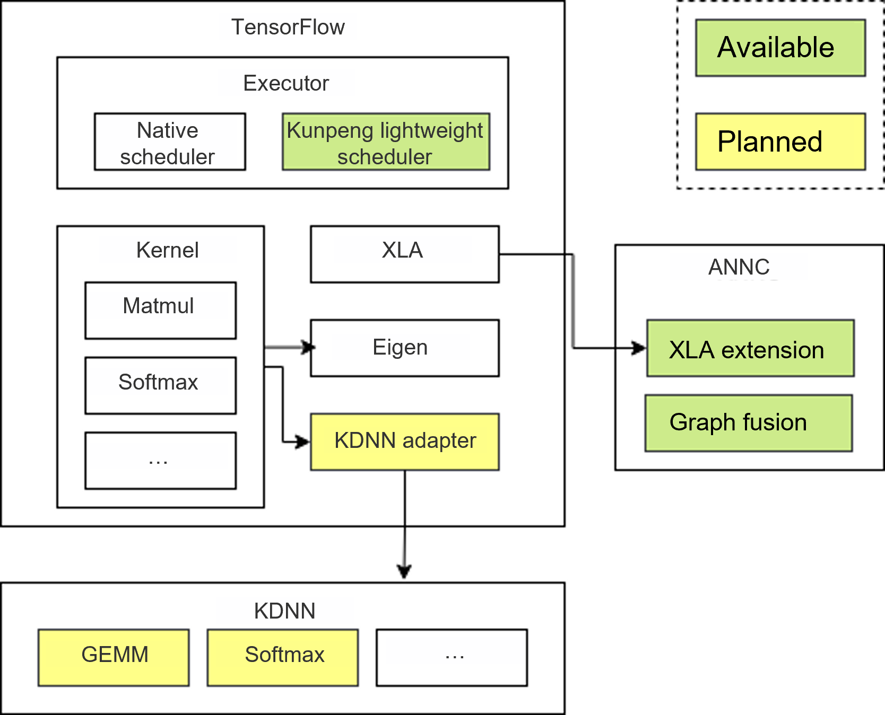

# Introduction to Kunpeng TensorFlow

## Latest Updates

- [2026-06-30]: Added the TensorFlow ANNC static graph fusion feature, adapted to Kunpeng 950 processor and supporting operators such as KPFusedGather and KPFusedSparseReshape. Added the constant folding optimization to TensorFlow ANNC for graph compilation, adapted to Kunpeng 950 processor.
- [2026-03-30]: Added the TensorFlow KDNN thread passthrough feature, supporting operators such as batchmatmul, concat, and softmax.
- [2025-09-30]: Added the TensorFlow ANNC for graph compilation optimization feature, providing optimizations including computational graph optimization, and generation and integration of high-performance fused operators.
- [2025-06-30]: Released the TensorFlow Serving thread scheduling optimization feature for the first time.

## Project Introduction

Kunpeng TensorFlow is a high-performance inference acceleration extension based on open-source TensorFlow. It focuses on efficient execution in search, recommendation, and advertising inference scenarios. It significantly improves throughput and cuts latency for model inference through in-depth enhancements in graph optimization, operators, and runtime, providing top performance for AI applications based on Kunpeng CPUs.

- Executor layer: runtime optimization
- Kernel layer: custom operators, which provide high-performance DNN operators based on KDNN.
- XLA layer: provides the Kunpeng graph compiler based on ANNC.

**Figure 1** Project architecture<a name="fig1326111445508"></a>



## Feature Description

<table>
<thead align="left">
<tr id="row1291816372202">
<th class="cellrowborder" valign="top" width="9.780978097809781%" id="mcps1.1.4.1.1"><p id="p291823714205">Feature</p></th>
<th class="cellrowborder" valign="top" width="72.57725772577258%" id="mcps1.1.4.1.3"><p id="p89181437152019">Description</p></th>
</tr>
</thead>
<tbody>
<tr id="row179181137112015">
<td class="cellrowborder" valign="top" width="9.780978097809781%" headers="mcps1.1.4.1.1"><p id="p1918123710208">Thread scheduling optimization</p></td>
<td class="cellrowborder" valign="top" width="72.57725772577258%" headers="mcps1.1.4.1.3"><p id="p491893752010">Refines operator scheduling algorithms and provides other thread management optimizations, delivering throughput improvements for concurrent model inference.</p></td>
</tr>
<tr id="row179181137112016">
<td class="cellrowborder" valign="top" width="9.780978097809781%" headers="mcps1.1.4.1.1"><p id="p1918123710209">ANNC for graph compilation optimization</p></td>
<td class="cellrowborder" valign="top" width="72.57725772577258%" headers="mcps1.1.4.1.3"><p id="p491893752011">ANNC is a compiler dedicated to accelerating neural network computing. It focuses on technologies including computational graph optimization, generation and integration of high-performance fused operators, and efficient code generation and optimization. These capabilities significantly improve inference performance in recommendation scenarios.</p></td>
</tr>
<tr id="row179181137112017">
<td class="cellrowborder" valign="top" width="9.780978097809781%" headers="mcps1.1.4.1.1"><p id="p1918123710210">KDNN thread passthrough</p></td>
<td class="cellrowborder" valign="top" width="72.57725772577258%" headers="mcps1.1.4.1.3"><p id="p491893752012">Transparently passes the upper-layer framework thread pool to the KDNN operator library. By reusing the framework thread pool, KDNN operator scheduling is optimized, improving operator performance.</p></td>
</tr>
<tr id="row179181137112018">
<td class="cellrowborder" valign="top" width="9.780978097809781%" headers="mcps1.1.4.1.1"><p id="p1918123710211">ANNC static graph fusion</p></td>
<td class="cellrowborder" valign="top" width="72.57725772577258%" headers="mcps1.1.4.1.3"><p id="p491893752013">Fuses multiple embedding operators into a single operator. Using the remapper mechanism, subgraphs with fixed structural patterns are replaced during graph compilation, improving inference throughput.</p></td>
</tr>
</tbody>
</table>

For details about Kunpeng TensorFlow features, see [Feature Introduction](./docs/en/feature_introduction.md).

## Directory Structure

```bash
tensorflow
├── 0001-tensorflow_2.15.0-optimize.patch               # TensorFlow patch file
├── 0002-tensorflow_2.15.0-annc-optimize.patch          # Patch file for TensorFlow ANNC static graph fusion
├── LICENSE                                             # License file
├── README_en.md                                        # Project introduction file
└── docs                                                # Documentation
│   └── en                                                # English document directory
│       ├── figures                                     # Figure resource directory
│       ├── api_reference.md                            # API Reference
│       ├── quick_start.md                              # Quick Start
│       ├── release_notes.md                            # Release Notes
│       ├── installation_guide.md                       # Installation guide
│       ├── feature_introduction.md                     # Feature introduction 
```

## Version Description

For details about the updates of the Kunpeng TensorFlow version, see [Release Notes](./docs/en/release_notes.md).

## Documents

<table>
<thead align="left">
<tr id="row1291816372202">
<th class="cellrowborder" valign="top" width="9.780978097809781%" id="mcps1.1.4.1.1"><p id="p291823714205">Resource Type</p></th>
<th class="cellrowborder" valign="top" width="17.64176417641764%" id="mcps1.1.4.1.2"><p id="p13918183762016">Resource Name</p></th>
<th class="cellrowborder" valign="top" width="72.57725772577258%" id="mcps1.1.4.1.3"><p id="p89181437152019">Resource Description</p></th>
</tr>
</thead>
<tbody>
<tr id="row179181137112015">
<td class="cellrowborder" valign="top" width="9.780978097809781%" headers="mcps1.1.4.1.1"><p id="p1918123710208">Document</p></td>
<td class="cellrowborder" valign="top" width="17.64176417641764%" headers="mcps1.1.4.1.2"><p id="p2091893722011"><a href="./docs/en/release_notes.md">Release Notes</a></p></td>
<td class="cellrowborder" valign="top" width="72.57725772577258%" headers="mcps1.1.4.1.3"><p id="p491893752010">Provides basic information and feature updates of each Kunpeng TensorFlow release.</p></td>
</tr>
<tr id="row179181137112015">
<td class="cellrowborder" valign="top" width="9.780978097809781%" headers="mcps1.1.4.1.1"><p id="p1918123710208">Document</p></td>
<td class="cellrowborder" valign="top" width="17.64176417641764%" headers="mcps1.1.4.1.2"><p id="p2091893722011"><a href="./docs/en/feature_introduction.md">Feature Introduction</a></p></td>
<td class="cellrowborder" valign="top" width="72.57725772577258%" headers="mcps1.1.4.1.3"><p id="p491893752010">Describes the Kunpeng TensorFlow features.</p></td>
</tr>
<tr id="row939116371143">
<td class="cellrowborder" valign="top" width="9.780978097809781%" headers="mcps1.1.4.1.1"><p id="p1039163711413">Document</p></td>
<td class="cellrowborder" valign="top" width="17.64176417641764%" headers="mcps1.1.4.1.2"><p id="p03913372046"><a href="./docs/en/quick_start.md">Quick Start</a></p></td>
<td class="cellrowborder" valign="top" width="72.57725772577258%" headers="mcps1.1.4.1.3"><p id="p1139217371746">Provides guidance for getting started with Kunpeng TensorFlow.</p></td>
</tr>
<tr id="row2918153732017">
<td class="cellrowborder" valign="top" width="9.780978097809781%" headers="mcps1.1.4.1.1"><p id="p598512211214">Document</p></td>
<td class="cellrowborder" valign="top" width="17.64176417641764%" headers="mcps1.1.4.1.2"><p id="p17918337172020"><a href="./docs/en/installation_guide.md">Installation Guide</a></p></td>
<td class="cellrowborder" valign="top" width="72.57725772577258%" headers="mcps1.1.4.1.3"><p id="p15918183742018">Describes how to compile and install Kunpeng TensorFlow.</p></td>
</tr>
<tr id="row2918153732017">
<td class="cellrowborder" valign="top" width="9.780978097809781%" headers="mcps1.1.4.1.1"><p id="p598512211214">Document</p></td>
<td class="cellrowborder" valign="top" width="17.64176417641764%" headers="mcps1.1.4.1.2"><p id="p17918337172020"><a href="./docs/en/api_reference.md">API Reference</a></p></td>
<td class="cellrowborder" valign="top" width="72.57725772577258%" headers="mcps1.1.4.1.3"><p id="p15918183742018">Describes how to use Kunpeng TensorFlow APIs.</p></td>
</tr>
</tbody>
</table>

## Disclaimer

This code repository contributes to the TensorFlow community. It strictly adheres to the coding style and methods, as well as security design of the native open-source software. Any vulnerability and security issues of the software shall be resolved by the corresponding upstream communities according to their response mechanisms. Please pay attention to the notifications and version updates released by the upstream communities. The Kunpeng computing community does not assume any responsibility for software vulnerabilities and security issues.

## License

This project is licensed under Apache License 2.0. For details, see the [LICENSE](./LICENSE).

The documentation of this project is released under the CC-BY 4.0 license. For details, see the [LICENSE](./docs/LICENSE).

## Contribution Statement

We welcome your contributions to the community. If you have any questions/suggestions or want to provide feedback on feature requirements and bug reports, you can submit [issues](https://gitcode.com/boostkit/community/blob/master/docs/contributor/issue-submit.md). For details, see [Contribution Guideline](https://gitcode.com/boostkit/community/blob/master/docs/contributor/contributing.md). You are also welcome to share insights in [Discussions](https://gitcode.com/boostkit/community/discussions). Thank you for your support.

## Acknowledgments

Kunpeng TensorFlow is jointly developed by the following Huawei department:

- Kunpeng Computing BoostKit Development Dept

Thank you for every PR from the community. We welcome your contributions to Kunpeng TensorFlow!
