# Feature Introduction

<!-- md-trans-meta sourceCommit=5c9162943c20095e6b484e3b477f280464376ee5 translatedAt=2026-08-04T03:20:03.526Z pushedAt=2026-08-05T07:33:43.163Z -->

## TensorFlow KDNN Thread Passthrough

### Overview

This section introduces the basic concepts and implementation principles of the TensorFlow KDNN thread passthrough optimization feature.

To improve TensorFlow inference performance, Kunpeng BoostKit proposes a TensorFlow KDNN thread passthrough optimization solution. KDNN provides high-performance implementations of core inference operators based on Kunpeng processor hardware. At the original Kernels implementation layer, a dispatch component distributes KDNN-supported operators to the KDNN backend. KDNN thread passthrough submits computational tasks to the framework thread pool for unified scheduling through KDNN, reusing the framework thread pool and reducing the time overhead of thread creation and destruction.

**KDNN thread passthrough**: When the KDNN optimization feature is enabled, if the operator input/output meets the constraints, the KDNN library is invoked; otherwise, the native TensorFlow interface is used. KDNN submits computational tasks to the framework thread pool for unified scheduling, reusing the framework thread pool. The KDNN optimization feature is integrated into TensorFlow through compilation options and code patches, with a KDNN feature switch added based on TensorFlow 2.15.

### Software Architecture

The software architecture of KDNN integrated with TensorFlow is shown in [Figure 1](#fig4919356464).

**Figure 1**  Software architecture of KDNN integrated with TensorFlow<a id="fig4919356464"></a>

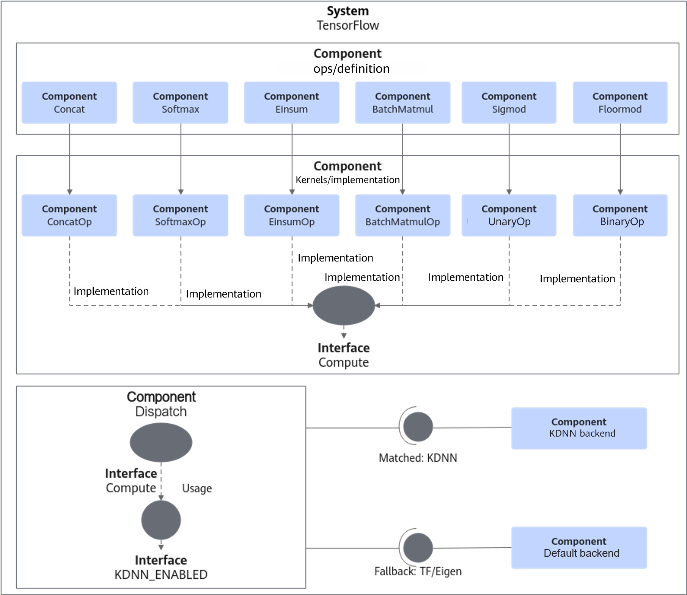

### Specifications

This section describes the operators that currently support the KDNN thread passthrough feature and their usage specifications.

The constraints of operators that support the KDNN thread passthrough feature are shown in [Table 1](#table8731173784819).

**Table 1** KDNN thread passthrough feature support scope<a id="table8731173784819"></a>

<table><thead align="left"><tr id="row573183720488"><th class="cellrowborder" colspan="2" valign="top" id="mcps1.2.9.1.1"><p id="p06021725181316"><a name="p06021725181316"></a><a name="p06021725181316"></a>Operator Name</p></th>
<th class="cellrowborder" colspan="4" valign="top" id="mcps1.2.9.1.2"><p id="p106022025191315"><a name="p106022025191315"></a><a name="p106022025191315"></a>Data Type Constraint</p></th>
<th class="cellrowborder" valign="top" id="mcps1.2.9.1.3"><p id="p16011255131"><a name="p16011255131"></a><a name="p16011255131"></a>Dimension Constraint</p></th>
<th class="cellrowborder" valign="top" id="mcps1.2.9.1.4"><p id="p55991325131312"><a name="p55991325131312"></a><a name="p55991325131312"></a>Other Constraints</p></th>
</tr>
</thead>
<tbody><tr id="row273812420184"><td class="cellrowborder" colspan="2" valign="top" headers="mcps1.2.9.1.1 "><p id="p1902143641316"><a name="p1902143641316"></a><a name="p1902143641316"></a>ConcatV2</p></td>
<td class="cellrowborder" colspan="4" valign="top" headers="mcps1.2.9.1.2 "><p id="p89021636161316"><a name="p89021636161316"></a><a name="p89021636161316"></a>fp32, fp16, bf16, int32, int8, or uint8</p></td>
<td class="cellrowborder" valign="top" headers="mcps1.2.9.1.3 "><p id="p109011236121313"><a name="p109011236121313"></a><a name="p109011236121313"></a>None</p></td>
<td class="cellrowborder" valign="top" headers="mcps1.2.9.1.4 "><p id="p76311158114918"><a name="p76311158114918"></a><a name="p76311158114918"></a>None</p></td>
</tr>
<tr id="row19133202192018"><td class="cellrowborder" colspan="2" valign="top" headers="mcps1.2.9.1.1 "><p id="p1033714554132"><a name="p1033714554132"></a><a name="p1033714554132"></a>BatchMatMul</p></td>
<td class="cellrowborder" colspan="4" valign="top" headers="mcps1.2.9.1.2 "><p id="p15337165511132"><a name="p15337165511132"></a><a name="p15337165511132"></a>fp32</p></td>
<td class="cellrowborder" valign="top" headers="mcps1.2.9.1.3 "><p id="p1833785511316"><a name="p1833785511316"></a><a name="p1833785511316"></a><span>2D-5D</span></p></td>
<td class="cellrowborder" valign="top" headers="mcps1.2.9.1.4 "><p id="p26461358164910"><a name="p26461358164910"></a><a name="p26461358164910"></a>None</p></td>
</tr>
<tr id="row1663113411277"><td class="cellrowborder" colspan="2" valign="top" headers="mcps1.2.9.1.1 "><p id="p1663113411277"><a name="p1663113411277"></a><a name="p1663113411277"></a>SparseMatmul</p></td>
<td class="cellrowborder" colspan="4" valign="top" headers="mcps1.2.9.1.2 "><p id="p563113411727"><a name="p563113411727"></a><a name="p563113411727"></a>fp32</p></td>
<td class="cellrowborder" valign="top" headers="mcps1.2.9.1.3 "><p id="p126311341327"><a name="p126311341327"></a><a name="p126311341327"></a>2D</p></td>
<td class="cellrowborder" valign="top" headers="mcps1.2.9.1.4 "><p id="p963193412714"><a name="p963193412714"></a><a name="p963193412714"></a>The number of columns in the output matrix is not less than 32.</p></td>
</tr>
<tr id="row171941117162015"><td class="cellrowborder" colspan="2" valign="top" headers="mcps1.2.9.1.1 "><p id="p5431181116145"><a name="p5431181116145"></a><a name="p5431181116145"></a>Einsum</p></td>
<td class="cellrowborder" colspan="4" valign="top" headers="mcps1.2.9.1.2 "><p id="p1943016119149"><a name="p1943016119149"></a><a name="p1943016119149"></a>fp32</p></td>
<td class="cellrowborder" valign="top" headers="mcps1.2.9.1.3 "><p id="p1043051115143"><a name="p1043051115143"></a><a name="p1043051115143"></a>None</p></td>
<td class="cellrowborder" valign="top" headers="mcps1.2.9.1.4 "><p id="p3659558154917"><a name="p3659558154917"></a><a name="p3659558154917"></a>None</p></td>
</tr>
<tr id="row4303415132016"><td class="cellrowborder" colspan="2" valign="top" headers="mcps1.2.9.1.1 "><p id="p5429101117142"><a name="p5429101117142"></a><a name="p5429101117142"></a>Sigmoid</p></td>
<td class="cellrowborder" colspan="4" valign="top" headers="mcps1.2.9.1.2 "><p id="p84291211151415"><a name="p84291211151415"></a><a name="p84291211151415"></a>fp32</p></td>
<td class="cellrowborder" valign="top" headers="mcps1.2.9.1.3 "><p id="p1342841171412"><a name="p1342841171412"></a><a name="p1342841171412"></a>Any non-empty dimension</p></td>
<td class="cellrowborder" valign="top" headers="mcps1.2.9.1.4 "><p id="p1260874031514"><a name="p1260874031514"></a><a name="p1260874031514"></a>None</p></td>
</tr>
<tr id="row1235520136201"><td class="cellrowborder" colspan="2" valign="top" headers="mcps1.2.9.1.1 "><p id="p4427171131419"><a name="p4427171131419"></a><a name="p4427171131419"></a>FloorMod</p></td>
<td class="cellrowborder" colspan="4" valign="top" headers="mcps1.2.9.1.2 "><p id="p1042761151418"><a name="p1042761151418"></a><a name="p1042761151418"></a>int64 or fp32</p></td>
<td class="cellrowborder" valign="top" headers="mcps1.2.9.1.3 "><p id="p154271711181411"><a name="p154271711181411"></a><a name="p154271711181411"></a>Any non-empty dimension</p></td>
<td class="cellrowborder" valign="top" headers="mcps1.2.9.1.4 "><p id="p74261611151414"><a name="p74261611151414"></a><a name="p74261611151414"></a>None</p></td>
</tr>
<tr id="row204255116209"><td class="cellrowborder" colspan="2" valign="top" headers="mcps1.2.9.1.1 "><p id="p16426141116147"><a name="p16426141116147"></a><a name="p16426141116147"></a>Softmax</p></td>
<td class="cellrowborder" colspan="4" valign="top" headers="mcps1.2.9.1.2 "><p id="p14425141171412"><a name="p14425141171412"></a><a name="p14425141171412"></a>fp32</p></td>
<td class="cellrowborder" valign="top" headers="mcps1.2.9.1.3 "><p id="p9425101111146"><a name="p9425101111146"></a><a name="p9425101111146"></a>2D</p></td>
<td class="cellrowborder" valign="top" headers="mcps1.2.9.1.4 "><p id="p144231611121419"><a name="p144231611121419"></a><a name="p144231611121419"></a>Only softmax operations along the second dimension (row) are supported.</p></td>
</tr>
</tbody>
</table>

### Application Scenarios

The TensorFlow KDNN thread passthrough optimization feature is primarily used in high-concurrency inference scenarios, delivering improved throughput and significantly reduced inference latency.

### Principles

This section describes the optimization feature of KDNN thread passthrough to help users better utilize it.

**Figure 2**  OMP parallelism<a id="omp-parallel"></a>

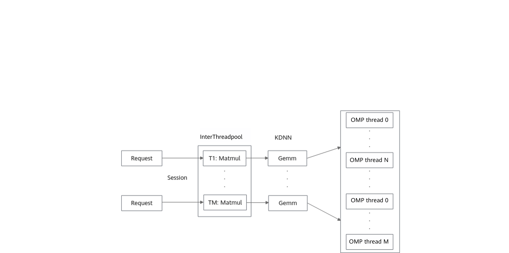

As shown in [**Figure 2**](#omp-parallel), in the OMP version of KDNN, each operator creates *N* OMP threads for computation, and *M* concurrent kernels create `M × N` OMP threads.

**Figure 3** Passthrough to the threadpool<a id="fig1203165984517"></a>


As shown in [**Figure 3**](#fig1203165984517), when thread passthrough is enabled, the framework thread pool is reused. KDNN submits computation tasks to the framework thread pool for unified scheduling, which reduces thread creation overhead and avoids the problem of thread count explosion.

## SparseMatmul Multi-threading Optimization

### Overview

The SparseMatmul operator belongs to the KDNN operator library and is used to compute the product of a sparse matrix and a dense matrix, supporting single-precision FP32 input. This operator serves as the core component of the NN layer in recommendation models. The operator is designed based on the Compressed Sparse Row (CSR) storage structure, achieving efficient utilization of computation and memory access by skipping zero blocks during the loading and computation stages. The core computation kernel has been SIMD-optimized for the Kunpeng platform, supports the NEON instruction set, and implements multi-thread optimization.

### Optimization Design

The SparseMatmul multi-thread optimization includes the following key design aspects:

1. **Data parallelism**: The output matrix is partitioned based on the column dimension, and each thread processes a distinct column block.

2. **Lock-free design**: An independent buffer is allocated for each thread, avoiding synchronization overhead between threads and eliminating false sharing issues.

3. **Load balancing**: The uniform slicing strategy is used to distribute workloads evenly across threads.

4. **Memory optimization**: Memory-aligned allocation interfaces are used to improve SIMD vectorization execution efficiency.

In the following scenarios, the system automatically falls back to the serial algorithm to avoid the additional overhead introduced by multi-thread scheduling:

- The thread pool is unavailable.

- Nested parallelism exists.

- Only single-thread execution is used.

Through the parallelization transformation and execution path optimization of Sparse MatMul, the operator can more fully utilize hardware resources in multi-core CPU scenarios, thereby reducing computation time.

### Optimization Implementation

**Algorithm Logic**

1. **Column sharding strategy**: Evenly divide the columns of the output matrix by the number of threads.

2. **Thread-private buffer**: Allocate an independent computation buffer for each thread to avoid data races.

3. **Parallel execution**: Reuse the framework thread pool, where KDNN submits computation tasks to the framework thread pool for unified scheduling.

4. **Single-thread fallback condition**: The serial algorithm is used when the thread pool pointer is null, the current execution is already within a parallel region, or the number of threads in the thread pool is less than or equal to 1.

**Interface Change**

The `ThreadpoolIface *tp` parameter is added to the API function signature to transfer the thread pool instance.

## EmbeddingTableLookup

### Overview

EmbeddingTableLookup is the core operator in the KEmbedding operator library, designed for efficient sparse embedding lookup operations in recommendation systems. This operator performs sparse embedding lookups by key from a preloaded resource table and outputs standard SparseTensor triplets (indices, values, dense_shape), delivering high performance and low latency. A typical use case is to load an offline-built sparse embedding table into the inference process memory and then perform fast lookups for a batch of keys during inference, which suits the needs of the data processing layer in recommendation models.

### Usage Procedure

Using the EmbeddingTableLookup operator typically involves three steps.

1. Call `EmbeddingIndexToValueTable` to create a resource table handle.

2. Call `InitializeEmbeddingIndexToValueTableFromTextFile` to initialize the resource table from a binary file.

3. Call `EmbeddingTableLookup` to perform batch lookup.

The retention of `TextFile` in the name `InitializeEmbeddingIndexToValueTableFromTextFile` is due to historical naming; the input file actually read is not a text file, but a KEmbedding binary table file.

### File and Memory Organization

An Embedding table file consists of two parts:

- File header: stores metadata such as `total_key_size` and byte order.

- Data area: each key sequentially stores the number of valid dimensions, the valid dimension index array, and the corresponding float value array.

After loading is complete, the resource table is internally stored in a bucketed manner:

- The outer layer is an `std::vector` with a fixed number of buckets.

- Each bucket internally uses `absl::flat_hash_map<uint64_t, EmbeddingValue>`.

- The value consists of several `(valid_value_index, valid_value)` pairs.

### Example Description

Assume the following table content is constructed:

- key `101` -> `(0, 1.0)`, `(2, 3.0)`

- key `202` -> `(1, 2.5)`

Use the following input for lookup:

```python
keys = [101, 202, 999]  # The third key 999 is not hit.
emb_dim = 4
```

The output result is:

```python
indices = [[0, 0], [0, 2], [1, 1]]
values = [1.0, 3.0, 2.5]
dense_shape = [3, 4]  # 3 is the number of keys, and 4 is the embedding dimension.
```

### Arm Optimization Design

On the Arm64 platform, the EmbeddingTableLookup operator has been optimized in the following aspects. These optimizations significantly improve the performance of the EmbeddingTableLookup operator on the Arm platform, making it suitable for high-concurrency recommendation model inference scenarios.

**Key-based Sharded Parallel Lookup**

- The key vector is partitioned among multiple worker threads using the TensorFlow shard parallel method.

- Each thread is responsible for key lookup within a specific range, which is suitable for batch request scenarios.

**Reducing Memory Allocation and Reallocation Overhead**

- The original method reserves memory based on the "maximum possible value" via `reserve(key_cnt * emb_dim)`, but the actual result is usually much smaller than this value, leading to memory waste.

- The optimized implementation first performs a count through `shard_results` to obtain the exact `value_tensor_size`, and then allocates the final output in a single operation.

**Eliminating Intermediate Vector Buffering for Direct Tensor Writes**

- The original method first accumulates results into an intermediate vector, and then copies them to the output tensor.

- The optimization implementation first calculates the total size, directly allocates the output tensor, and then writes the results straight into it, cutting down on extra memory copy overhead.

## TensorFlow ANNC Static Graph Fusion

### Overview

This section introduces the basic concepts and implementation principles of the TensorFlow ANNC static graph fusion optimization feature.

To improve TensorFlow inference performance, Kunpeng BoostKit proposes a TensorFlow ANNC static graph fusion optimization solution. Kunpeng BoostKit provides multiple custom operators, and during the graph optimization phase, the remapper mechanism is used to replace computation subgraphs that match specific characteristics with custom operators. Static graph fusion achieves end-to-end performance improvement by eliminating intermediate memory overhead and optimizing memory access logic. The following operators are currently supported:

- KPFusedEmbeddingActionIdGather

- KPFusedGather

- KPFusedEmbeddingPadding

- KPFusedEmbeddingPaddingFast

- KPFusedSparseDynamicStitch

- KPFusedSparseReshape

- KPFusedSparseSegmentReduce

- KPFusedSparseSegmentReduceNonzero

- KPFusedSparseSelect

The ANNC static graph fusion feature switch is integrated into TensorFlow via a code patch, added on top of TensorFlow 2.15. When the ANNC static graph fusion feature is enabled, if a computation graph subgraph conforms to a specific structure and its inputs and outputs satisfy the constraints, the eligible subgraph will be replaced with the corresponding Custom Operator during the Graph Optimization phase.

### Software Architecture

The software architecture of the ANNC static graph fusion is shown in [Figure 4](#fig4919356463).

**Figure 4**  Software architecture of the ANNC static graph fusion<a id="fig4919356463"></a>

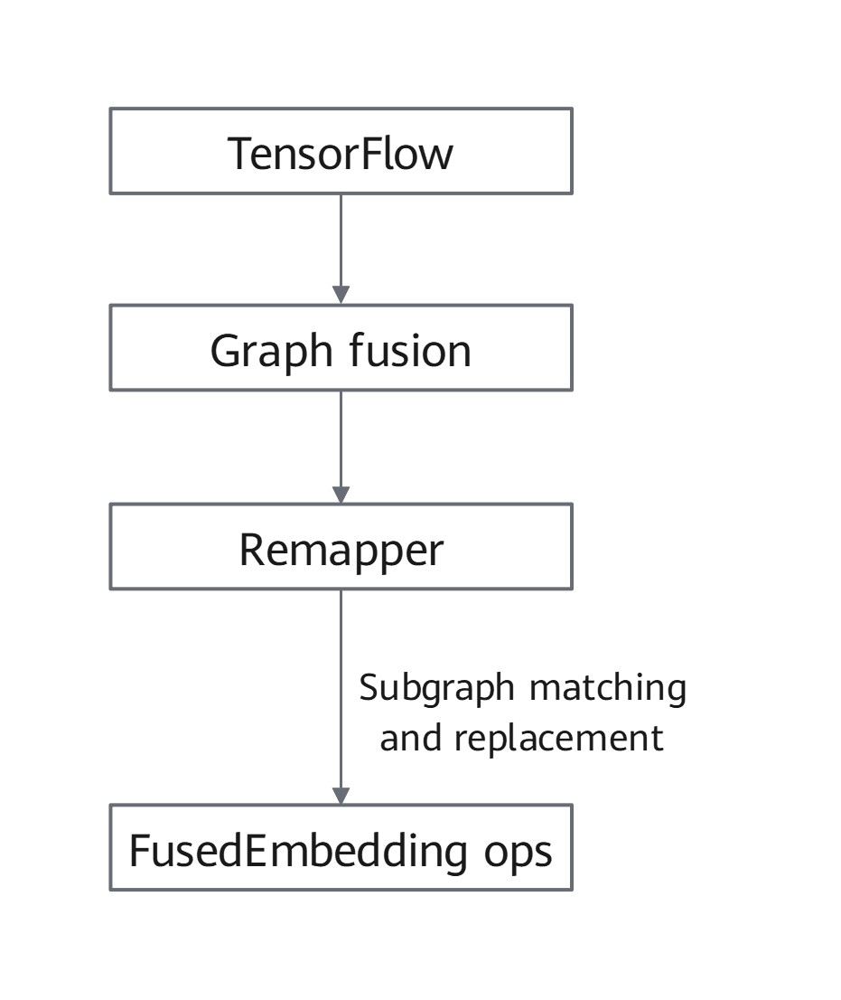

### Specifications

This section describes the currently supported custom operators and their usage constraints.

#### KPFusedEmbeddingActionIdGather

**Native subgraph structure**

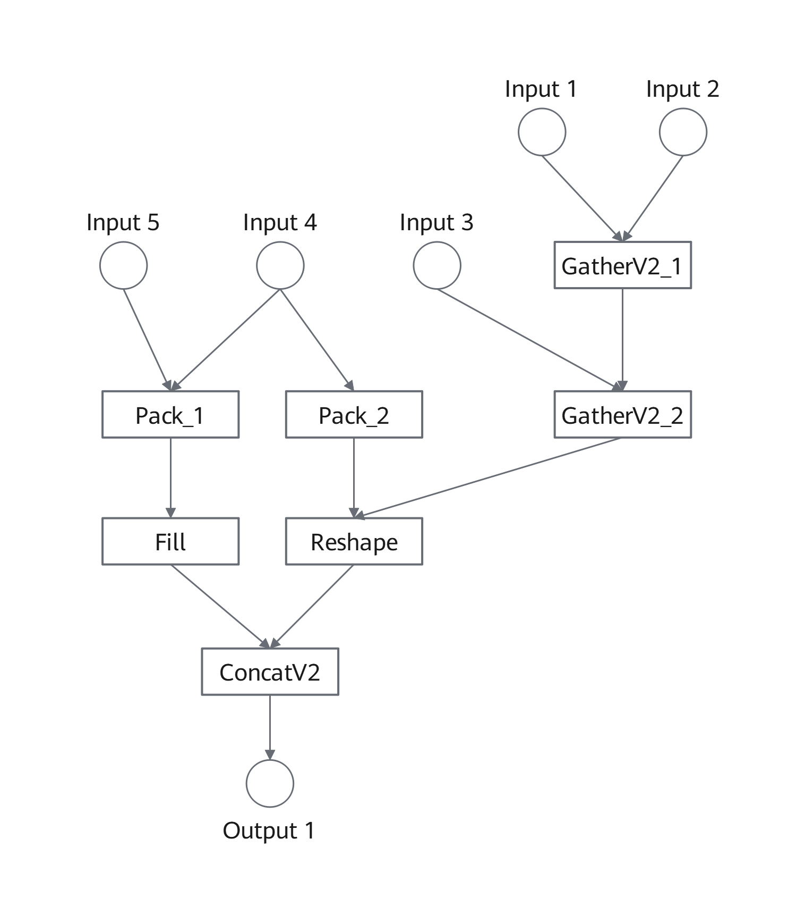

**Input/Output Constraints**

| Input Name | Data Type    | Shape   |
| ---------- | ------------ | ------- |
| Input 1    | int32/int64  | 2D Tensor |
| Input 2    | float        | 2D Tensor |
| Input 3    | int32/int64  | 2D Tensor |
| Input 4    | int32        | Scalar  |
| Input 5    | int32        | Scalar  |

| Output Name | Data Type |
| ----------- | --------- |
| Output 1    | float     |

#### KPFusedGather

**Native subgraph structure**


**Input/Output Constraints**

| Input Name | Data Type | Shape    |
| ---------- | --------- | -------- |
| Input 1    | float     | 2D Tensor |
| Input 2    | int64     | 2D Tensor |
| Input 3    | int32     | [2]       |

| Output Name | Data Type |
| ---- | ---- |
| Output 1    | int64    |
| Output 2    | int32    |
| Output 3    | float    |

#### KPFusedEmbeddingPadding

**Native subgraph structure**


**Input/Output Constraints**

| Input Name | Data Type | Shape    |
| ---------- | --------- | -------- |
| Input 1    | int64     | [2]      |
| Input 2    | float     | 2D Tensor |
| Input 3    | int32     | Scalar   |
| Input 4    | int32     | [2]      |
| Input 5    | int32     | Scalar   |

| Output Name | Data Type |
| ----------- | --------- |
| Output 1    | int32     |
| Output 2    | float     |

#### KPFusedEmbeddingPaddingFast

**Native subgraph structure**

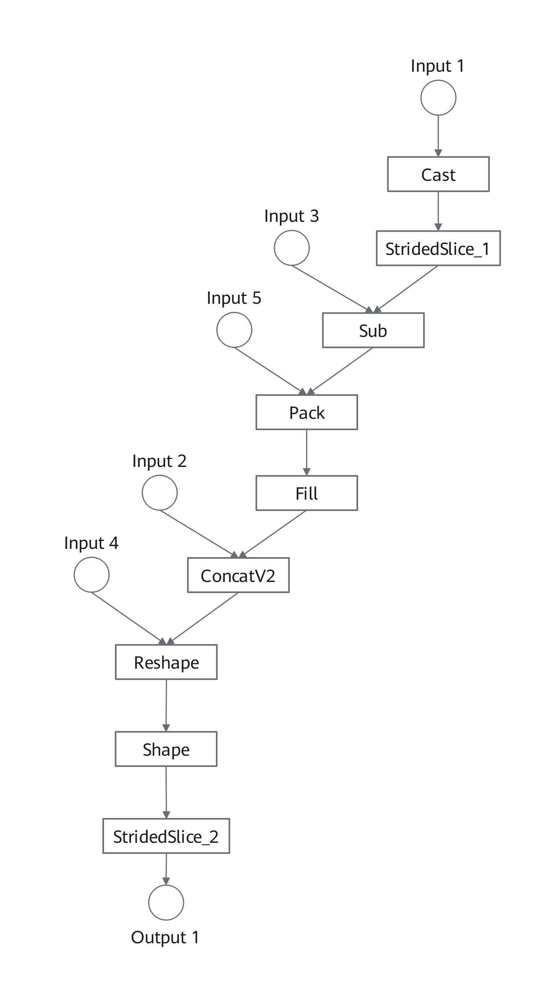

**Input/Output Constraints**

| Input Name | Data Type | Shape |
| -------- | -------- | ------- |
| Input 1    | int64    | [2]     |
| Input 2    | float    | 2D Tensor |
| Input 3    | int32    | Scalar    |
| Input 4    | int32    | [2]     |
| Input 5    | int32    | Scalar    |

| Output Name | Data Type |
| ----------- | --------- |
| Output 1    | int32     |
| Output 2    | int32     |

#### KPFusedSparseDynamicStitch

**Native subgraph structure**


**Input/Output Constraints**

| Input Name | Data Type | Shape |
| -------- | -------- | ----------------- |
| Input 1 | int64 | Tensor |
| Input 2 | float | Non-empty list of 2D tensors |

| Output Name | Data Type |
| -------- | -------- |
| Output 1 | float |

#### KPFusedSparseReshape

**Native subgraph structure**

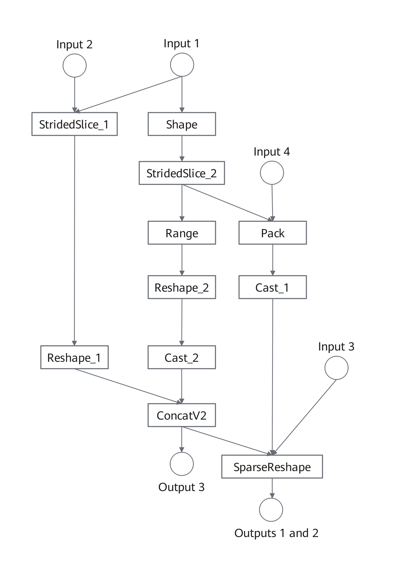

**Input/Output Constraints**

| Input Name | Data Type    | Shape    |
| ---------- | ------------ | -------- |
| Input 1    | int64        | 2D Tensor |
| Input 2    | int32        | [2]      |
| Input 3    | int64        | [2]      |
| Input 4    | int32/int64  | Scalar   |

| Output Name | Data Type |
| ----------- | --------- |
| Output 1    | int64     |
| Output 2    | int64     |

#### KPFusedSparseSegmentReduce

**Native subgraph structure**


**Input/Output Constraints**

| Input Name | Data Type    | Shape    |
| ---------- | ------------ | -------- |
| Input 1    | float        | 2D Tensor |
| Input 2    | int32/int64  | 1D Tensor |
| Input 3    | int64        | 2D Tensor |
| Input 4    | int32        | [2]      |
| Input 5    | int32        | Scalar   |

| Output Name | Data Type |
| ----------- | --------- |
| Output 1    | float     |
| Output 2    | int32     |

#### KPFusedSparseSegmentReduceNonzero

**Native subgraph structure**

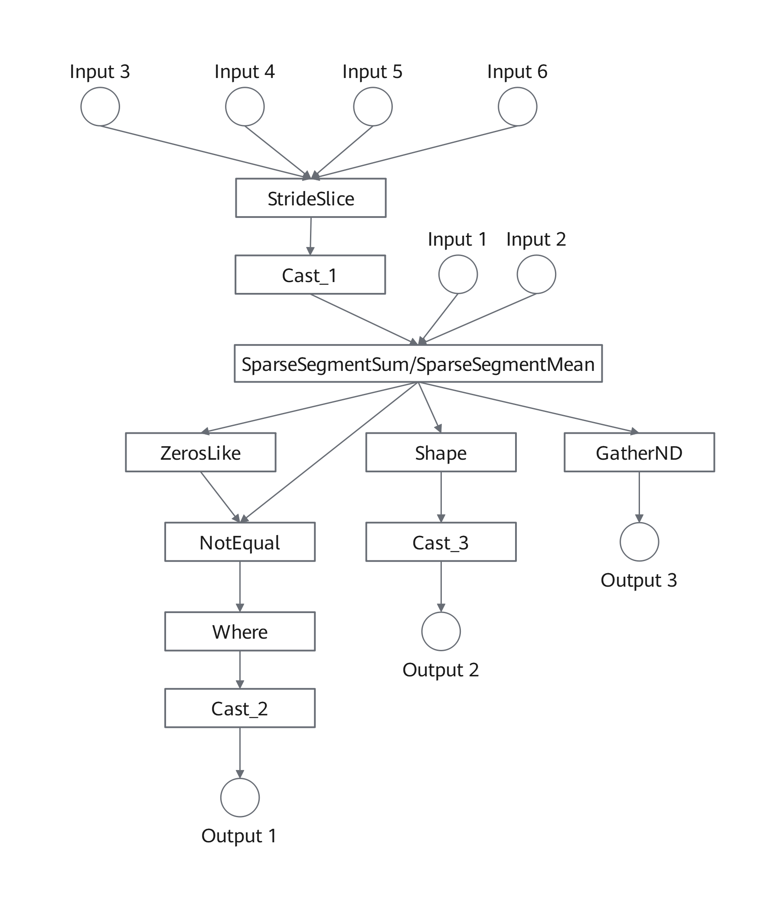

**Input/Output Constraints**

| Input Name | Data Type    | Shape    |
| ---------- | ------------ | -------- |
| Input 1    | float        | 1D Tensor |
| Input 2    | int32/int64  | 1D Tensor |
| Input 3    | int64        | 2D Tensor |
| Input 4    | int32        | [2]      |

| Output Name | Data Type |
| ----------- | --------- |
| Output 1    | int32     |
| Output 2    | int32     |
| Output 3    | float     |

#### KPFusedSparseSelect

**Native subgraph structure**

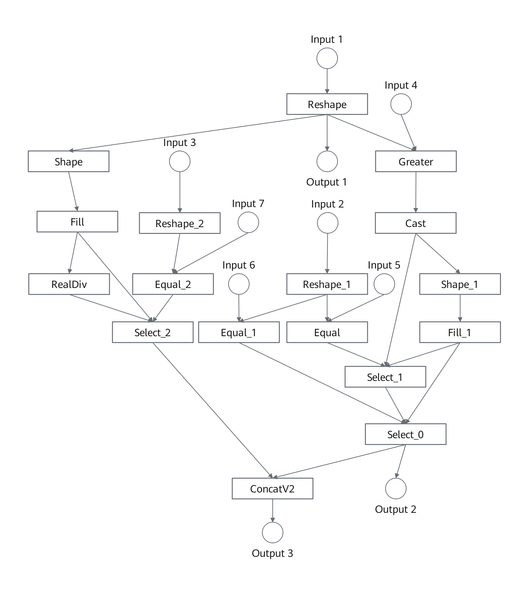

**Input/Output Constraints**

| Input Name | Data Type | Shape |
| -------- | -------- | ---- |
| Input 1    | int32    | Tensor |
| Input 2    | int32    | Tensor |
| Input 3    | int32    | Tensor |
| Input 4    | int32    | Scalar |
| Input 5    | int32    | Scalar |
| Input 6    | int32    | Scalar |
| Input 7    | int32    | Scalar |

| Output Name | Data Type |
| -------- | -------- |
| Output 1    | int32    |
| Output 2    | float    |
| Output 3    | float    |

>  **NOTE**
> When Embedding operator fusion is enabled, if a subgraph meeting the requirements exists, it will be replaced with the corresponding custom operator during the graph optimization phase; otherwise, the native TensorFlow interface is used.

### Application Scenarios

TensorFlow ANNC static graph fusion is primarily used in high-concurrency inference scenarios, delivering improved throughput and significantly reduced inference latency.

### Principles

This section describes the ANNC static graph fusion optimization feature to help users better utilize it.

After ANNC static graph fusion is enabled, subgraphs meeting the requirements are replaced with corresponding custom operators during the graph optimization phase, thereby reducing intermediate memory overhead, optimizing memory access logic, and achieving end-to-end performance improvement.

**Figure 5** Operator fusion principle<a name="fig4919356474"></a>

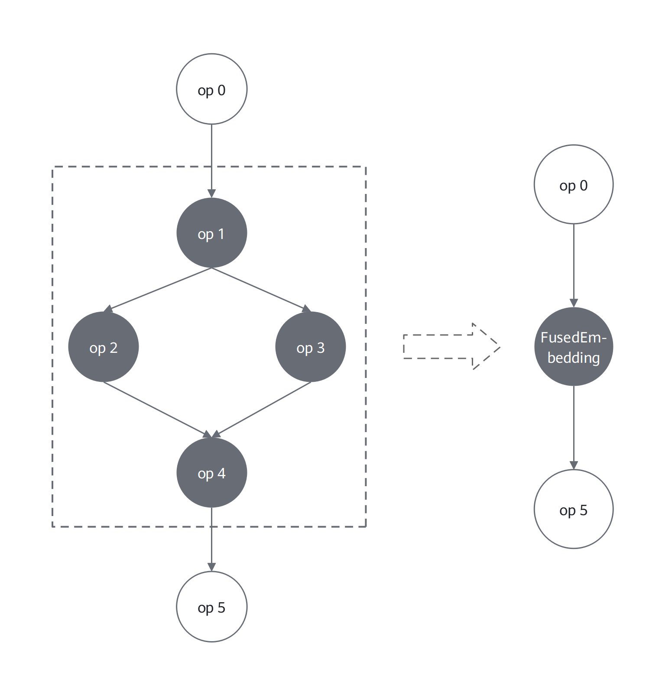

## TensorFlow ANNC Graph Compilation Optimization Feature (Legacy)

>  **NOTE**
> This feature is frozen in a standalone Legacy patch and only supports direct application to the official TensorFlow
> `v2.15.0` baseline. It is not part of the currently maintained default profile, and compatibility with other feature patches is not guaranteed.

### Overview

This section describes the basic concepts and implementation principles of the TensorFlow Accelerated Neural Network Compiler (ANNC) for graph compilation optimization.

To improve the inference performance of TensorFlow Serving (hereinafter referred to as TF Serving), Kunpeng BoostKit proposes the TensorFlow ANNC graph compilation optimization solution. ANNC is a compiler focused on accelerating neural network computation, concentrating on accelerating recommendation inference performance through computational graph optimization, high-performance fusion operator generation and integration technologies, and efficient code generation and optimization capabilities. As an extended acceleration suite based on the Open Accelerated Linear Algebra (OpenXLA), ANNC is released in the ANNC open-source repository of the openEuler community. It features Kunpeng-affinity optimization characteristics. It is integrated into the TensorFlow inference framework and Accelerated Linear Algebra (XLA) through compilation options and code patches, adding TensorFlow graph fusion, XLA graph fusion, operator optimization, and constant folding optimization features based on TensorFlow Serving/TensorFlow 2.15.

- TensorFlow graph fusion: fusion and rewriting of graphs at the TensorFlow model level.

- XLA graph fusion: ANNC-driven XLA graph fusion.

- Operator optimization: ANNC-driven operator optimization.

- Constant folding optimization: ANNC-driven constant folding optimization.

>  **NOTE**
> OpenXLA is an open ecosystem consisting of high-performance, portable, and scalable machine learning infrastructure components.
> XLA is an open-source compiler for machine learning. It optimizes models from the TensorFlow framework, to enable efficient execution across various hardware platforms including GPUs, CPUs, and machine learning accelerators.

### Software Architecture

[**Figure 6**](#tf-serving-software-architecture) shows the TF Serving software architecture. [**Table 1**](#tf-serving-software-component-functions) describes the functions of each component.

**Figure 6** TF Serving software architecture<a id="tf-serving-software-architecture"></a>


**Table 1** TF Serving software component functions<a id="tf-serving-software-component-functions"></a>

<a name="table17527817415"></a>

<table><thead align="left"><tr id="row13527611645"><th class="cellrowborder" valign="top" width="20%" id="mcps1.2.3.1.1"><p id="p1452751848"><a name="p1452751848"></a><a name="p1452751848"></a>Component Name</p></th>
<th class="cellrowborder" valign="top" width="80%" id="mcps1.2.3.1.2"><p id="p3527312418"><a name="p3527312418"></a><a name="p3527312418"></a>Description</p></th>
</tr>
</thead>
<tbody><tr id="row9527411342"><td class="cellrowborder" valign="top" width="20%" headers="mcps1.2.3.1.1 "><p id="p652710118414"><a name="p652710118414"></a><a name="p652710118414"></a>TF Serving</p></td>
<td class="cellrowborder" valign="top" width="80%" headers="mcps1.2.3.1.2 "><p id="p12527316419"><a name="p12527316419"></a><a name="p12527316419"></a>A high-performance inference server designed specifically for TensorFlow model deployment.</p></td>
</tr>
<tr id="row890710021716"><td class="cellrowborder" valign="top" width="20%" headers="mcps1.2.3.1.1 "><p id="p175272111416"><a name="p175272111416"></a><a name="p175272111416"></a>SavedModel</p></td>
<td class="cellrowborder" valign="top" width="80%" headers="mcps1.2.3.1.2 "><p id="p185271018417"><a name="p185271018417"></a><a name="p185271018417"></a>A standardized model saving format provided by TensorFlow, which allows trained models to be imported, inferred, and retrained in different TensorFlow environments.</p></td>
</tr>
<tr id="row552715117416"><td class="cellrowborder" valign="top" width="20%" headers="mcps1.2.3.1.1 "><p id="p060405316012"><a name="p060405316012"></a><a name="p060405316012"></a>Graph Fusion</p></td>
<td class="cellrowborder" valign="top" width="80%" headers="mcps1.2.3.1.2 "><p id="p1860416535018"><a name="p1860416535018"></a><a name="p1860416535018"></a>ANNC graph fusion module.</p></td>
</tr>
<tr id="row1552751643"><td class="cellrowborder" valign="top" width="20%" headers="mcps1.2.3.1.1 "><p id="p652710113419"><a name="p652710113419"></a><a name="p652710113419"></a>TensorFlow</p></td>
<td class="cellrowborder" valign="top" width="80%" headers="mcps1.2.3.1.2 "><p id="p3527201147"><a name="p3527201147"></a><a name="p3527201147"></a>An open-source machine learning framework primarily used for training and inference of deep learning models.</p></td>
</tr>
<tr id="row1145126151312"><td class="cellrowborder" valign="top" width="20%" headers="mcps1.2.3.1.1 "><p id="p134819201318"><a name="p134819201318"></a><a name="p134819201318"></a>ANNC</p></td>
<td class="cellrowborder" valign="top" width="80%" headers="mcps1.2.3.1.2 "><p id="p183481199139"><a name="p183481199139"></a><a name="p183481199139"></a>An AI compiler optimized for machine learning models, capable of compiling models into high-performance executable code.</p></td>
</tr>
<tr id="row53481395136"><td class="cellrowborder" valign="top" width="20%" headers="mcps1.2.3.1.1 "><p id="p117197117117"><a name="p117197117117"></a><a name="p117197117117"></a>XLA Extension</p></td>
<td class="cellrowborder" valign="top" width="80%" headers="mcps1.2.3.1.2 "><p id="p3719131119116"><a name="p3719131119116"></a><a name="p3719131119116"></a>ANNC's XLA-based extension component.</p></td>
</tr>
<tr id="row512919311905"><td class="cellrowborder" valign="top" width="20%" headers="mcps1.2.3.1.1 "><p id="p134526191311"><a name="p134526191311"></a><a name="p134526191311"></a>XLA</p></td>
<td class="cellrowborder" valign="top" width="80%" headers="mcps1.2.3.1.2 "><p id="p204518611318"><a name="p204518611318"></a><a name="p204518611318"></a><span>An open-source machine learning compiler</span>.</p></td>
</tr>
<tr id="row116041953806"><td class="cellrowborder" valign="top" width="20%" headers="mcps1.2.3.1.1 "><p id="p161299311305"><a name="p161299311305"></a><a name="p161299311305"></a>Kernels</p></td>
<td class="cellrowborder" valign="top" width="80%" headers="mcps1.2.3.1.2 "><p id="p2129143115012"><a name="p2129143115012"></a><a name="p2129143115012"></a>TensorFlow operator implementation.</p></td>
</tr>
</tbody>
</table>

### Application Scenarios

The TensorFlow ANNC feature is mainly used in recommendation systems and advertising delivery. It can greatly improve inference performance for coarse-ranking models in high-concurrency scenarios, boosting throughput while significantly reducing latency.

### Principles

This section describes the TensorFlow/XLA optimization features to help users better utilize them.

**TensorFlow Graph Fusion**

Some subgraphs in TensorFlow models contain redundant computations. By identifying specific graph patterns, you can fuse multiple operators in the subgraphs into one fused operator. This avoids extra work, optimizes memory access, and improves model inference performance. For details, see [**Figure 7** TensorFlow graph fusion](#tensorflow-graph-fusion). This function enables graph fusion and rewriting at the TensorFlow model level on the frontend, and supports manual creation of custom fused operators on the backend.

**Figure 7** TensorFlow graph fusion<a id="tensorflow-graph-fusion"></a>


**XLA Graph Fusion**

XLA provides multiple hardware-agnostic graph fusion optimization policies. However, the resulting cluster (including the fused parts) may still contain redundant computations. For example, sub-expressions are repeated or can be merged across different fusion operations. For details, see [**Figure 8** XLA graph fusion](#xla-graph-fusion). This function aims to identify redundant computations after fusion, such as the F1 operations. Redundant computations can be eliminated using pre-fusion policies, such as the fusion of F4, F5, and F6 operations, to further improve the model inference efficiency.

**Figure 8** XLA graph fusion<a name="fig5154159193015"></a><a id="xla-graph-fusion"></a>

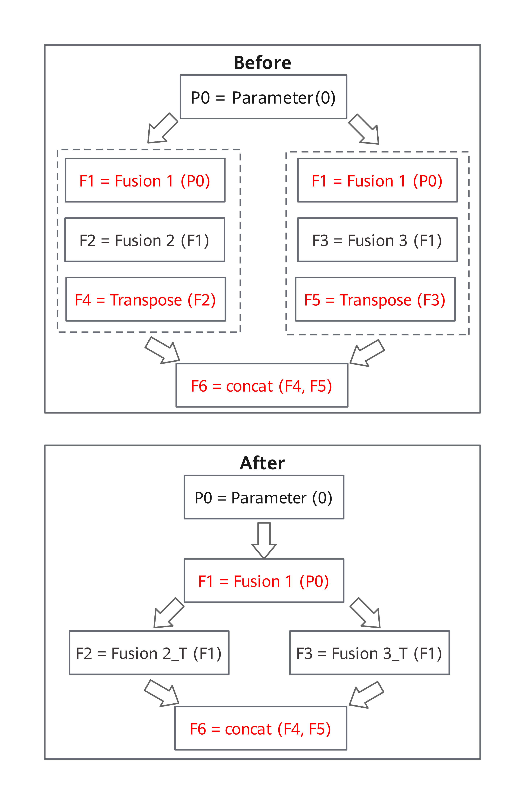

**Operator Optimization**

This feature performs operator optimization across stages, including offloading the Matrix Multiplication (MatMul) operator to XLA, calling the General Matrix Multiplication (GEMM) operation interface provided by Open Basic Linear Algebra Subprograms (OpenBLAS), and replacing the Softmax function with a more efficient implementation. In addition, it identifies specific operation patterns to eliminate redundant computations and further improve the model inference performance. For example, in scenarios where multiple slices are concatenated, redundant slicing operations are removed.

**Constant Folding Optimization**

This function focuses on optimizing the packing overhead of constant operands in matrix multiplication operators. It applies to OpenBLAS call scenarios involving a matrix multiplication operator `C = A * B`, where at least one operand is a constant (for example, weight B in an inference model). The values and shape of such an operand are known at compile time and remain unchanged at runtime. When this optimization is not enabled, the ANNC compiler needs to pack and rearrange the constant operand to meet hardware memory access alignment and cache locality requirements, as shown in [**Figure 9** Data packing](#data-packing). Since the valid layout of the constant operand can be uniquely determined at compile time, the packing operation can be moved to the compilation phase in this scenario. When this optimization is enabled, the offline packing tool and the dedicated repack-free backend kpgeemm are used during compilation to completely eliminate the redundant runtime overhead, as shown in [**Figure 10** Constant folding workflow](#constant-folding-workflow).

**Figure 9** Data packing<a name="fig836316691916"></a><a id="data-packing"></a>

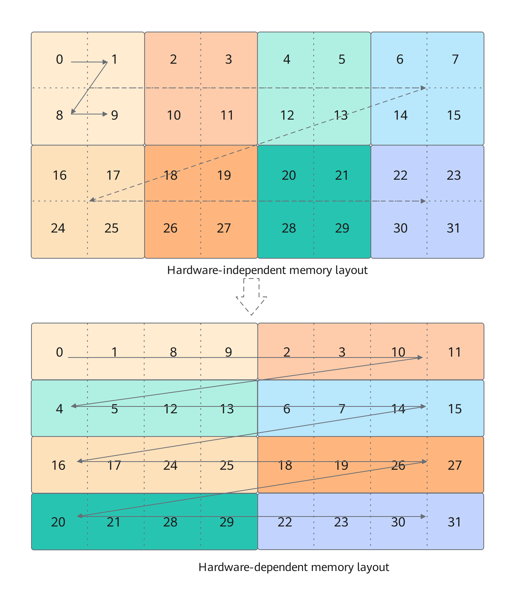

**Figure 10** Constant folding workflow<a name="fig836316691917"></a><a id="constant-folding-workflow"></a>

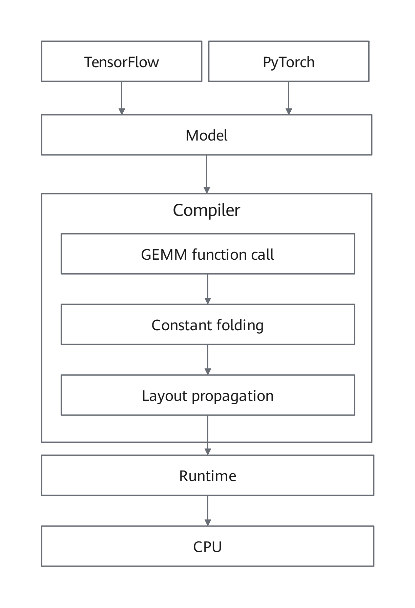

For details about function configuration, see <a href="./quick_start.md">*Quick Start*</a>.

## TensorFlow Serving Thread Scheduling Optimization Feature (Legacy)

>  **NOTE**
> This feature has been frozen in a standalone Legacy patch and is only supported for direct application to the official TensorFlow `v2.15.0` baseline. It is not part of the currently maintained default profile, and compatibility with other feature patches is not guaranteed.

### Overview

This section describes the basic concepts and implementation principles of the thread scheduling optimization feature for TensorFlow Serving.

Kunpeng BoostKit developed a thread scheduling optimization solution to enhance TF Serving inference performance. TensorFlow employs inter-operator thread pools to parallelize independent operators, this approach can lead to task contention in high-concurrency scenarios when multiple sessions share the same thread pool, substantially degrading computational efficiency for entire graphs. Kunpeng BoostKit's solution addresses this limitation through refined operator scheduling algorithms and advanced thread management optimizations, delivering significant throughput improvements for concurrent model inference.

Implemented as patches integrated into openEuler's `sra_tensorflow_adapter` repository, these optimizations introduce two new configuration parameters for TF Serving/TensorFlow 2.15:

- Batch operator scheduling (`--batch_op_scheduling`): Enables the operator scheduling optimization and XLA thread pool management optimization features. When single-core inference latency meets requirements, this option can be used to enhance concurrent processing capability and overall throughput.

- Thread affinity isolation (`--task_affinity_isolation`): Provides the following isolation methods: When TensorFlow scheduling is used, sequential core binding is recommended. When this option is enabled together with the `--batch_op_scheduling` option, and hyper-threading is enabled, interleaved core binding is recommended.

  - Sequential core binding allocates TensorFlow computing threads to the first K cores and TF Serving communication threads to remaining cores.

  - Interleaved core binding (applicable when hyper-threading is enabled) assigns TensorFlow threads to physical cores and TF Serving communication threads to virtual cores.

>  **NOTE**
> XLA serves as TensorFlow's optimizing compiler, specifically designed to enhance the execution speed of linear algebra operations. By transforming TensorFlow computational graphs into highly efficient, hardware-specific instructions, XLA delivers significant performance improvements.

### Software Architecture

[**Figure 11**](#tf-serving-software-architecture-1) shows the TF Serving software architecture. [**Table 1**](#tf-serving-component-functions) describes the functions of each module.

**Figure 11** TF Serving software architecture<a id="tf-serving-software-architecture-1"></a>

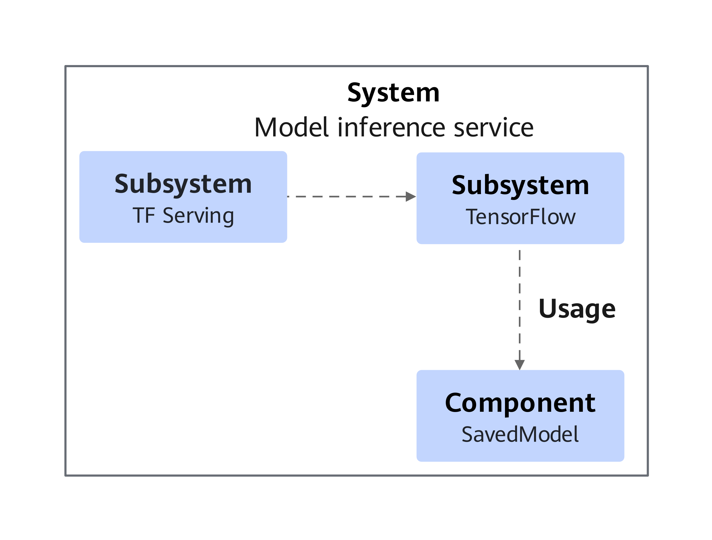

**Table 1** TF Serving component functions<a id="tf-serving-component-functions"></a>

<a name="table17527817415"></a>

<table><thead align="left"><tr id="row13527611645"><th class="cellrowborder" valign="top" width="23.02%" id="mcps1.2.3.1.1"><p id="p1452751848"><a name="p1452751848"></a><a name="p1452751848"></a>Module Name</p></th>
<th class="cellrowborder" valign="top" width="76.98%" id="mcps1.2.3.1.2"><p id="p3527312418"><a name="p3527312418"></a><a name="p3527312418"></a>Description</p></th>
</tr>
</thead>
<tbody><tr id="row9527411342"><td class="cellrowborder" valign="top" width="23.02%" headers="mcps1.2.3.1.1 "><p id="p652710118414"><a name="p652710118414"></a><a name="p652710118414"></a>TF Serving</p></td>
<td class="cellrowborder" valign="top" width="76.98%" headers="mcps1.2.3.1.2 "><p id="p12527316419"><a name="p12527316419"></a><a name="p12527316419"></a>A high-performance inference server designed specifically for TensorFlow model deployment.</p></td>
</tr>
<tr id="row552715117416"><td class="cellrowborder" valign="top" width="23.02%" headers="mcps1.2.3.1.1 "><p id="p652710113419"><a name="p652710113419"></a><a name="p652710113419"></a>TensorFlow</p></td>
<td class="cellrowborder" valign="top" width="76.98%" headers="mcps1.2.3.1.2 "><p id="p3527201147"><a name="p3527201147"></a><a name="p3527201147"></a>An open-source machine learning framework primarily used for training and inference of deep learning models.</p></td>
</tr>
<tr id="row1552751643"><td class="cellrowborder" valign="top" width="23.02%" headers="mcps1.2.3.1.1 "><p id="p175272111416"><a name="p175272111416"></a><a name="p175272111416"></a>SavedModel</p></td>
<td class="cellrowborder" valign="top" width="76.98%" headers="mcps1.2.3.1.2 "><p id="p185271018417"><a name="p185271018417"></a><a name="p185271018417"></a>A standardized model serialization format provided by TensorFlow, enabling trained models to be imported, inferred, and retrained across different TensorFlow environments.</p></td>
</tr>
</tbody>
</table>

### Application Scenarios

The TF Serving thread scheduling optimization feature delivers adaptable solutions for diverse inference workloads:

- It can greatly improve inference performance for coarse-ranking models in high-concurrency scenarios, boosting throughput while significantly reducing latency.

- Effectively optimizes latency-sensitive, low-concurrency scenarios through proper thread management parameter configuration.

### Principles

This section details TF Serving's thread pool architecture for inference, clarifying the principles of the feature to guide optimal configuration decisions.

**Figure 12** TF Serving thread pool overview<a name="fig158087456394"></a><a id="tf-serving-thread-pool-overview"></a>


The inference threads in TF Serving fall into two functional categories: communication threads and computing threads.

Communication threads:

- `grpcpp_sync_ser` threads manage client inference requests (including parsing, inference triggering, and response delivery).

Computing threads:

- `tf_Compute` threads coordinate parallel tasks across operators.

- `tf_numa_-1_Eige` threads execute intra-operator parallel tasks.

XLA-enabled deployments create threads for XLA computation.

- `host_executor` threads coordinate parallel tasks across XLA operators.

- `tf_XLAEigen` threads execute intra-XLA-operator parallel tasks.

[**Figure 13** Inference request handling process](#inference-request-handling-process) shows the overall inference request handling process.

**Figure 13** Inference request handling process<a name="fig1746025495015"></a><a id="inference-request-handling-process"></a>


Client inference requests are parsed by `grpcpp_sync_ser` threads before triggering session-based inference execution. Parallel operator processing occurs through `tf_Compute or host_executor` threads, with `tf_numa_-1_Eige` or `tf_XLAEigen` threads handling intra-operator parallel computing.

Kunpeng BoostKit improves the operator scheduling algorithm and uses batch operator scheduling. [**Figure 14** Inference process after optimization](#inference-process-after-optimization) shows the overall inference process.

**Figure 14** Inference process after optimization<a name="fig1321324116542"></a><a id="inference-process-after-optimization"></a>

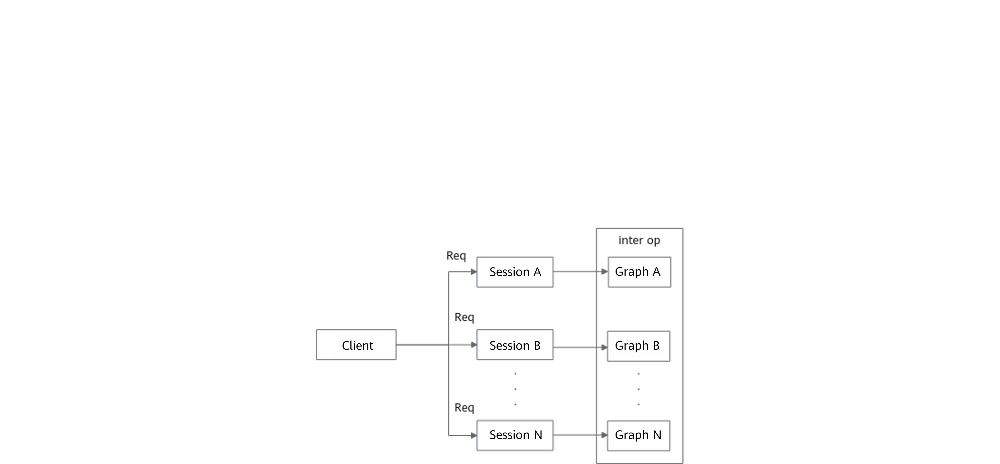

Client inference requests are parsed by `grpcpp_sync_ser` threads before triggering session-based inference, with operators running sequentially in `tf_Compute` threads (disabling intra-operator parallelism).

This optimization reduces cross-session interference, enabling lower per-session inference latency, improved TF Serving concurrency, and additional gains from thread affinity isolation between communication and computing threads.

The thread scheduling feature enables:

- Batch operator scheduling (via `--batch_op_scheduling`) for enhanced throughput in high-concurrency scenarios

- Optimized XLA thread pool management, enabled alongside batch operator scheduling, to schedule XLA operators onto the current thread, thereby reducing context switching overhead.

- Configurable thread affinity isolation (via `--task_affinity_isolation`) for binding communication and computing threads to different CPU cores

For details about function configuration, see <a href="./quick_start.md">Quick Start</a>.

## Change History

| Release Date | Description |
| ---- | ---- |
| 2026-09-30 | This is the third official release. <ul><li>Added the introduction of the KDNN SparseMatmul multi-thread optimization feature.</li><li>Added the introduction of the kembedding operator library EmbeddingTableLookup operator feature.</li></ul> |
| 2026-06-30 | This is the second official release. <ul><li>Added the introduction of the constant folding optimization feature to the TensorFlow ANNC graph compilation optimization feature.</li><li>Added the TensorFlow ANNC static graph fusion feature, including the corresponding feature introduction, software architecture, and other content.</li></ul> |
| 2026-03-30 | This is the first official release. <ul><li>Added the TensorFlow KDNN thread passthrough feature, including the corresponding feature introduction, software architecture, and other content.</li></ul> |
