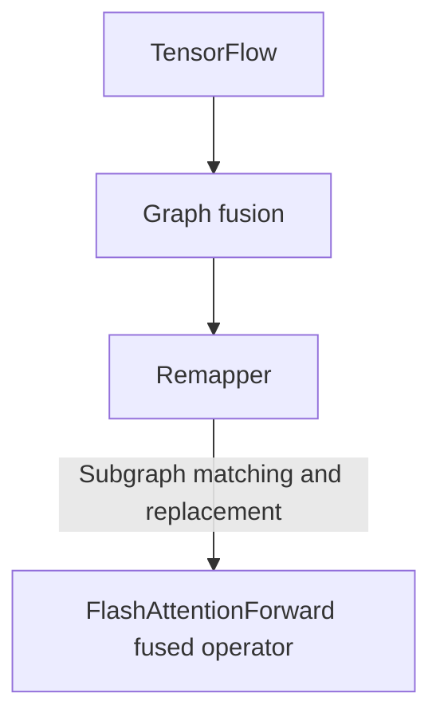
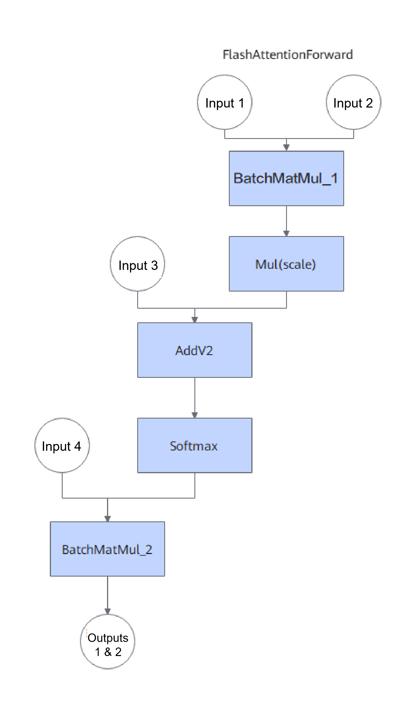
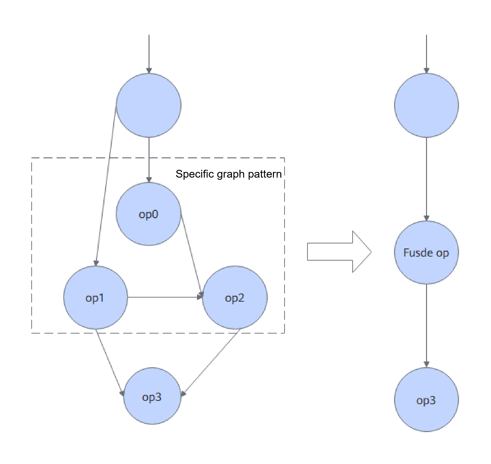

# Feature Introduction

<!-- md-trans-meta sourceCommit=062d2574fdfde12276d08b23b05dc9d9d8b875e2 translatedAt=2026-08-31T03:37:41.221Z pushedAt=2026-09-15T03:11:10.624Z -->

## TensorFlow FAGO Static Graph Fusion

### Overview

This section introduces the basic concepts and implementation principles of the TensorFlow FAGO static graph fusion optimization feature.

To improve TensorFlow inference performance, Kunpeng BoostKit proposes a TensorFlow FAGO static graph fusion optimization solution. Kunpeng BoostKit offers the FlashAttentionForward custom operator, and during the graph optimization phase, the remapper mechanism is used to replace computational subgraphs that match specific characteristics with the custom operator. Static graph fusion achieves end-to-end performance improvement by eliminating intermediate memory overhead and optimizing memory access logic.

The FAGO static graph fusion feature switch is integrated into TensorFlow via a code patch, added on top of TensorFlow 2.20.
When the FAGO static graph fusion feature is enabled, if a subgraph of the computational graph conforms to a specific structure and its inputs and outputs satisfy the constraints, the eligible subgraph will be replaced with the corresponding custom operator during the graph optimization phase.

### Software Architecture

The software architecture of the FAGO static graph fusion is shown in [Figure 1](#fig1).

**Figure 1**  Software architecture of the FAGO static graph fusion

### Supported Custom Operator Specifications and Usage Constraints

This section describes the currently supported custom operator and its usage constraints.

#### FlashAttentionForward

**Open-source Subgraph Structure**

**Input/Output Constraints**

| Input Name | Data Type | Shape |
| -------- | ----------- | ------- |
| Input 1 | float | 3D tensor |
| Input 2 | float | 3D tensor |
| Input 3 | float | 3D tensor |
| Input 4 | float | 2D tensor |

| Output Name | Data Type | Shape |
| -------- | -------- | ------- |
| Output 1 | float | 3D tensor |
| Output 2 | float | 2D tensor |

>  **NOTE:**
> When FlashAttentionForward operator fusion is enabled, if a subgraph meeting the requirements exists, it will be replaced with the corresponding custom operator during the graph optimization phase; otherwise, the open-source TensorFlow interface is used.

### Application Scenarios

TensorFlow FAGO static graph fusion is mainly used in high-concurrency inference scenarios, where it significantly reduces inference latency.

### Principles

This section describes the FAGO static graph fusion optimization feature to help users better utilize it.

After FAGO static graph fusion is enabled, a subgraph meeting the requirements is replaced with the corresponding custom operator during the graph optimization phase, thereby reducing intermediate memory overhead, optimizing memory access logic, and achieving end-to-end performance improvement.

**Figure 2** Operator fusion principle 

## Change History

| Date | Description |
| ---- | ---- |
| 2026-09-30 | This is the first official release. <ul><li>Added the TensorFlow FAGO static graph fusion feature, including its feature introduction, software architecture, and other content.</li></ul>|
