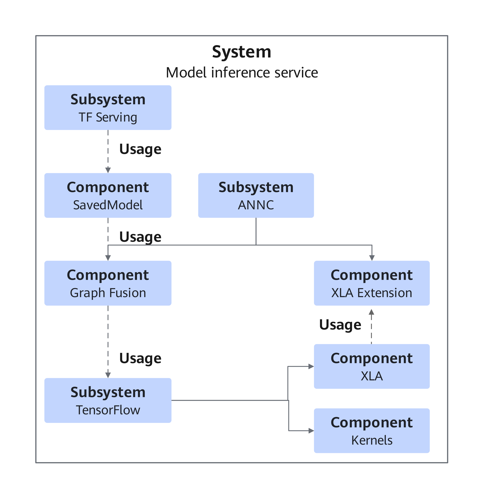
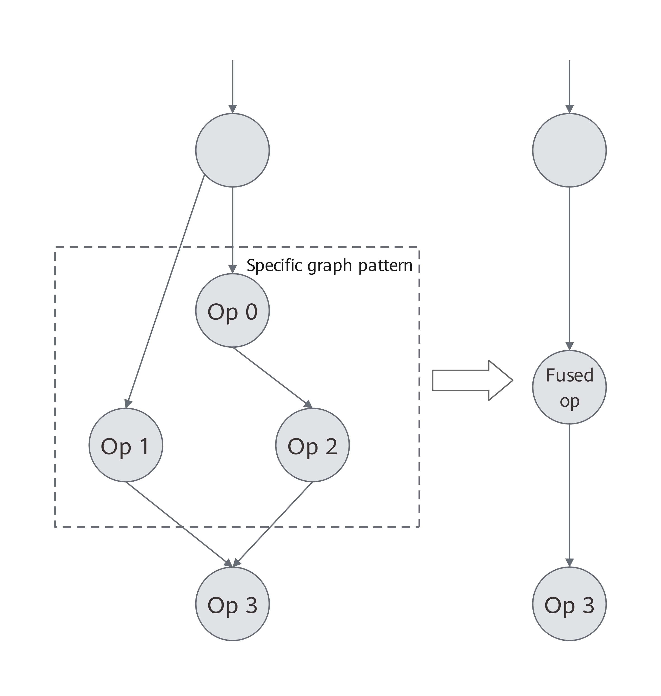
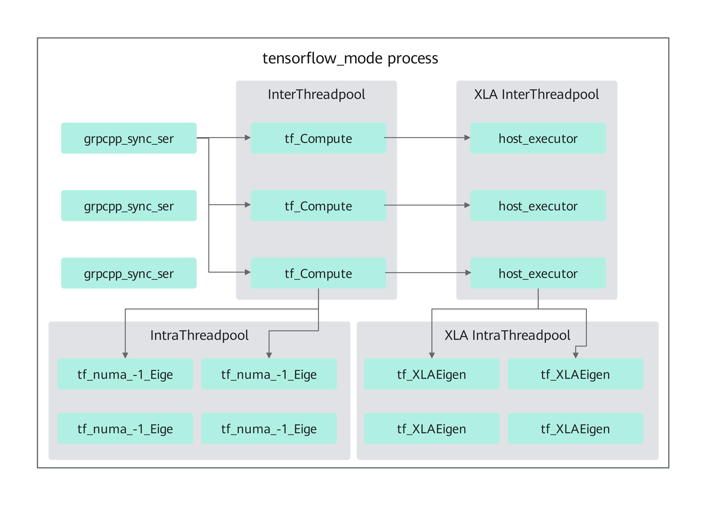
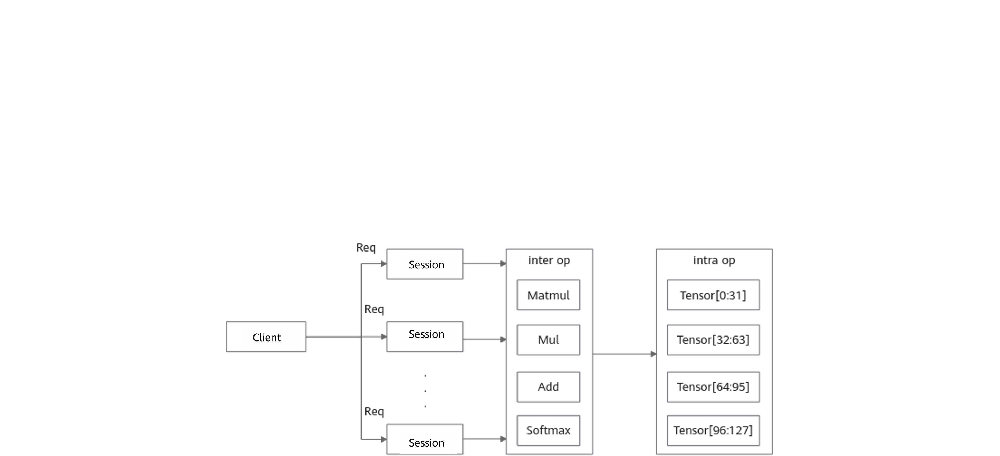
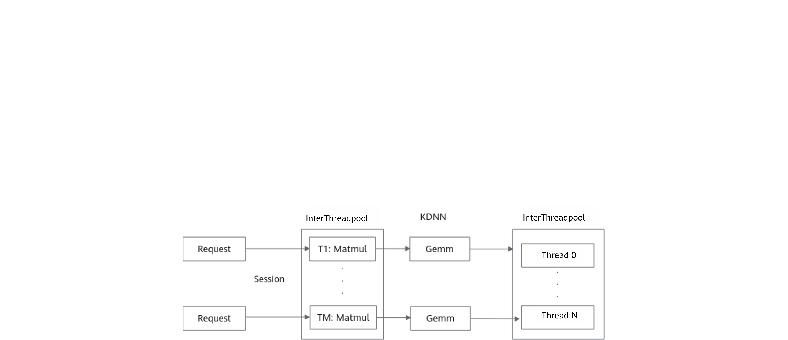
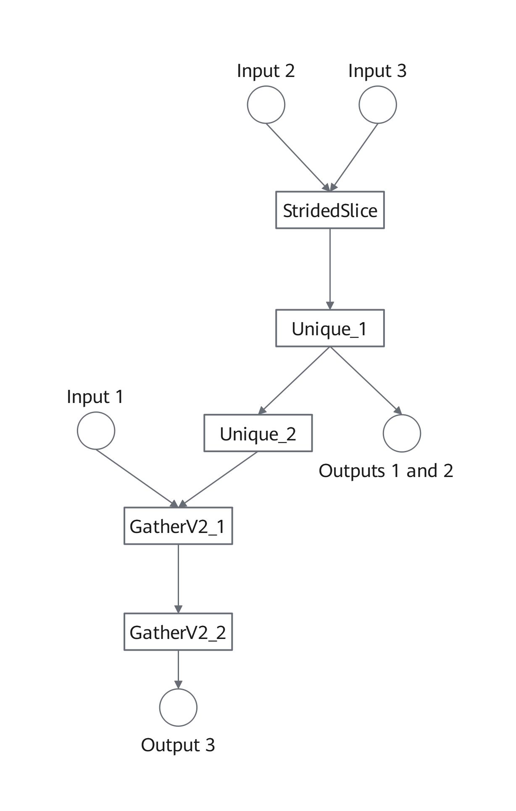
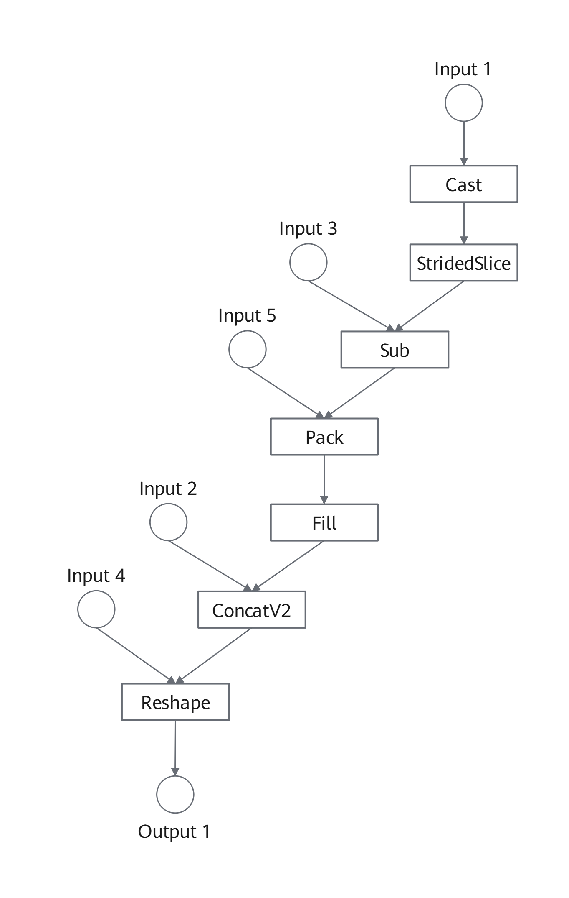
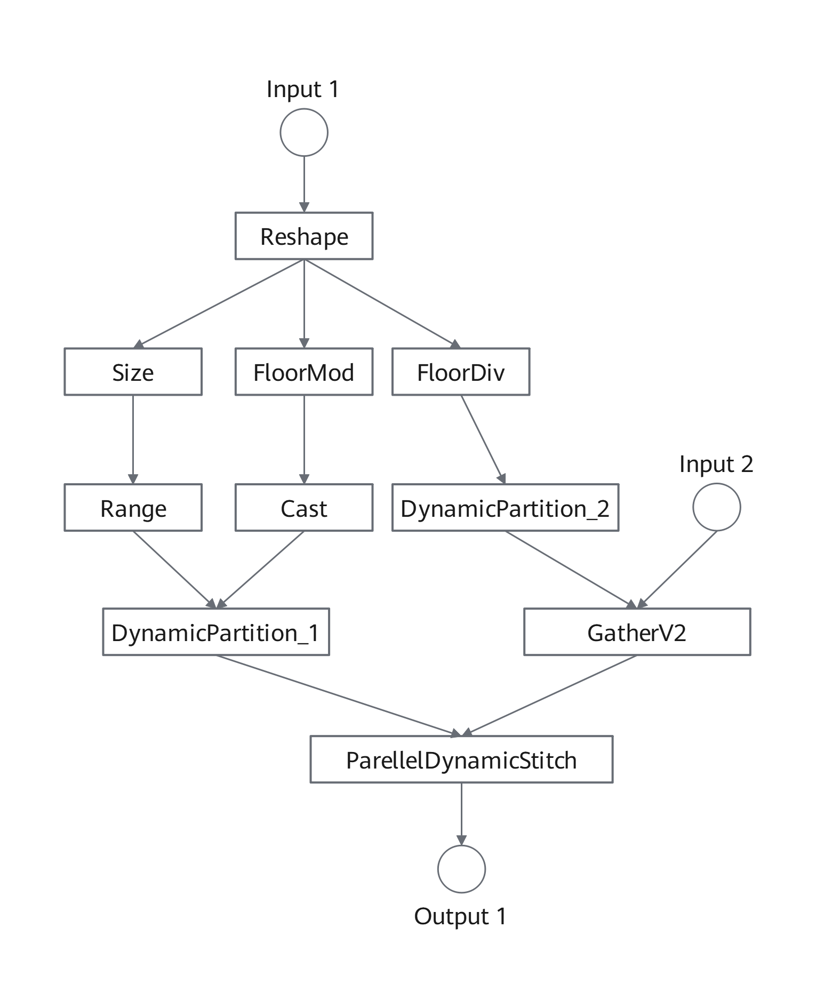
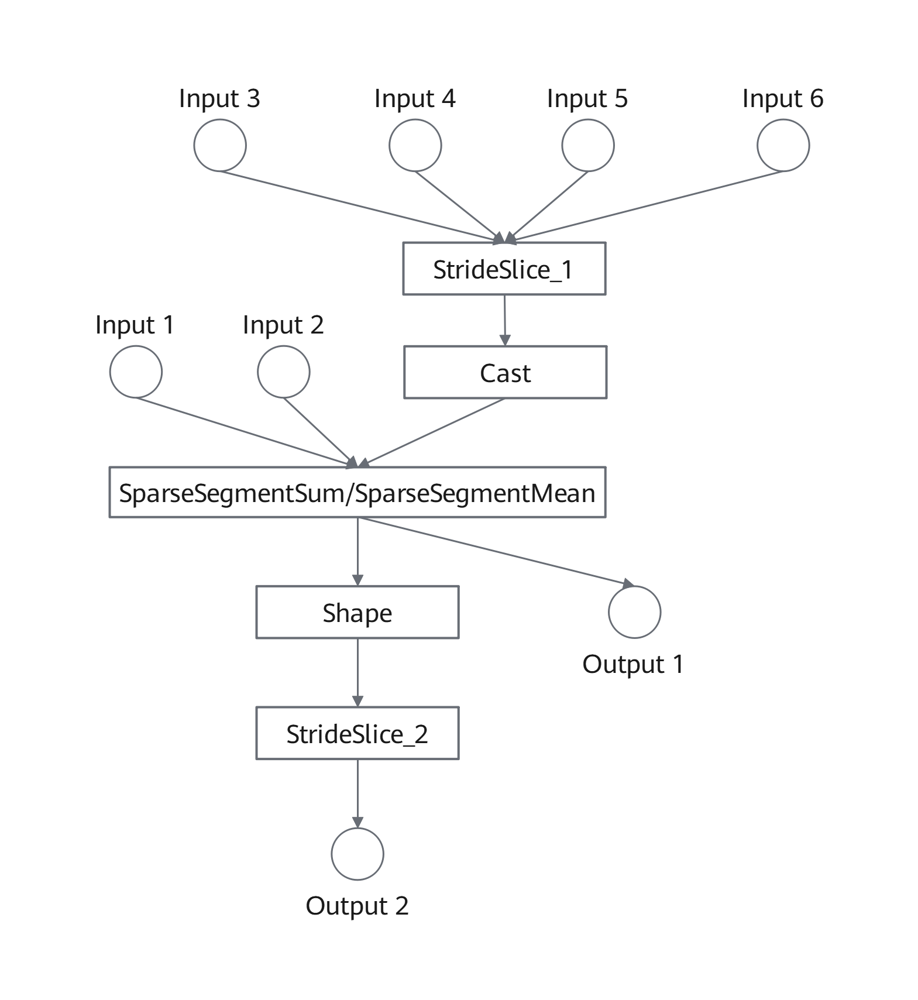

# Feature Introduction

## TensorFlow ANNC for Graph Compilation Optimization

### Introduction

This section describes the basic concepts and implementation principles of the TensorFlow Accelerated Neural Network Compiler (ANNC) for graph compilation optimization.

Kunpeng BoostKit provides this TensorFlow ANNC feature to enhance TensorFlow Serving (TF Serving) inference performance. ANNC is a compiler dedicated to accelerating neural network computing. It focuses on technologies including computational graph optimization, generation and integration of high-performance fused operators, and efficient code generation and optimization. These capabilities significantly improve inference performance in recommendation scenarios. As an extension kit based on open-source Open Accelerated Linear Algebra (OpenXLA), ANNC is released in the ANNC open-source repository of the openEuler community. It features Kunpeng-affinity optimization capabilities, and is integrated into the TensorFlow inference framework and Accelerated Linear Algebra (XLA) through compilation options and code patches. Based on TensorFlow Serving and TensorFlow 2.15, this feature introduces TensorFlow graph fusion, XLA graph fusion, operator optimization, and constant folding optimization.

- TensorFlow graph fusion: fusion and rewriting of graphs at the TensorFlow model level.
- XLA graph fusion: XLA graph fusion enhanced by ANNC.
- Operator optimization: ANNC-driven operator optimization.
- Constant folding optimization: ANNC constant folding optimization.

> **NOTE:**
>OpenXLA is an open ecosystem consisting of high-performance, portable, and scalable machine learning infrastructure components.
>XLA is an open-source compiler for machine learning. It optimizes models from the TensorFlow framework, to enable efficient execution across various hardware platforms including GPUs, CPUs, and machine learning accelerators.

### Software Architecture

**[Figure 1** TF Serving software architecture](#tf-serving-software-architecture) shows the TF Serving software architecture. [**Table 1** TF Serving software component functions](#tf-serving-software-component-functions) describes the functions of each component.

**Figure 1** TF Serving software architecture<a name="fig2460131971612"></a><a id="tf-serving-software-architecture"></a>



**Table 1** TF Serving software component functions<a id="tf-serving-software-component-functions"></a>

<a name="table17527817415"></a>
<table><thead align="left"><tr id="row13527611645"><th class="cellrowborder" valign="top" width="20%" id="mcps1.2.3.1.1"><p id="p1452751848"><a name="p1452751848"></a><a name="p1452751848"></a>Component</p>
</th>
<th class="cellrowborder" valign="top" width="80%" id="mcps1.2.3.1.2"><p id="p3527312418"><a name="p3527312418"></a><a name="p3527312418"></a>Description</p>
</th>
</tr>
</thead>
<tbody><tr id="row9527411342"><td class="cellrowborder" valign="top" width="20%" headers="mcps1.2.3.1.1 "><p id="p652710118414"><a name="p652710118414"></a><a name="p652710118414"></a>TF Serving</p>
</td>
<td class="cellrowborder" valign="top" width="80%" headers="mcps1.2.3.1.2 "><p id="p12527316419"><a name="p12527316419"></a><a name="p12527316419"></a>Dedicated, high-performance inference server optimized for TensorFlow model deployment</p>
</td>
</tr>
<tr id="row890710021716"><td class="cellrowborder" valign="top" width="20%" headers="mcps1.2.3.1.1 "><p id="p175272111416"><a name="p175272111416"></a><a name="p175272111416"></a>SavedModel</p>
</td>
<td class="cellrowborder" valign="top" width="80%" headers="mcps1.2.3.1.2 "><p id="p185271018417"><a name="p185271018417"></a><a name="p185271018417"></a>TensorFlow's standardized model format enabling seamless model import, inference, and retraining across diverse TensorFlow implementations</p>
</td>
</tr>
<tr id="row552715117416"><td class="cellrowborder" valign="top" width="20%" headers="mcps1.2.3.1.1 "><p id="p060405316012"><a name="p060405316012"></a><a name="p060405316012"></a>Graph Fusion</p>
</td>
<td class="cellrowborder" valign="top" width="80%" headers="mcps1.2.3.1.2 "><p id="p1860416535018"><a name="p1860416535018"></a><a name="p1860416535018"></a>ANNC graph fusion component</p>
</td>
</tr>
<tr id="row1552751643"><td class="cellrowborder" valign="top" width="20%" headers="mcps1.2.3.1.1 "><p id="p652710113419"><a name="p652710113419"></a><a name="p652710113419"></a>TensorFlow</p>
</td>
<td class="cellrowborder" valign="top" width="80%" headers="mcps1.2.3.1.2 "><p id="p3527201147"><a name="p3527201147"></a><a name="p3527201147"></a>Open-source machine learning framework specializing in deep learning model training and inference</p>
</td>
</tr>
<tr id="row1145126151312"><td class="cellrowborder" valign="top" width="20%" headers="mcps1.2.3.1.1 "><p id="p134819201318"><a name="p134819201318"></a><a name="p134819201318"></a>ANNC</p>
</td>
<td class="cellrowborder" valign="top" width="80%" headers="mcps1.2.3.1.2 "><p id="p183481199139"><a name="p183481199139"></a><a name="p183481199139"></a>AI compiler optimized for machine learning models, which can compile models into high-performance executable code</p>
</td>
</tr>
<tr id="row53481395136"><td class="cellrowborder" valign="top" width="20%" headers="mcps1.2.3.1.1 "><p id="p117197117117"><a name="p117197117117"></a><a name="p117197117117"></a>XLA Extension</p>
</td>
<td class="cellrowborder" valign="top" width="80%" headers="mcps1.2.3.1.2 "><p id="p3719131119116"><a name="p3719131119116"></a><a name="p3719131119116"></a>ANNC XLA extension</p>
</td>
</tr>
<tr id="row512919311905"><td class="cellrowborder" valign="top" width="20%" headers="mcps1.2.3.1.1 "><p id="p134526191311"><a name="p134526191311"></a><a name="p134526191311"></a>XLA</p>
</td>
<td class="cellrowborder" valign="top" width="80%" headers="mcps1.2.3.1.2 "><p id="p204518611318"><a name="p204518611318"></a><a name="p204518611318"></a><span>Open-source compiler for machine learning</span></p>
</td>
</tr>
<tr id="row116041953806"><td class="cellrowborder" valign="top" width="20%" headers="mcps1.2.3.1.1 "><p id="p161299311305"><a name="p161299311305"></a><a name="p161299311305"></a>Kernels</p>
</td>
<td class="cellrowborder" valign="top" width="80%" headers="mcps1.2.3.1.2 "><p id="p2129143115012"><a name="p2129143115012"></a><a name="p2129143115012"></a>TensorFlow operator implementation</p>
</td>
</tr>
</tbody>
</table>

### Application Scenarios<a name="ZH-CN_TOPIC_0000002550048255"></a>

The TensorFlow Serving ANNC feature is mainly used in recommendation systems and advertising delivery. It can greatly improve inference performance for coarse-ranking models in high-concurrency scenarios, boosting throughput while significantly reducing latency.

### Principles<a name="ZH-CN_TOPIC_0000002550048263"></a>

This section describes the TensorFlow/XLA optimization features.

**TensorFlow Graph Fusion<a name="section2050553619512"></a>**

Some subgraphs in TensorFlow models contain redundant computations. By identifying specific graph patterns, you can fuse multiple operators in the subgraphs into one fused operator. This avoids extra work, optimizes memory access, and improves model inference performance. For details, see [**Figure 1** TensorFlow graph fusion](#tensorflow-graph-fusion). This function enables graph fusion and rewriting at the TensorFlow model level on the frontend, and supports manual creation of custom fused operators on the backend.

**Figure 1** TensorFlow graph fusion<a name="fig836316691915"></a><a id="tensorflow-graph-fusion"></a>



**XLA Graph Fusion<a name="section1049725715115"></a>**

XLA provides multiple hardware-agnostic graph fusion optimization policies. However, the resulting cluster (including the fused parts) may still contain redundant computations. For example, sub-expressions are repeated or can be merged across different fusion operations. For details, see [**Figure 2** XLA graph fusion](#xla-graph-fusion). This function aims to identify redundant computations after fusion, such as the F1 operations. Redundant computations can be eliminated using pre-fusion policies, such as the fusion of F4, F5, and F6 operations, to further improve the model inference efficiency.

**Figure 2** XLA graph fusion<a name="fig5154159193015"></a><a id="xla-graph-fusion"></a>


**Operator Optimization<a name="section287331525216"></a>**

This feature performs operator optimization across stages, including offloading the Matrix Multiplication (MatMul) operator to XLA, calling the General Matrix Multiplication (GEMM) operation interface provided by Open Basic Linear Algebra Subprograms (OpenBLAS), and replacing the Softmax function with a more efficient implementation. In addition, it identifies specific operation patterns to eliminate redundant computations and further improve the model inference performance. For example, in scenarios where multiple slices are concatenated, redundant slicing operations are removed.

**Constant Folding Optimization<a name="section2050553619512"></a>**

This function focuses on optimizing the packing overhead of constant operands in matrix multiplication operators. It applies to OpenBLAS call scenarios involving a matrix multiplication operator `C = A × B`, where at least one operand (such as weight `B` in an inference model) is a constant. The value and shape of such operands are known at compile time and remain unchanged at runtime. When this optimization is disabled, the ANNC compiler must pack and rearrange constant operands to meet hardware memory access alignment and cache locality requirements, as shown in [**Figure 3** Data packing](#data-packing). Since the valid layout of constant operands can be uniquely determined by the compiler, the packing operation in this scenario can be shifted forward to the compile phase. Once this optimization is enabled, an offline packing tool used during compilation and a dedicated rearrangement-free backend (kpgemm) can completely eliminate redundant runtime overhead, as shown in [**Figure 4** Constant folding workflow](#constant-folding-workflow).

**Figure 3** Data packing<a name="fig836316691915"></a><a id="data-packing"></a>


**Figure 4** Constant folding workflow<a name="fig836316691915"></a><a id="constant-folding-workflow"></a>


For details about function configuration, see <a href="./quick_start.md">Quick Start</a>.

## TensorFlow Serving Thread Scheduling

### Introduction

This section describes the basic concepts and implementation principles of the thread scheduling optimization feature for TensorFlow Serving.

Kunpeng BoostKit developed a thread scheduling optimization solution to enhance TF Serving inference performance. TensorFlow employs inter-operator thread pools to parallelize independent operators, this approach can lead to task contention in high-concurrency scenarios when multiple sessions share the same thread pool, substantially degrading computational efficiency for entire graphs. Kunpeng BoostKit's solution addresses this limitation through refined operator scheduling algorithms and advanced thread management optimizations, delivering significant throughput improvements for concurrent model inference.

Implemented as patches integrated into openEuler's `sra_tensorflow_adapter` repository, these optimizations introduce two new configuration parameters for TF Serving/TensorFlow 2.15:

- Batch operator scheduling (`--batch_op_scheduling`): Enables the operator scheduling optimization and XLA thread pool management optimization features. When single-core inference latency meets requirements, this option can be used to enhance concurrent processing capability and overall throughput.
- Thread affinity isolation (`--task_affinity_isolation`): Provides the following isolation methods: When the TensorFlow scheduling mode is used, sequential core binding is recommended. When this option is enabled together with the `--batch_op_scheduling` option, and hyper-threading is enabled, interleaved core binding is recommended.

  - Sequential core binding allocates TensorFlow computing threads to the first K cores and TF Serving communication threads to remaining cores.
  - Interleaved core binding (applicable when hyper-threading is enabled) assigns TensorFlow threads to physical cores and TF Serving communication threads to virtual cores.

> **NOTE:**
>XLA serves as TensorFlow's optimizing compiler, specifically designed to enhance the execution speed of linear algebra operations. By transforming TensorFlow computational graphs into highly efficient, hardware-specific instructions, XLA delivers significant performance improvements.

### Software Architecture

[**Figure 1** TF Serving software architecture](#tf-serving-software-architecture-1) shows the TF Serving software architecture. [**Table 1** TF Serving component functions](#tf-serving-component-functions) describes the functions of each component.

**Figure 1** TF Serving software architecture<a name="fig9660112419318"></a><a id="tf-serving-software-architecture-1"></a>


**Table 1** TF Serving component functions<a id="tf-serving-component-functions"></a>

<a name="table17527817415"></a>
<table><thead align="left"><tr id="row13527611645"><th class="cellrowborder" valign="top" width="23.02%" id="mcps1.2.3.1.1"><p id="p1452751848"><a name="p1452751848"></a><a name="p1452751848"></a>Component</p>
</th>
<th class="cellrowborder" valign="top" width="76.98%" id="mcps1.2.3.1.2"><p id="p3527312418"><a name="p3527312418"></a><a name="p3527312418"></a>Description</p>
</th>
</tr>
</thead>
<tbody><tr id="row9527411342"><td class="cellrowborder" valign="top" width="23.02%" headers="mcps1.2.3.1.1 "><p id="p652710118414"><a name="p652710118414"></a><a name="p652710118414"></a>TF Serving</p>
</td>
<td class="cellrowborder" valign="top" width="76.98%" headers="mcps1.2.3.1.2 "><p id="p12527316419"><a name="p12527316419"></a><a name="p12527316419"></a>Dedicated, high-performance inference server optimized for TensorFlow model deployment</p>
</td>
</tr>
<tr id="row552715117416"><td class="cellrowborder" valign="top" width="23.02%" headers="mcps1.2.3.1.1 "><p id="p652710113419"><a name="p652710113419"></a><a name="p652710113419"></a>TensorFlow</p>
</td>
<td class="cellrowborder" valign="top" width="76.98%" headers="mcps1.2.3.1.2 "><p id="p3527201147"><a name="p3527201147"></a><a name="p3527201147"></a>Open-source machine learning framework specializing in deep learning model training and inference</p>
</td>
</tr>
<tr id="row1552751643"><td class="cellrowborder" valign="top" width="23.02%" headers="mcps1.2.3.1.1 "><p id="p175272111416"><a name="p175272111416"></a><a name="p175272111416"></a>SavedModel</p>
</td>
<td class="cellrowborder" valign="top" width="76.98%" headers="mcps1.2.3.1.2 "><p id="p185271018417"><a name="p185271018417"></a><a name="p185271018417"></a>TensorFlow's standardized model format enabling seamless model import, inference, and retraining across diverse TensorFlow implementations</p>
</td>
</tr>
</tbody>
</table>

### Application Scenarios

The TF Serving thread scheduling optimization feature delivers adaptable solutions for diverse inference workloads:

- Dramatically improves performance in high-concurrency coarse ranking model scenarios, boosting throughput while significantly reducing latency
- Effectively optimizes latency-sensitive, low-concurrency scenarios through proper thread management parameter configuration.

### Principles

This section details TF Serving's thread pool architecture for inference, clarifying the principles of the feature to guide optimal configuration decisions.

**Figure 1** TF Serving thread pool overview<a name="fig158087456394"></a><a id="tf-serving-thread-pool-overview"></a>



The inference threads in TF Serving fall into two functional categories: communication threads and computing threads.

Communication threads:

- `grpcpp_sync_ser` threads manage client inference requests (including parsing, inference triggering, and response delivery).

Computing threads:

- `tf_Compute` threads coordinate parallel tasks across operators.
- `tf_numa_-1_Eige` threads execute intra-operator parallel tasks.

XLA-enabled deployments create threads for XLA computation.

- `host_executor` threads coordinate parallel tasks across XLA operators.
- `tf_XLAEigen` threads execute intra-XLA-operator parallel tasks.

[**Figure 2** Inference request handling process](#inference-request-handling-process) shows the overall inference request handling process.

**Figure 2** Inference request handling process<a name="fig1746025495015"></a><a id="inference-request-handling-process"></a>



Client inference requests are parsed by `grpcpp_sync_ser` threads before triggering session-based inference execution. Parallel operator processing occurs through `tf_Compute or host_executor` threads, with `tf_numa_-1_Eige` or `tf_XLAEigen` threads handling intra-operator parallel computing.

Kunpeng BoostKit improves the operator scheduling algorithm and uses batch operator scheduling. [**Figure 3** Inference process after optimization](#inference-process-after-optimization) shows the overall inference process.

**Figure 3** Inference process after optimization<a name="fig1321324116542"></a><a id="inference-process-after-optimization"></a>


Client inference requests are parsed by `grpcpp_sync_ser` threads before triggering session-based inference, with operators running sequentially in `tf_Compute` threads (disabling intra-operator parallelism).

This optimization reduces cross-session interference, enabling lower per-session inference latency, improved TF Serving concurrency, and additional gains from thread affinity isolation between communication and computing threads.

The thread scheduling feature enables:

- Batch operator scheduling (via `--batch_op_scheduling`) for enhanced throughput in high-concurrency scenarios
- Optimized XLA thread pool management, enabled alongside batch operator scheduling, to schedule XLA operators onto the current thread, thereby reducing context switching overhead.
- Configurable thread affinity isolation (via `--task_affinity_isolation`) for binding communication and computing threads to different CPU cores

For details about function configuration, see <a href="./quick_start.md">Quick Start</a>.

## TensorFlow KDNN Thread Passthrough

### Introduction

This section describes the basic concepts and implementation principles of the TensorFlow KDNN thread passthrough optimization feature, and provides guidance for installing and using the feature in the openEuler 24.03 LTS SP3 based on the new Kunpeng 920 processor model.

To improve the TensorFlow inference performance, Kunpeng BoostKit introduces the TensorFlow KDNN thread passthrough optimization solution. KDNN provides high-performance implementation of inference core operators based on the Kunpeng CPU hardware. At the original kernel implementation layer, a dispatch component distributes KDNN-supported operators to the KDNN backend. The KDNN thread passthrough feature submits computing tasks to the framework thread pool for unified scheduling through KDNN. This reuses the framework thread pool and reduces the overhead of thread creation and destruction.

The optimization feature is integrated into TensorFlow through compilation options and code patches. TensorFlow 2.15 introduces a KDNN feature flag.

**KDNN thread passthrough**: When the KDNN optimization feature is enabled and the operator input and output meet the constraints, the KDNN library is invoked. KDNN submits computing tasks to the framework thread pool for unified scheduling and reuses the framework thread pool.

### Software Architecture

[Figure 1](#fig4919356464) shows the software architecture of KDNN integrated with TensorFlow.

Figure 1 Software architecture of KDNN integrated with TensorFlow<a name="fig4919356464"></a>


### Specifications

This section describes the operators that support the KDNN thread passthrough feature and the specifications.

[Table 1](#table8731173784819) lists the operators that support the KDNN thread passthrough feature.

**Table 1** Operators that support KDNN thread passthrough

<a name="table8731173784819"></a>
<table><thead align="left"><tr id="row573183720488"><th class="cellrowborder" colspan="2" valign="top" id="mcps1.2.9.1.1"><p id="p06021725181316"><a name="p06021725181316"></a><a name="p06021725181316"></a>Operator</p>
</th>
<th class="cellrowborder" colspan="4" valign="top" id="mcps1.2.9.1.2"><p id="p106022025191315"><a name="p106022025191315"></a><a name="p106022025191315"></a>Data Type Constraint</p>
</th>
<th class="cellrowborder" valign="top" id="mcps1.2.9.1.3"><p id="p16011255131"><a name="p16011255131"></a><a name="p16011255131"></a>Dimension Constraint</p>
</th>
<th class="cellrowborder" valign="top" id="mcps1.2.9.1.4"><p id="p55991325131312"><a name="p55991325131312"></a><a name="p55991325131312"></a> Other Constraints</p>
</th>
</tr>
</thead>
<tbody><tr id="row273812420184"><td class="cellrowborder" colspan="2" valign="top" headers="mcps1.2.9.1.1 "><p id="p1902143641316"><a name="p1902143641316"></a><a name="p1902143641316"></a>ConcatV2</p>
</td>
<td class="cellrowborder" colspan="4" valign="top" headers="mcps1.2.9.1.2 "><p id="p89021636161316"><a name="p89021636161316"></a><a name="p89021636161316"></a>fp32, fp16, bf16, int32, int8, or uint8</p>
</td>
<td class="cellrowborder" valign="top" headers="mcps1.2.9.1.3 "><p id="p109011236121313"><a name="p109011236121313"></a><a name="p109011236121313"></a>None</p>
</td>
<td class="cellrowborder" valign="top" headers="mcps1.2.9.1.4 "><p id="p76311158114918"><a name="p76311158114918"></a><a name="p76311158114918"></a>None</p>
</td>
</tr>
<tr id="row19133202192018"><td class="cellrowborder" colspan="2" valign="top" headers="mcps1.2.9.1.1 "><p id="p1033714554132"><a name="p1033714554132"></a><a name="p1033714554132"></a>BatchMatMul</p>
</td>
<td class="cellrowborder" colspan="4" valign="top" headers="mcps1.2.9.1.2 "><p id="p15337165511132"><a name="p15337165511132"></a><a name="p15337165511132"></a>fp32</p>
</td>
<td class="cellrowborder" valign="top" headers="mcps1.2.9.1.3 "><p id="p1833785511316"><a name="p1833785511316"></a><a name="p1833785511316"></a><span>2D-5D</span></p>
</td>
<td class="cellrowborder" valign="top" headers="mcps1.2.9.1.4 "><p id="p26461358164910"><a name="p26461358164910"></a><a name="p26461358164910"></a>None</p>
</td>
</tr>
<tr id="row171941117162015"><td class="cellrowborder" colspan="2" valign="top" headers="mcps1.2.9.1.1 "><p id="p5431181116145"><a name="p5431181116145"></a><a name="p5431181116145"></a>Einsum</p>
</td>
<td class="cellrowborder" colspan="4" valign="top" headers="mcps1.2.9.1.2 "><p id="p1943016119149"><a name="p1943016119149"></a><a name="p1943016119149"></a>fp32</p>
</td>
<td class="cellrowborder" valign="top" headers="mcps1.2.9.1.3 "><p id="p1043051115143"><a name="p1043051115143"></a><a name="p1043051115143"></a>None</p>
</td>
<td class="cellrowborder" valign="top" headers="mcps1.2.9.1.4 "><p id="p3659558154917"><a name="p3659558154917"></a><a name="p3659558154917"></a>None</p>
</td>
</tr>
<tr id="row4303415132016"><td class="cellrowborder" colspan="2" valign="top" headers="mcps1.2.9.1.1 "><p id="p5429101117142"><a name="p5429101117142"></a><a name="p5429101117142"></a>Sigmoid</p>
</td>
<td class="cellrowborder" colspan="4" valign="top" headers="mcps1.2.9.1.2 "><p id="p84291211151415"><a name="p84291211151415"></a><a name="p84291211151415"></a>fp32</p>
</td>
<td class="cellrowborder" valign="top" headers="mcps1.2.9.1.3 "><p id="p1342841171412"><a name="p1342841171412"></a><a name="p1342841171412"></a>Any non-empty dimension</p>
</td>
<td class="cellrowborder" valign="top" headers="mcps1.2.9.1.4 "><p id="p1260874031514"><a name="p1260874031514"></a><a name="p1260874031514"></a>None</p>
</td>
</tr>
<tr id="row1235520136201"><td class="cellrowborder" colspan="2" valign="top" headers="mcps1.2.9.1.1 "><p id="p4427171131419"><a name="p4427171131419"></a><a name="p4427171131419"></a>FloorMod</p>
</td>
<td class="cellrowborder" colspan="4" valign="top" headers="mcps1.2.9.1.2 "><p id="p1042761151418"><a name="p1042761151418"></a><a name="p1042761151418"></a>int64 or fp32</p>
</td>
<td class="cellrowborder" valign="top" headers="mcps1.2.9.1.3 "><p id="p154271711181411"><a name="p154271711181411"></a><a name="p154271711181411"></a>Any non-empty dimension</p>
</td>
<td class="cellrowborder" valign="top" headers="mcps1.2.9.1.4 "><p id="p74261611151414"><a name="p74261611151414"></a><a name="p74261611151414"></a>None</p>
</td>
</tr>
<tr id="row204255116209"><td class="cellrowborder" colspan="2" valign="top" headers="mcps1.2.9.1.1 "><p id="p16426141116147"><a name="p16426141116147"></a><a name="p16426141116147"></a>Softmax</p>
</td>
<td class="cellrowborder" colspan="4" valign="top" headers="mcps1.2.9.1.2 "><p id="p14425141171412"><a name="p14425141171412"></a><a name="p14425141171412"></a>fp32</p>
</td>
<td class="cellrowborder" valign="top" headers="mcps1.2.9.1.3 "><p id="p9425101111146"><a name="p9425101111146"></a><a name="p9425101111146"></a>2D</p>
</td>
<td class="cellrowborder" valign="top" headers="mcps1.2.9.1.4 "><p id="p144231611121419"><a name="p144231611121419"></a><a name="p144231611121419"></a>Supports only the softmax operation along the second dimension (row).</p>
</td>
</tr>
</tbody>
</table>

> **NOTE:**
>When the KDNN optimization feature is enabled, KDNN is invoked if the operator input and output meet the constraints; otherwise, the native TensorFlow APIs are used.

### Application Scenarios

The TensorFlow KDNN thread passthrough optimization feature is mainly used in high-concurrency inference scenarios, improving throughput and reducing inference latency.

### Principles

This section describes the KDNN thread passthrough optimization feature to help users better understand and apply it.

**Figure 1** OMP parallelism<a name="fig19954351104320"></a>


In the OMP version of KDNN, each operator creates _N_ OMP threads for computation. For _M_ concurrent kernels, `M × N` OMP threads are created.

**Figure 2** Passthrough to the threadpool<a name="fig1203165984517"></a>



When thread passthrough is enabled, the framework thread pool is reused. KDNN submits computing tasks to the framework thread pool for unified scheduling, reducing the overhead of thread creation and avoiding the uncontrolled thread growth.

## SparseMatmul Multi-threading Optimization

### Introduction

The SparseMatmul operator is a KDNN operator for calculating the product of a sparse matrix and a dense matrix. It supports single-precision FP32 inputs. This operator is the core component of the Neural Network (NN) layers in recommendation models.

The operator is designed based on the compressed sparse row (CSR) storage structure. It skips zero blocks during loading and computing to maximize the efficiency of computational and memory bandwidth utilization. The core computing kernel has been optimized for the Kunpeng platform by leveraging SIMD (supporting the NEON instruction set), implementing multi-threading optimization.

### Optimization

The SparseMatmul multi-threading optimization includes the following core designs:

1. **Data parallelism**: The output matrix is partitioned based on the column dimension, and each thread processes a distinct column block.

2. **Lock-free design**: A per-thread buffer is allocated to eliminate thread synchronization overhead and eliminate false sharing.

3. **Load balancing**: The uniform slicing strategy is used to distribute workloads evenly across threads.

4. **Memory optimization**: `malloc_align` ensures aligned memory allocation, maximizing SIMD vectorization throughput..

The algorithm automatically falls back to the serial version in the following scenarios to avoid unnecessary scheduling overhead:

- The thread pool is unavailable.
- Nested parallelism exists.
- Only single-thread execution is performed.

Through parallelization and execution path optimization of Sparse MatMul, the operator can fully utilize hardware resources in multi-core CPU scenarios, reducing the computing time.

### Optimization Implementation

**Algorithm Logic**

1. **Column partitioning strategy**: The output matrix columns are evenly divided according to the number of threads.
2. **Thread-local buffer**: A per-thread buffer is allocated to eliminate data contention.
3. **Parallel execution**: The `ParallelFor` interface of the KDNN thread pool is used.
4. **Single-thread fallback condition**: The serial algorithm is applied when the thread pool pointer is null, the current thread is already in a parallel region, or the thread pool size is less than or equal to `1`.

**Interface Change**

The `ThreadpoolIface *tp` parameter is added to pass the thread pool instance.

## EmbeddingTableLookup Operator

### Introduction

The EmbeddingTableLookup operator, a core operator in the kembedding operator library, is used to efficiently perform sparse embedding lookup. This operator can be used to retrieve sparse embeddings from a pre-loaded resource table based on keys and output a standard SparseTensor triplet (`indices`, `values`, and `dense_shape`), featuring high performance and low latency.

In a typical application scenario, it loads the sparse embedding table built offline to the memory of an inference process, and then performs quick lookup based on a batch of keys during inference. This meets the requirements of a data processing layer in a recommendation model.

### Usage Process

Generally, three steps are required to use the `EmbeddingTableLookup` operator.

1. Call `EmbeddingIndexToValueTable` to create a resource table handle.
2. Call `InitializeEmbeddingIndexToValueTableFromTextFile` to initialize the resource table from a binary file.
3. Call `EmbeddingTableLookup` to perform batch lookup.

### File and Memory Organization

The embedding table file consists of two parts:

- File header: stores meta information such as `total_key_size` and byte order.
- Data area: Each key stores the number of valid dimensions, the valid dimension index array, and corresponding float value array in sequence.

After the loading is complete, the resource table is stored in a bucket-based structure:

- The outer layer is a `std::vector` with a fixed number of buckets.
- Each bucket uses `absl::flat_hash_map<uint64_t, EmbeddingValue>`.
- The value consists of multiple `(valid_value_index, valid_value)` pairs.

### Example Description

Assume that the following table is constructed:

- key `101` -> `(0, 1.0)`, `(2, 3.0)`
- key `202` -> `(1, 2.5)`

Use the following input for lookup:

```python
keys = [101, 202, 999] # The third key 999 is not hit.
emb_dim = 4
```

The output is as follows:

```python
indices = [[0, 0], [0, 2], [1, 1]]
values = [1.0, 3.0, 2.5]
dense_shape = [3, 4] # 3 indicates the number of keys, and 4 indicates the embedding dimension.
```

### Arm Optimization

On the AArch64 platform, the `EmbeddingTableLookup` operator has been optimized in the following aspects. These optimizations greatly improve its performance on the Arm platform, making it well-suited for high-concurrency inference scenarios of recommendation models.

**1. Parallel lookup by key sharding**

- The TensorFlow sharding parallel method is used to split the key vector across multiple worker threads.
- Each thread is responsible for searching for looking up keys within its assigned range, which is efficient for batch request scenarios.

**2. Reduced memory allocation and expansion costs**

- The original method reserves memory based on the maximum possible size by using `reserve(key_cnt * emb_dim)`. However, the actual result is usually much smaller than this value, which causes memory waste.
- The optimized implementation first counts results via `shard_results` to obtain the exact `value_tensor_size`, and then allocates memory for the final output tensor in one step.

**3. Eliminating intermediate vector buffers**

- In the original method, results are first accumulated in an intermediate vector and then copied to the output tensor.
- The optimized implementation calculates the total size in advance, allocates memory for the output tensor directly, and writes results into it, reducing unnecessary memory copy overhead.

## TensorFlow ANNC Static Graph Fusion

### Introduction

This section describes the basic concepts and implementation principles of the TensorFlow ANNC static graph fusion feature, and provides guidance for installing and using the feature in the openEuler 24.03 LTS SP3 based on the Kunpeng 950 processor.

To enhance TensorFlow inference performance, Kunpeng BoostKit proposes the TensorFlow ANNC static graph fusion solution. Kunpeng BoostKit provides multiple custom operators. During graph compilation, the remapper mechanism replaces subgraphs that meet specific patterns with custom operators. Static graph fusion reduces intermediate memory overhead and optimizes memory access, delivering end-to-end performance improvements. Currently, the following operators are supported:

* KPFusedEmbeddingActionIdGather
* KPFusedGather
* KPFusedEmbeddingPadding
* KPFusedEmbeddingPaddingFast
* KPFusedSparseDynamicStitch
* KPFusedSparseReshape
* KPFusedSparseSegmentReduce
* KPFusedSparseSegmentReduceNonzero
* KPFusedSparseSelect

The ANNC static graph fusion feature is integrated into TensorFlow 2.15 through a code patch.

When the ANNC static graph fusion feature is enabled, if a subgraph in the computational graph matches specific structures and its inputs and outputs meet the constraints, the subgraph will be replaced with the corresponding custom operator during graph compilation.

### Software Architecture

[Figure 1](#fig4919356463) shows the software architecture of the ANNC static graph fusion feature.

**Figure 1** Software architecture of the ANNC static graph fusion<a name="fig4919356463"></a>


### Specifications

This section describes the supported custom operators and their usage restrictions.

#### KPFusedEmbeddingActionIdGather

**Native subgraph structure**


**Input and Output Constraints**

| Input Name | Data Type | Shape |
| --- | --- | --- |
| Input 1 | int32/int64 | 2-dimensional tensor |
| Input 2 | float | 2-dimensional tensor |
| Input 3 | int32/int64 | 2-dimensional tensor |
| Input 4 | int32 | Scalar |
| Input 5 | int32 | Scalar |

| Output Name | Data Type |
| --- | --- |
| Output 1 | float |

#### KPFusedGather

**Native subgraph structure**



**Input and Output Constraints**

| Input Name| Data Type| Shape|
| --- | --- | --- |
| Input 1| float | 2-dimensional tensor|
| Input 2| int64 | 2-dimensional tensor|
| Input 3| int32 | [2] |

| Output Name| Data Type|
| --- | --- |
| Output 1| int64 |
| Output 2| int32 |
| Output 3| float |

#### KPFusedEmbeddingPadding

**Native subgraph structure**



**Input and Output Constraints**

| Input Name| Data Type| Shape|
| --- | --- | --- |
| Input 1| int64 | [2] |
| Input 2| float | 2-dimensional tensor|
| Input 3| int32 | Scalar|
| Input 4| int32 | [2] |
| Input 5| int32 | Scalar|

| Output Name| Data Type|
| --- | --- |
| Output 1| int32 |
| Output 2| float |

#### KPFusedEmbeddingPaddingFast

**Native subgraph structure**


**Input and Output Constraints**

| Input Name| Data Type| Shape|
| --- | --- | --- |
| Input 1| int64 | [2] |
| Input 2| float | 2-dimensional tensor|
| Input 3| int32 | Scalar|
| Input 4| int32 | [2] |
| Input 5| int32 | Scalar|

| Output Name| Data Type|
| --- | --- |
| Output 1| int32 |
| Output 2| int32 |

#### KPFusedSparseDynamicStitch

**Native subgraph structure**



**Input and Output Constraints**

| Input Name| Data Type| Shape|
| --- | --- | --- |
| Input 1| int64 | Tensor|
| Input 2| float | A list of non-empty 2D tensors|

| Output Name| Data Type|
| --- | --- |
| Output 1| float |

#### KPFusedSparseReshape

**Native subgraph structure**


**Input and Output Constraints**

| Input Name| Data Type| Shape|
| --- | --- | --- |
| Input 1| int64 | 2-dimensional tensor|
| Input 2| int32 | [2] |
| Input 3| int64 | [2] |
| Input 4| int32/int64 | Scalar|

| Output Name| Data Type|
| --- | --- |
| Output 1| int64 |
| Output 2| int64 |

#### KPFusedSparseSegmentReduce

**Native subgraph structure**



**Input and Output Constraints**

| Input Name| Data Type| Shape|
| --- | --- | --- |
| Input 1| float | 2-dimensional tensor|
| Input 2| int32/int64 | 1-dimensional tensor|
| Input 3| int64 | 2-dimensional tensor|
| Input 4| int32 | [2] |
| Input 5| int32 | Scalar|

| Output Name| Data Type|
| --- | --- |
| Output 1| float |
| Output 2| int32 |

#### KPFusedSparseSegmentReduceNonzero

**Native subgraph structure**


**Input and Output Constraints**

| Input Name| Data Type| Shape|
| --- | --- | --- |
| Input 1| float | 1-dimensional tensor|
| Input 2| int32/int64 | 1-dimensional tensor|
| Input 3| int64 | 2-dimensional tensor|
| Input 4| int32 | [2] |

| Output Name| Data Type|
| --- | --- |
| Output 1| int32 |
| Output 2| int32 |
| Output 3| float |

#### KPFusedSparseSelect

**Native subgraph structure**


**Input and Output Constraints**

| Input Name| Data Type| Shape|
| --- | --- | --- |
| Input 1| int32 | Tensor|
| Input 2| int32 | Tensor|
| Input 3| int32 | Tensor|
| Input 4| int32 | Scalar|
| Input 5| int32 | Scalar|
| Input 6| int32 | Scalar|
| Input 7| int32 | Scalar|

| Output Name| Data Type|
| --- | --- |
| Output 1| int32 |
| Output 2| float |
| Output 3| float |

> **NOTE:**
>When the embedding operator fusion is enabled, if a subgraph meets the required conditions, it will be replaced with the corresponding custom operator during graph compilation. Otherwise, the native TensorFlow APIs are used.

### Application Scenarios

The TensorFlow ANNC static graph fusion feature is mainly applied in high-concurrency inference scenarios, where it improves throughput and reduces inference latency.

### Principles

This section explains the ANNC static graph fusion optimization feature to help users make better use of it.

When ANNC static graph fusion is enabled, eligible subgraphs are replaced with the corresponding custom operators during graph compilation. This reduces intermediate memory overhead and optimizes memory access, resulting in end-to-end performance improvements.

**Figure 11** Operator fusion principle<a name="fig4919356474"></a>


## Description

| Release Date| Change History|
| ---- | ---- |
| 2026-06-30 | This is the second official release. <ul><li>Added the description for constant folding optimization to the TensorFlow ANNC for graph compilation documentation. </li><li>Added the TensorFlow ANNC static graph fusion feature, including feature description and software architecture. </li><li>Added the description for the KDNN SparseMatmul multi-threading optimization feature. </li><li>Added the description for the EmbeddingTableLookup operator of the kembedding operator library.</li></ul> |
| 2026-03-30 | This is the first official release. <ul><li>Added the TensorFlow KDNN thread passthrough feature, including feature description and software architecture.</li></ul>|
