# 特性介绍

## TensorFlow KDNN线程直通

### 简介

本章节介绍了TensorFlow KDNN线程直通优化特性的基本概念和实现原理。

为提升TensorFlow推理性能，鲲鹏BoostKit提出了TensorFlow KDNN线程直通优化方案。KDNN提供了推理核心算子基于鲲鹏处理器硬件的高性能实现，在原有的Kernels实现层使用dispatch组件将支持KDNN的算子分发到KDNN后端。KDNN线程直通是通过KDNN将计算任务提交到框架线程池统一调度方式，复用框架线程池，减少线程创建销毁的时间损耗。

**KDNN线程直通**：开启KDNN优化特性条件下，如果算子输入输出满足约束则会调用KDNN库，否则使用TensorFlow开源接口。KDNN将计算任务提交到框架线程池统一调度，复用框架线程池。KDNN优化特性通过编译选项和代码补丁的方式接入TensorFlow，基于TensorFlow 2.15版本增加KDNN特性开关。

### 软件架构

KDNN对接TensorFlow软件架构图如[图1](#fig4919356464)所示。

**图 1**  KDNN对接TensorFlow软件架构图<a name="fig4919356464"></a>

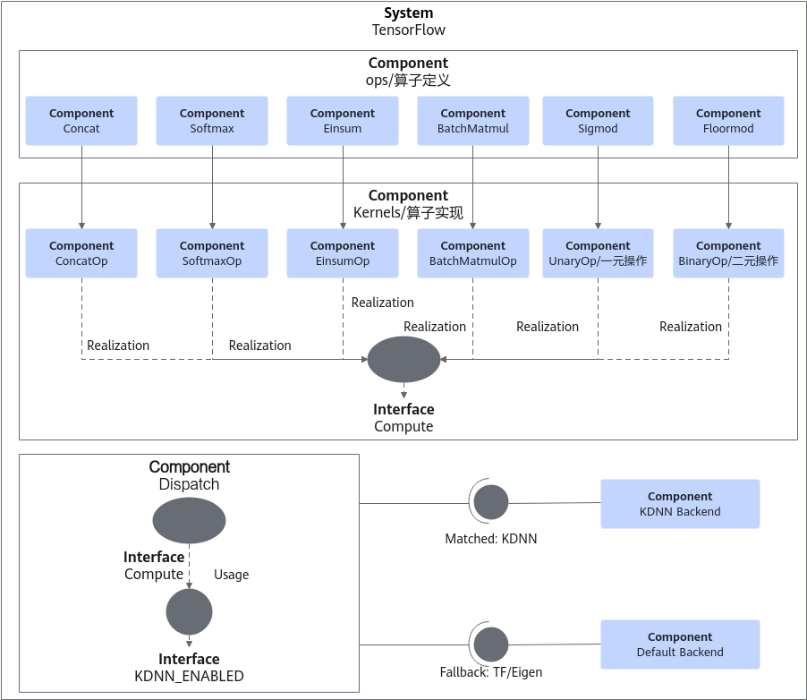

### 规格

本节介绍当前已经支持KDNN线程直通特性的算子及使用规格

已经支持KDNN线程直通特性的算子约束如[表1 KDNN线程直通特性支持范围](#table8731173784819)所示。

**表 1**  KDNN线程直通特性支持范围

<a name="table8731173784819"></a>

<table><thead align="left"><tr id="row573183720488"><th class="cellrowborder" colspan="2" valign="top" id="mcps1.2.9.1.1"><p id="p06021725181316"><a name="p06021725181316"></a><a name="p06021725181316"></a>算子名称</p>
</th>
<th class="cellrowborder" colspan="4" valign="top" id="mcps1.2.9.1.2"><p id="p106022025191315"><a name="p106022025191315"></a><a name="p106022025191315"></a>数据类型约束</p>
</th>
<th class="cellrowborder" valign="top" id="mcps1.2.9.1.3"><p id="p16011255131"><a name="p16011255131"></a><a name="p16011255131"></a>维度约束</p>
</th>
<th class="cellrowborder" valign="top" id="mcps1.2.9.1.4"><p id="p55991325131312"><a name="p55991325131312"></a><a name="p55991325131312"></a>其他约束</p>
</th>
</tr>
</thead>
<tbody><tr id="row273812420184"><td class="cellrowborder" colspan="2" valign="top" headers="mcps1.2.9.1.1 "><p id="p1902143641316"><a name="p1902143641316"></a><a name="p1902143641316"></a>ConcatV2</p>
</td>
<td class="cellrowborder" colspan="4" valign="top" headers="mcps1.2.9.1.2 "><p id="p89021636161316"><a name="p89021636161316"></a><a name="p89021636161316"></a>fp32、fp16、bf16、int32、int8、uint8</p>
</td>
<td class="cellrowborder" valign="top" headers="mcps1.2.9.1.3 "><p id="p109011236121313"><a name="p109011236121313"></a><a name="p109011236121313"></a>无</p>
</td>
<td class="cellrowborder" valign="top" headers="mcps1.2.9.1.4 "><p id="p76311158114918"><a name="p76311158114918"></a><a name="p76311158114918"></a>无</p>
</td>
</tr>
<tr id="row19133202192018"><td class="cellrowborder" colspan="2" valign="top" headers="mcps1.2.9.1.1 "><p id="p1033714554132"><a name="p1033714554132"></a><a name="p1033714554132"></a>BatchMatMul</p>
</td>
<td class="cellrowborder" colspan="4" valign="top" headers="mcps1.2.9.1.2 "><p id="p15337165511132"><a name="p15337165511132"></a><a name="p15337165511132"></a>fp32</p>
</td>
<td class="cellrowborder" valign="top" headers="mcps1.2.9.1.3 "><p id="p1833785511316"><a name="p1833785511316"></a><a name="p1833785511316"></a><span>2D-5D</span></p>
</td>
<td class="cellrowborder" valign="top" headers="mcps1.2.9.1.4 "><p id="p26461358164910"><a name="p26461358164910"></a><a name="p26461358164910"></a>无</p>
</td>
</tr>
<tr id="row1663113411277"><td class="cellrowborder" colspan="2" valign="top" headers="mcps1.2.9.1.1 "><p id="p1663113411277"><a name="p1663113411277"></a><a name="p1663113411277"></a>SparseMatmul</p>
</td>
<td class="cellrowborder" colspan="4" valign="top" headers="mcps1.2.9.1.2 "><p id="p563113411727"><a name="p563113411727"></a><a name="p563113411727"></a>fp32</p>
</td>
<td class="cellrowborder" valign="top" headers="mcps1.2.9.1.3 "><p id="p126311341327"><a name="p126311341327"></a><a name="p126311341327"></a>2D</p>
</td>
<td class="cellrowborder" valign="top" headers="mcps1.2.9.1.4 "><p id="p963193412714"><a name="p963193412714"></a><a name="p963193412714"></a>输出矩阵的列数不小于32</p>
</td>
</tr>
<tr id="row171941117162015"><td class="cellrowborder" colspan="2" valign="top" headers="mcps1.2.9.1.1 "><p id="p5431181116145"><a name="p5431181116145"></a><a name="p5431181116145"></a>Einsum</p>
</td>
<td class="cellrowborder" colspan="4" valign="top" headers="mcps1.2.9.1.2 "><p id="p1943016119149"><a name="p1943016119149"></a><a name="p1943016119149"></a>fp32</p>
</td>
<td class="cellrowborder" valign="top" headers="mcps1.2.9.1.3 "><p id="p1043051115143"><a name="p1043051115143"></a><a name="p1043051115143"></a>无</p>
</td>
<td class="cellrowborder" valign="top" headers="mcps1.2.9.1.4 "><p id="p3659558154917"><a name="p3659558154917"></a><a name="p3659558154917"></a>无</p>
</td>
</tr>
<tr id="row4303415132016"><td class="cellrowborder" colspan="2" valign="top" headers="mcps1.2.9.1.1 "><p id="p5429101117142"><a name="p5429101117142"></a><a name="p5429101117142"></a>Sigmoid</p>
</td>
<td class="cellrowborder" colspan="4" valign="top" headers="mcps1.2.9.1.2 "><p id="p84291211151415"><a name="p84291211151415"></a><a name="p84291211151415"></a>fp32</p>
</td>
<td class="cellrowborder" valign="top" headers="mcps1.2.9.1.3 "><p id="p1342841171412"><a name="p1342841171412"></a><a name="p1342841171412"></a>非空的任意维度</p>
</td>
<td class="cellrowborder" valign="top" headers="mcps1.2.9.1.4 "><p id="p1260874031514"><a name="p1260874031514"></a><a name="p1260874031514"></a>无</p>
</td>
</tr>
<tr id="row1235520136201"><td class="cellrowborder" colspan="2" valign="top" headers="mcps1.2.9.1.1 "><p id="p4427171131419"><a name="p4427171131419"></a><a name="p4427171131419"></a>FloorMod</p>
</td>
<td class="cellrowborder" colspan="4" valign="top" headers="mcps1.2.9.1.2 "><p id="p1042761151418"><a name="p1042761151418"></a><a name="p1042761151418"></a>int64、fp32</p>
</td>
<td class="cellrowborder" valign="top" headers="mcps1.2.9.1.3 "><p id="p154271711181411"><a name="p154271711181411"></a><a name="p154271711181411"></a>非空的任意维度</p>
</td>
<td class="cellrowborder" valign="top" headers="mcps1.2.9.1.4 "><p id="p74261611151414"><a name="p74261611151414"></a><a name="p74261611151414"></a>无</p>
</td>
</tr>
<tr id="row204255116209"><td class="cellrowborder" colspan="2" valign="top" headers="mcps1.2.9.1.1 "><p id="p16426141116147"><a name="p16426141116147"></a><a name="p16426141116147"></a>Softmax</p>
</td>
<td class="cellrowborder" colspan="4" valign="top" headers="mcps1.2.9.1.2 "><p id="p14425141171412"><a name="p14425141171412"></a><a name="p14425141171412"></a>fp32</p>
</td>
<td class="cellrowborder" valign="top" headers="mcps1.2.9.1.3 "><p id="p9425101111146"><a name="p9425101111146"></a><a name="p9425101111146"></a>2D</p>
</td>
<td class="cellrowborder" valign="top" headers="mcps1.2.9.1.4 "><p id="p144231611121419"><a name="p144231611121419"></a><a name="p144231611121419"></a>仅支持沿第二维度（行）执行softmax运算</p>
</td>
</tr>
</tbody>
</table>

### 应用场景

TensorFlow KDNN线程直通优化特性主要在高并发推理场景中使用，表现在吞吐量的提升和推理时延大幅下降。

### 原理描述

本节针对KDNN Threadpool线程直通的优化特性进行描述，以帮助用户更好地使用。

**图 2**  OMP并行<a name="fig19954351104320"></a><a id="OMP并行示意图"></a>

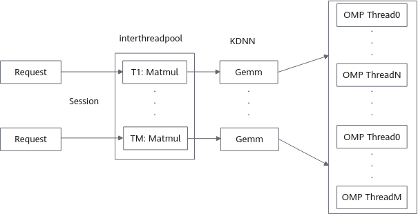

如[**图 2**  OMP并行](#OMP并行示意图)所示，OMP版本的KDNN中，每个算子将创建N个OMP线程计算，M个Kernel并发则会创建M*N个OMP线程。

**图 3**  Threadpool线程直通<a name="fig1203165984517"></a><a id="Threadpool线程直通示意图"></a>

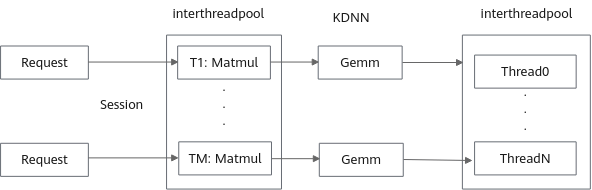

如[**图 3**  Threadpool线程直通](#Threadpool线程直通示意图)所示，使能线程直通后，会复用框架线程池，KDNN将计算任务提交到框架线程池统一调度，降低了线程创建的损耗同时避免了线程数爆炸的问题。

## SparseMatmul多线程优化

### 简介

SparseMatmul算子属于KDNN算子库，用于计算稀疏矩阵与稠密矩阵的乘积，支持单精度FP32输入。该算子是推荐模型NN层的核心组件。
算子基于压缩稀疏行（CSR）存储结构设计，通过在装载与计算阶段跳过零块，实现计算与访存的高效利用。核心计算内核针对鲲鹏平台进行了SIMD优化，支持NEON指令集，并实现了多线程优化。

### 优化设计

SparseMatmul多线程优化包含以下关键设计：

1. **数据并行**：按输出矩阵的列维度进行分片，每个线程处理独立的列块。
2. **无锁设计**：为每个线程分配独立缓冲区，避免线程间同步开销，同时消除伪共享问题。
3. **负载均衡**：采用均匀分片策略，使各线程工作量尽可能均衡。
4. **内存优化**：使用内存对齐分配接口，提升SIMD向量化执行效率。

在以下场景下会自动回退到串行算法，以避免多线程调度带来的额外开销：

- 线程池不可用
- 存在嵌套并行
- 仅单线程执行

通过对Sparse MatMul的并行化改造和执行路径优化，算子能够在多核CPU场景下更充分地利用硬件资源，降低计算耗时。

### 优化实现

**算法逻辑**

1. **列分片策略**：将输出矩阵的列按线程数均匀分割。
2. **线程私有缓冲区**：为每个线程分配独立的计算缓冲区，避免数据竞争。
3. **并行执行**：复用框架线程池，KDNN将计算任务提交到框架线程池统一调度。
4. **单线程回退条件**：在线程池指针为空、当前已在并行区域或线程池线程数小于等于1时使用串行算法。

**接口变化**

新增`ThreadpoolIface *tp`参数，用于传递线程池实例。

## EmbeddingTableLookup算子

### 简介

EmbeddingTableLookup是KEmbedding算子库中的核心算子，用于推荐系统中高效执行稀疏Embedding查找操作。该算子能从预先加载的资源表中按key查找稀疏Embedding，并输出标准SparseTensor三元组（indices、values、dense_shape），具有高性能和低延迟的特点。
典型使用场景是把离线构建好的稀疏embedding表加载到推理进程内存中，然后在推理过程中按一批key执行快速查找，适合推荐模型数据处理层的需求。

### 使用流程

使用EmbeddingTableLookup算子通常需要三个步骤。

1. 调用`EmbeddingIndexToValueTable`创建资源表句柄。
2. 调用`InitializeEmbeddingIndexToValueTableFromTextFile`从二进制文件初始化资源表。
3. 调用`EmbeddingTableLookup`执行批量查找。

其中，`InitializeEmbeddingIndexToValueTableFromTextFile`名称中保留`TextFile`是历史命名，实际读取的输入文件不是文本文件，而是KEmbedding二进制表文件。

### 文件与内存组织

Embedding表文件由两部分组成：

- 文件头：保存`total_key_size`、字节序等元信息。
- 数据区：每个key依次保存有效维度个数、有效维度索引数组、对应float值数组。

加载完成后，资源表内部按分桶方式保存：

- 外层为固定bucket数量的`std::vector`。
- 每个bucket内部使用`absl::flat_hash_map<uint64_t, EmbeddingValue>`。
- value为若干`(valid_value_index, valid_value)`对。

### 示例说明

假设构建如下表内容：

- key `101` -> `(0, 1.0)`、`(2, 3.0)`
- key `202` -> `(1, 2.5)`

使用如下输入进行查找：

```python
keys = [101, 202, 999]  # 第三个 key 999 未命中
emb_dim = 4
```

输出结果为：

```python
indices = [[0, 0], [0, 2], [1, 1]]
values = [1.0, 3.0, 2.5]
dense_shape = [3, 4]  # 3 是 key 数量，4 是 embedding 维度
```

### ARM优化设计

在ARM64平台上，EmbeddingTableLookup算子进行了以下多方面优化，这些优化使得EmbeddingTableLookup算子在ARM平台上的性能大幅提升，适合高并发的推荐模型推理场景。

**按key分片并行查找**

- 通过TensorFlow shard并行方法将key向量切分给多个worker线程。
- 每个线程负责一个区间内的key查找，适合批量请求场景。

**减少内存分配和扩容成本**

- 原方法通过`reserve(key_cnt * emb_dim)`按“最大可能值”预留内存，实际结果通常远小于这个值，导致内存浪费。
- 优化实现先通过`shard_results`做一遍计数，得到精确的`value_tensor_size`，然后一次性分配最终输出。

**去掉中间vector缓冲，直接写Tensor**

- 原方法先把结果攒到中间vector，最后再复制到输出Tensor。
- 优化实现先统计总大小，直接分配输出Tensor，然后直接写入结果，减少额外的内存复制开销。

## TensorFlow ANNC静态图融合

### 简介

本章节介绍了TensorFlow ANNC静态图融合优化特性的基本概念和实现原理。

为提升TensorFlow推理性能，鲲鹏BoostKit提出了TensorFlow ANNC静态图融合优化方案。鲲鹏BoostKit提供了多个自定义算子，在图优化阶段利用remapper机制将符合特定特征的计算子图替换为自定义算子。静态图融合通过消除中间内存开销、优化访存逻辑等，实现端到端的性能提升。当前支持如下算子：

- KPFusedEmbeddingActionIdGather
- KPFusedGather
- KPFusedEmbeddingPadding
- KPFusedEmbeddingPaddingFast
- KPFusedSparseDynamicStitch
- KPFusedSparseReshape
- KPFusedSparseSegmentReduce
- KPFusedSparseSegmentReduceNonzero
- KPFusedSparseSelect

ANNC静态图融合特性开关通过代码补丁的方式接入TensorFlow，基于TensorFlow 2.15版本增加。
开启ANNC静态图融合特性条件下，如果计算图子图符合特定结构并且输入输出满足约束，会在图优化阶段将符合要求的子图替换为对应的自定义算子。

### 软件架构

ANNC静态图融合软件架构图如[图4](#fig4919356463)所示。

**图 4**  ANNC静态图融合软件架构图<a name="fig4919356463"></a>

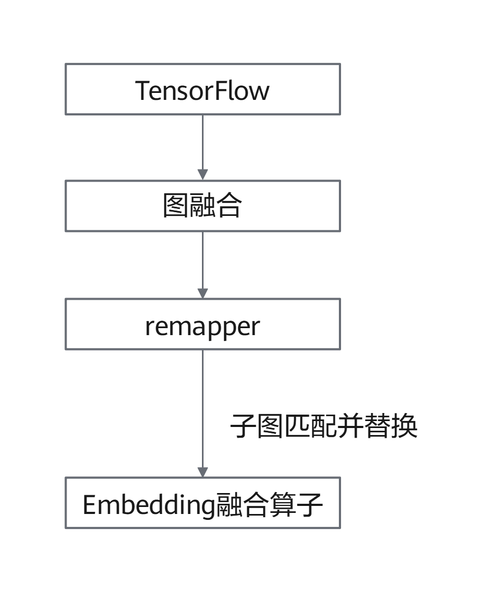

### 规格

本节介绍当前已经支持自定义算子及使用约束。

#### KPFusedEmbeddingActionIdGather算子

**开源子图结构**

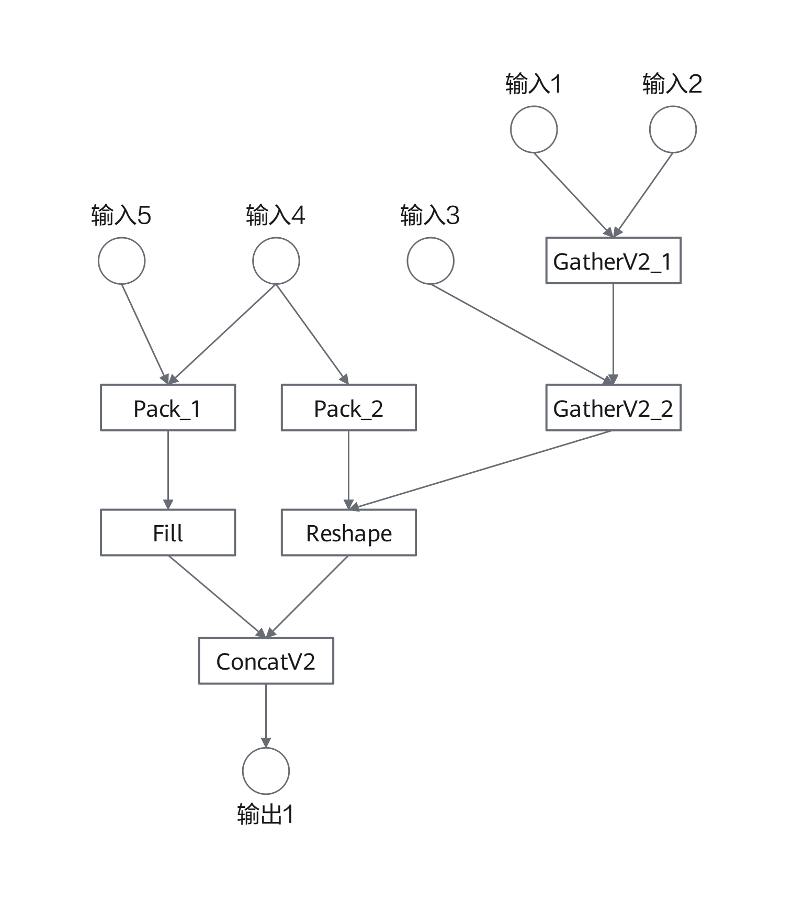

**输入输出约束**

| 输入名称 | 数据类型    | 形状    |
| -------- | ----------- | ------- |
| 输入1    | int32/int64 | 2维张量 |
| 输入2    | float       | 2维张量 |
| 输入3    | int32/int64 | 2维张量 |
| 输入4    | int32       | 标量    |
| 输入5    | int32       | 标量    |

| 输出名称 | 数据类型 |
| -------- | -------- |
| 输出1    | float    |

#### KPFusedGather算子

**开源子图结构**

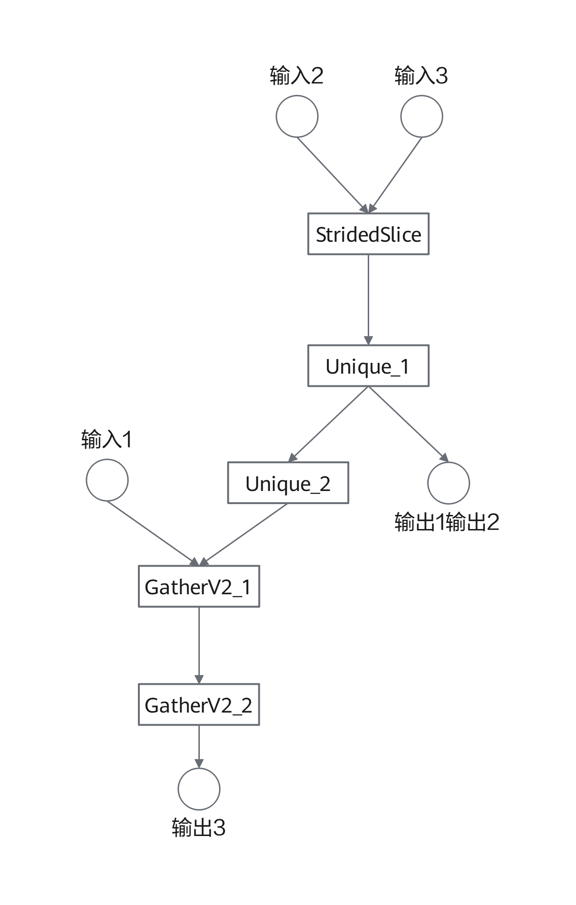

**输入输出约束**

| 输入名称 | 数据类型 | 形状    |
| -------- | -------- | ------- |
| 输入1    | float    | 2维张量 |
| 输入2    | int64    | 2维张量 |
| 输入3    | int32    | [2]     |

| 输出名称 | 数据类型 |
| -------- | -------- |
| 输出1    | int64    |
| 输出2    | int32    |
| 输出3    | float    |

#### KPFusedEmbeddingPadding算子

**开源子图结构**

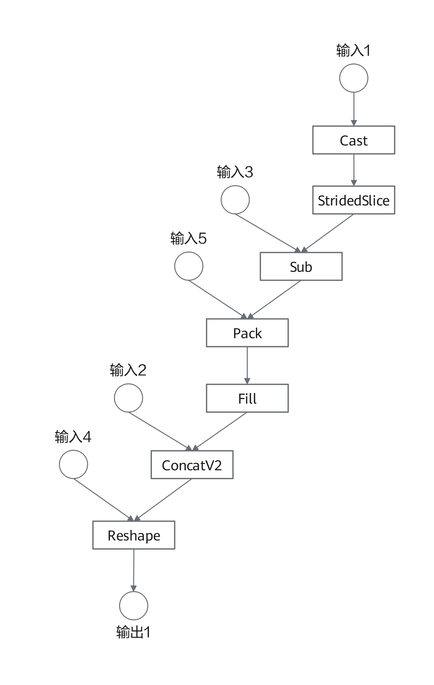

**输入输出约束**

| 输入名称 | 数据类型 | 形状    |
| -------- | -------- | ------- |
| 输入1    | int64    | [2]     |
| 输入2    | float    | 2维张量 |
| 输入3    | int32    | 标量    |
| 输入4    | int32    | [2]     |
| 输入5    | int32    | 标量    |

| 输出名称 | 数据类型 |
| -------- | -------- |
| 输出1    | int32    |
| 输出2    | float    |

#### KPFusedEmbeddingPaddingFast算子

**开源子图结构**

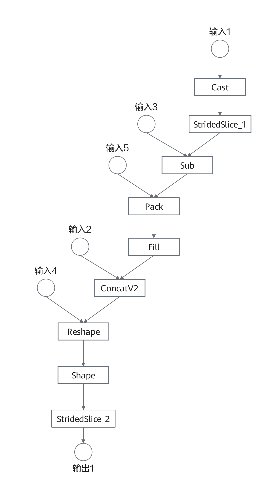

**输入输出约束**

| 输入名称 | 数据类型 | 形状    |
| -------- | -------- | ------- |
| 输入1    | int64    | [2]     |
| 输入2    | float    | 2维张量 |
| 输入3    | int32    | 标量    |
| 输入4    | int32    | [2]     |
| 输入5    | int32    | 标量    |

| 输出名称 | 数据类型 |
| -------- | -------- |
| 输出1    | int32    |
| 输出2    | int32    |

#### KPFusedSparseDynamicStitch算子

**开源子图结构**

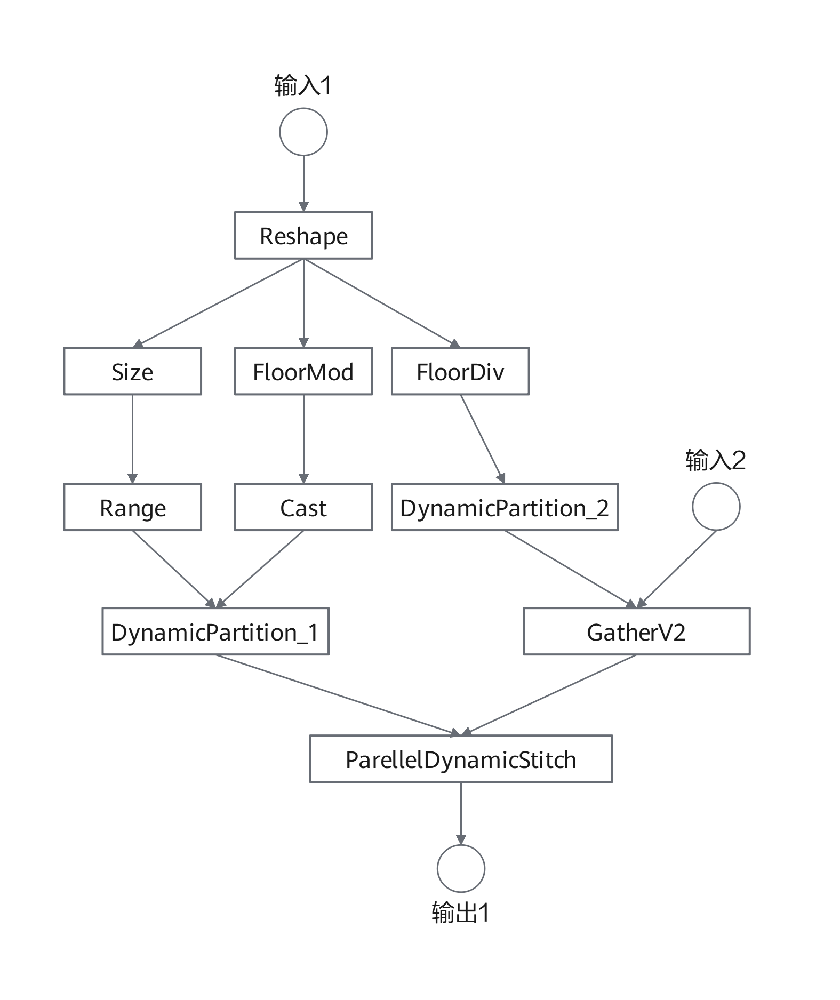

**输入输出约束**

| 输入名称 | 数据类型 | 形状              |
| -------- | -------- | ----------------- |
| 输入1    | int64    | 张量              |
| 输入2    | float    | 非空的2维张量列表 |

| 输出名称 | 数据类型 |
| -------- | -------- |
| 输出1    | float    |

#### KPFusedSparseReshape算子

**开源子图结构**

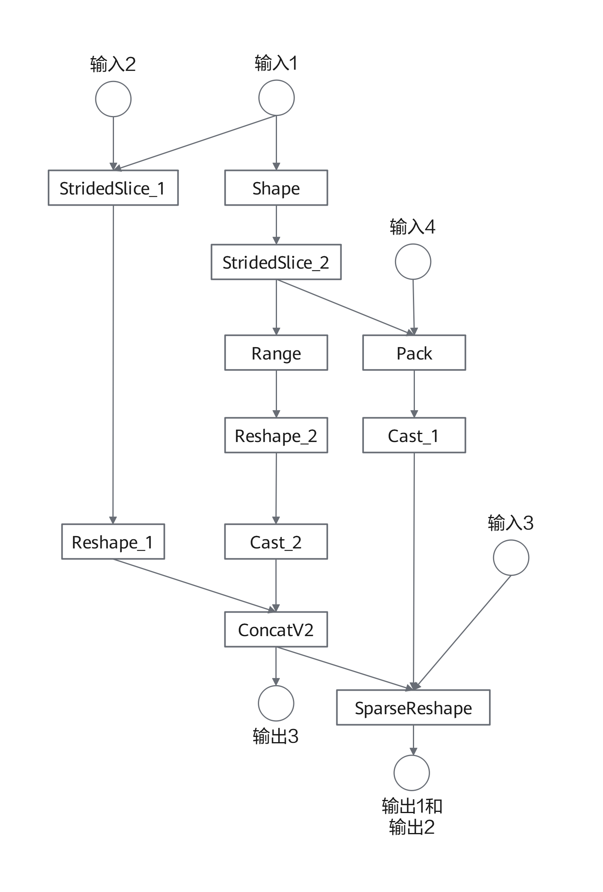

**输入输出约束**

| 输入名称 | 数据类型    | 形状    |
| -------- | ----------- | ------- |
| 输入1    | int64       | 2维张量 |
| 输入2    | int32       | [2]     |
| 输入3    | int64       | [2]     |
| 输入4    | int32/int64 | 标量    |

| 输出名称 | 数据类型 |
| -------- | -------- |
| 输出1    | int64    |
| 输出2    | int64    |

#### KPFusedSparseSegmentReduce算子

**开源子图结构**

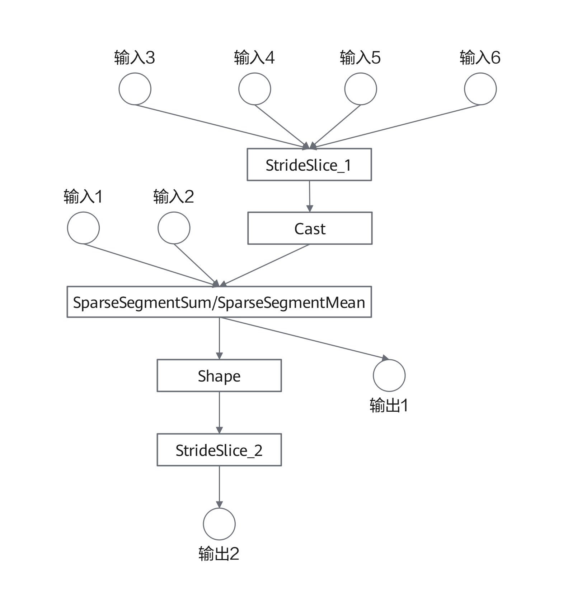

**输入输出约束**

| 输入名称 | 数据类型    | 形状    |
| -------- | ----------- | ------- |
| 输入1    | float       | 2维张量 |
| 输入2    | int32/int64 | 1维张量 |
| 输入3    | int64       | 2维张量 |
| 输入4    | int32       | [2]     |
| 输入5    | int32       | 标量    |

| 输出名称 | 数据类型 |
| -------- | -------- |
| 输出1    | float    |
| 输出2    | int32    |

#### KPFusedSparseSegmentReduceNonzero算子

**开源子图结构**

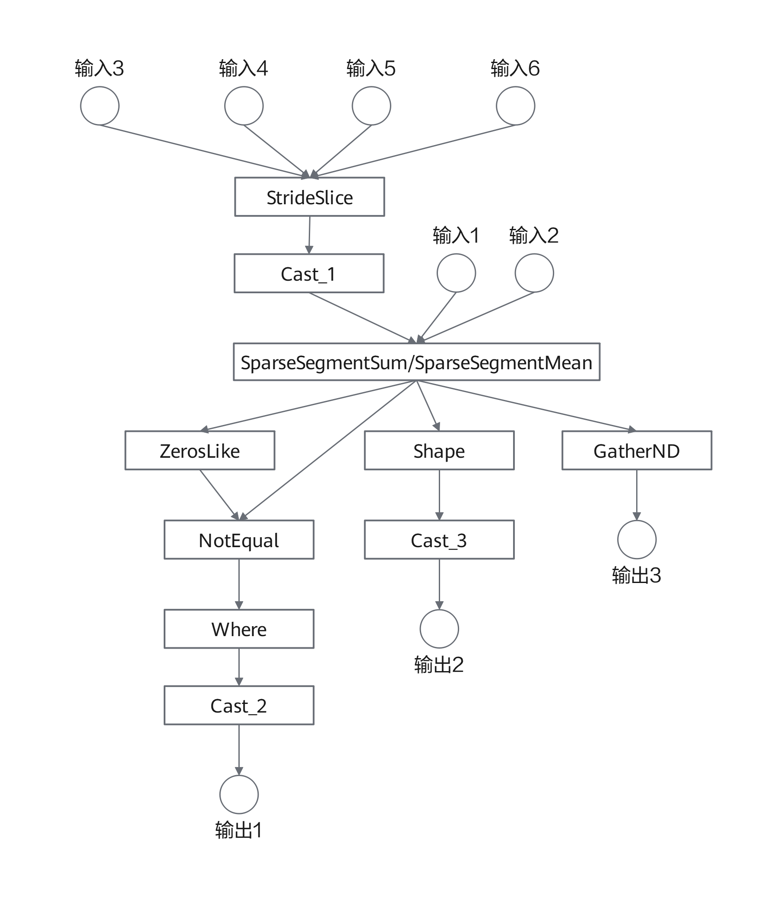

**输入输出约束**

| 输入名称 | 数据类型    | 形状    |
| -------- | ----------- | ------- |
| 输入1    | float       | 1维张量 |
| 输入2    | int32/int64 | 1维张量 |
| 输入3    | int64       | 2维张量 |
| 输入4    | int32       | [2]     |

| 输出名称 | 数据类型 |
| -------- | -------- |
| 输出1    | int32    |
| 输出2    | int32    |
| 输出3    | float    |

#### KPFusedSparseSelect算子

**开源子图结构**

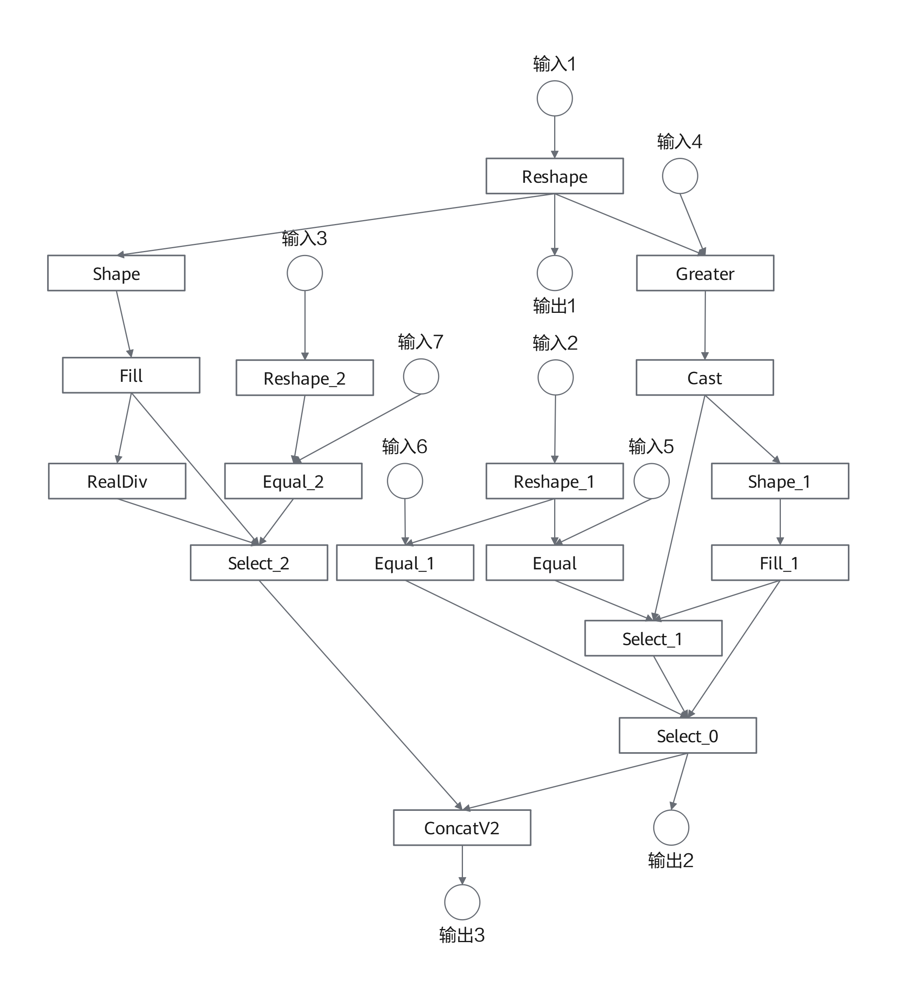

**输入输出约束**

| 输入名称 | 数据类型 | 形状 |
| -------- | -------- | ---- |
| 输入1    | int32    | 张量 |
| 输入2    | int32    | 张量 |
| 输入3    | int32    | 张量 |
| 输入4    | int32    | 标量 |
| 输入5    | int32    | 标量 |
| 输入6    | int32    | 标量 |
| 输入7    | int32    | 标量 |

| 输出名称 | 数据类型 |
| -------- | -------- |
| 输出1    | int32    |
| 输出2    | float    |
| 输出3    | float    |

>  **说明：**
> 开启Embedding算子融合条件下，如果存在符合要求的子图则会在图优化阶段替换为对应的自定义算子，否则使用TensorFlow开源接口。

### 应用场景

TensorFlow ANNC静态图融合主要在高并发推理场景中使用，表现在吞吐量的提升和推理时延大幅下降。

### 原理描述

本节针对ANNC静态图融合优化特性进行描述，以帮助用户更好地使用。

使能ANNC静态图融合后，会在图优化阶段将符合要求的子图替换为对应的自定义算子，进而减少中间内存开销、优化访存逻辑等，实现端到端的性能提升。

**图 5**  算子融合原理图<a name="fig4919356474"></a>

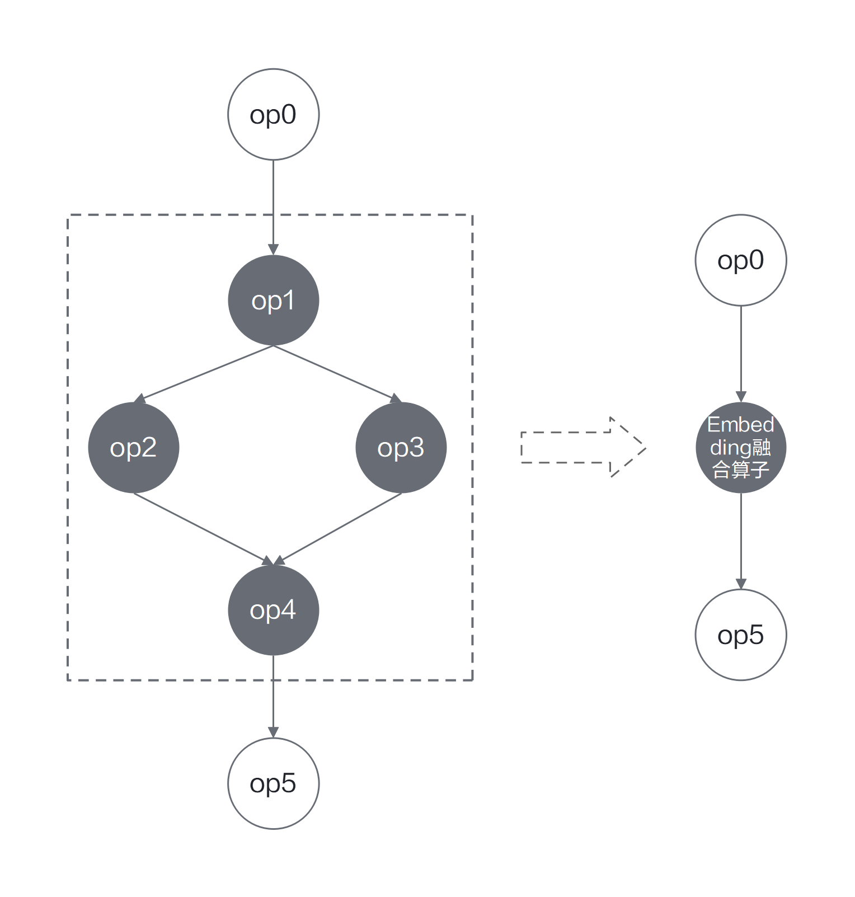

## TensorFlow ANNC图编译优化特性（Legacy）

>  **说明：**
> 本特性已冻结在独立Legacy补丁中，仅支持直接应用到官方TensorFlow
> `v2.15.0`基线，不属于当前维护的默认Profile，也不保证与其他特性补丁兼容。

### 简介

本章节介绍了TensorFlow ANNC（Accelerated Neural Network Compiler）图编译优化特性的基本概念和实现原理。

为提升TensorFlow Serving（以下简称TF Serving）推理性能，鲲鹏BoostKit提出了TensorFlow ANNC图编译优化方案。ANNC是专注于加速神经网络计算的编译器，聚焦于通过计算图优化，高性能融合算子生成和对接技术，高效代码生成和优化能力，加速推荐的推理性能。ANNC作为基于开源OpenXLA（Open Accelerated Linear Algebra）的扩展加速套件，发布在openEuler组织的ANNC开源仓，具有鲲鹏亲和的优化特性，通过编译选项和代码补丁的方式接入TensorFlow推理框架和XLA，基于TensorFlow Serving/TensorFlow 2.15版本新增TensorFlow图融合、XLA（Accelerated Linear Algebra）图融合、算子优化和常量折叠优化特性。

- TensorFlow图融合：提供TensorFlow模型层面的图融合与图重写功能。
- XLA图融合：提供ANNC XLA图融合特性。
- 算子优化：提供ANNC算子优化特性。
- 常量折叠优化：提供ANNC常量折叠优化特性。

>  **说明：**
> OpenXLA是一个由高性能、可移植、可扩展的机器学习基础架构组件组成的开放生态系统。
> XLA是一种开源机器学习编译器。XLA编译器从TensorFlow框架获取模型，并优化模型以便在不同硬件平台（包括GPU、CPU和机器学习加速器）上实现高性能执行。

### 软件架构

TF Serving软件架构如[**图 6** TF Serving软件架构](#TF-Serving软件架构)所示，组件功能如[**表 1** TF Serving软件组件功能介绍](#TF-Serving软件组件功能介绍)所示。

**图 6** TF Serving软件架构<a name="fig2460131971612"></a><a id="TF-Serving软件架构"></a>

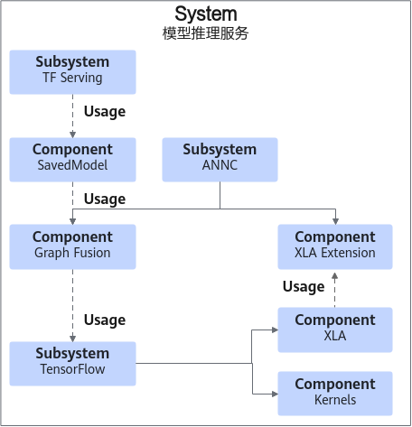

**表 1** TF Serving软件组件功能介绍<a id="TF-Serving软件组件功能介绍"></a>

<a name="table17527817415"></a>
<table><thead align="left"><tr id="row13527611645"><th class="cellrowborder" valign="top" width="20%" id="mcps1.2.3.1.1"><p id="p1452751848"><a name="p1452751848"></a><a name="p1452751848"></a>组件名称</p>
</th>
<th class="cellrowborder" valign="top" width="80%" id="mcps1.2.3.1.2"><p id="p3527312418"><a name="p3527312418"></a><a name="p3527312418"></a>描述</p>
</th>
</tr>
</thead>
<tbody><tr id="row9527411342"><td class="cellrowborder" valign="top" width="20%" headers="mcps1.2.3.1.1 "><p id="p652710118414"><a name="p652710118414"></a><a name="p652710118414"></a>TF Serving</p>
</td>
<td class="cellrowborder" valign="top" width="80%" headers="mcps1.2.3.1.2 "><p id="p12527316419"><a name="p12527316419"></a><a name="p12527316419"></a>专为TensorFlow模型部署设计的高性能推理服务端。</p>
</td>
</tr>
<tr id="row890710021716"><td class="cellrowborder" valign="top" width="20%" headers="mcps1.2.3.1.1 "><p id="p175272111416"><a name="p175272111416"></a><a name="p175272111416"></a>SavedModel</p>
</td>
<td class="cellrowborder" valign="top" width="80%" headers="mcps1.2.3.1.2 "><p id="p185271018417"><a name="p185271018417"></a><a name="p185271018417"></a>TensorFlow提供的一种标准化的模型保存格式，训练好的模型能够在不同的TensorFlow环境中进行导入、推理和再训练。</p>
</td>
</tr>
<tr id="row552715117416"><td class="cellrowborder" valign="top" width="20%" headers="mcps1.2.3.1.1 "><p id="p060405316012"><a name="p060405316012"></a><a name="p060405316012"></a>Graph Fusion</p>
</td>
<td class="cellrowborder" valign="top" width="80%" headers="mcps1.2.3.1.2 "><p id="p1860416535018"><a name="p1860416535018"></a><a name="p1860416535018"></a>ANNC图融合模块。</p>
</td>
</tr>
<tr id="row1552751643"><td class="cellrowborder" valign="top" width="20%" headers="mcps1.2.3.1.1 "><p id="p652710113419"><a name="p652710113419"></a><a name="p652710113419"></a>TensorFlow</p>
</td>
<td class="cellrowborder" valign="top" width="80%" headers="mcps1.2.3.1.2 "><p id="p3527201147"><a name="p3527201147"></a><a name="p3527201147"></a>开源的机器学习框架，主要用于深度学习模型的训练和推理。</p>
</td>
</tr>
<tr id="row1145126151312"><td class="cellrowborder" valign="top" width="20%" headers="mcps1.2.3.1.1 "><p id="p134819201318"><a name="p134819201318"></a><a name="p134819201318"></a>ANNC</p>
</td>
<td class="cellrowborder" valign="top" width="80%" headers="mcps1.2.3.1.2 "><p id="p183481199139"><a name="p183481199139"></a><a name="p183481199139"></a>专为机器学习模型优化的AI编译器，能够将模型编译成高性能可执行代码。</p>
</td>
</tr>
<tr id="row53481395136"><td class="cellrowborder" valign="top" width="20%" headers="mcps1.2.3.1.1 "><p id="p117197117117"><a name="p117197117117"></a><a name="p117197117117"></a>XLA Extension</p>
</td>
<td class="cellrowborder" valign="top" width="80%" headers="mcps1.2.3.1.2 "><p id="p3719131119116"><a name="p3719131119116"></a><a name="p3719131119116"></a>ANNC基于XLA的扩展组件。</p>
</td>
</tr>
<tr id="row512919311905"><td class="cellrowborder" valign="top" width="20%" headers="mcps1.2.3.1.1 "><p id="p134526191311"><a name="p134526191311"></a><a name="p134526191311"></a>XLA</p>
</td>
<td class="cellrowborder" valign="top" width="80%" headers="mcps1.2.3.1.2 "><p id="p204518611318"><a name="p204518611318"></a><a name="p204518611318"></a><span>开源机器学习编译器</span>。</p>
</td>
</tr>
<tr id="row116041953806"><td class="cellrowborder" valign="top" width="20%" headers="mcps1.2.3.1.1 "><p id="p161299311305"><a name="p161299311305"></a><a name="p161299311305"></a>Kernels</p>
</td>
<td class="cellrowborder" valign="top" width="80%" headers="mcps1.2.3.1.2 "><p id="p2129143115012"><a name="p2129143115012"></a><a name="p2129143115012"></a>TensorFlow算子实现。</p>
</td>
</tr>
</tbody>
</table>

### 应用场景

TensorFlow ANNC图编译优化特性主要在推荐系统和广告投放中使用。对于高并发粗排模型推理场景优化效果明显，表现在吞吐量的提升和推理时延大幅下降。

### 原理描述

本节针对TensorFlow/XLA的优化特性进行描述，以帮助用户更好地使用。

**TensorFlow图融合**

在TensorFlow模型中存在一些子图包含冗余计算，通过识别特定的图模式，将子图中的多个算子融合为一个“融合算子”，能够避免冗余计算，优化访存，提升模型推理性能，如[**图 7** TensorFlow图融合示意图](#TensorFlow图融合示意图)所示。本功能在前端提供TensorFlow模型层面的图融合与图重写功能，在后端提供“自定义融合算子”的手动实现。

**图 7** TensorFlow图融合示意图<a name="fig836316691915"></a><a id="TensorFlow图融合示意图"></a>

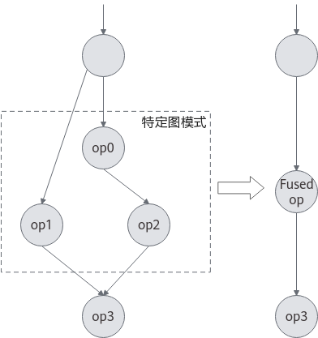

**XLA图融合**

XLA自身提供了多种与硬件无关的图融合优化策略，但是优化后的聚类（包括融合部分）仍可能包含重复计算，即多个融合操作之间存在相同或可合并的子表达式。如[**图 8** XLA图融合示意图](#XLA图融合示意图)所示，本功能旨在识别融合后的重复计算，如[**图 8** XLA图融合示意图](#XLA图融合示意图)中F1操作；并通过预融合策略消除冗余计算，如[**图 8** XLA图融合示意图](#XLA图融合示意图)中F4、F5、F6操作的融合，以进一步提升模型推理效率。

**图 8** XLA图融合示意图<a name="fig5154159193015"></a><a id="XLA图融合示意图"></a>

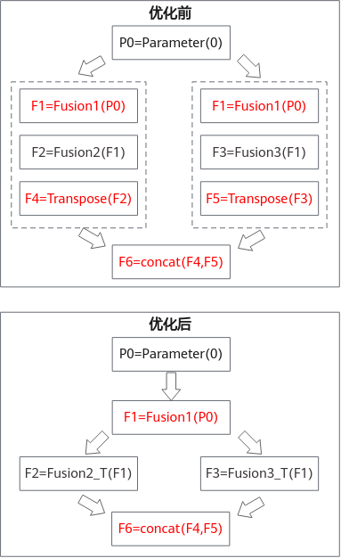

**算子优化**

本功能包含各阶段的算子优化，包括将MatMul（Matrix Multiplication）算子下发至XLA，调用OpenBLAS（Open Basic Linear Algebra Subprograms）所提供的GEMM（General Matrix Multiplication）运算接口，包括将Softmax函数替换为更高效的实现；同时本功能通过识别特定的操作模式，减少其中的冗余操作，进一步提升模型的推理性能，例如：针对多个切片后进行拼接的模式，删除其中冗余的切片操作。

**常量折叠优化**

本功能专注于优化含有常量操作数的矩阵乘算子中常量操作数的打包开销。面对矩阵乘算子C=A*B，其中至少一个操作数为常量（例如推理模型中的权重B）的OpenBLAS调用场景。此类操作数在编译时已知权重的数值和形状，且运行时不发生改变。在未启用本优化时，ANNC编译器为满足硬件访存对齐和缓存局部性要求，需要对常量操作数进行数据打包和重排，如[**图 9** 数据打包示意图](#数据打包示意图)所示。由于该操作常量操作数的合法布局完全可以在编译器唯一确定，因此在该场景下将打包操作前置到编译期，启用本优化后，通过编译期间离线打包工具和专用免重排后端kpgeemm，可以彻底消除运行时的冗余开销，如[**图 10** 常量折叠流程示意图](#常量折叠流程示意图)所示。

**图 9** 数据打包示意图<a name="fig836316691916"></a><a id="数据打包示意图"></a>

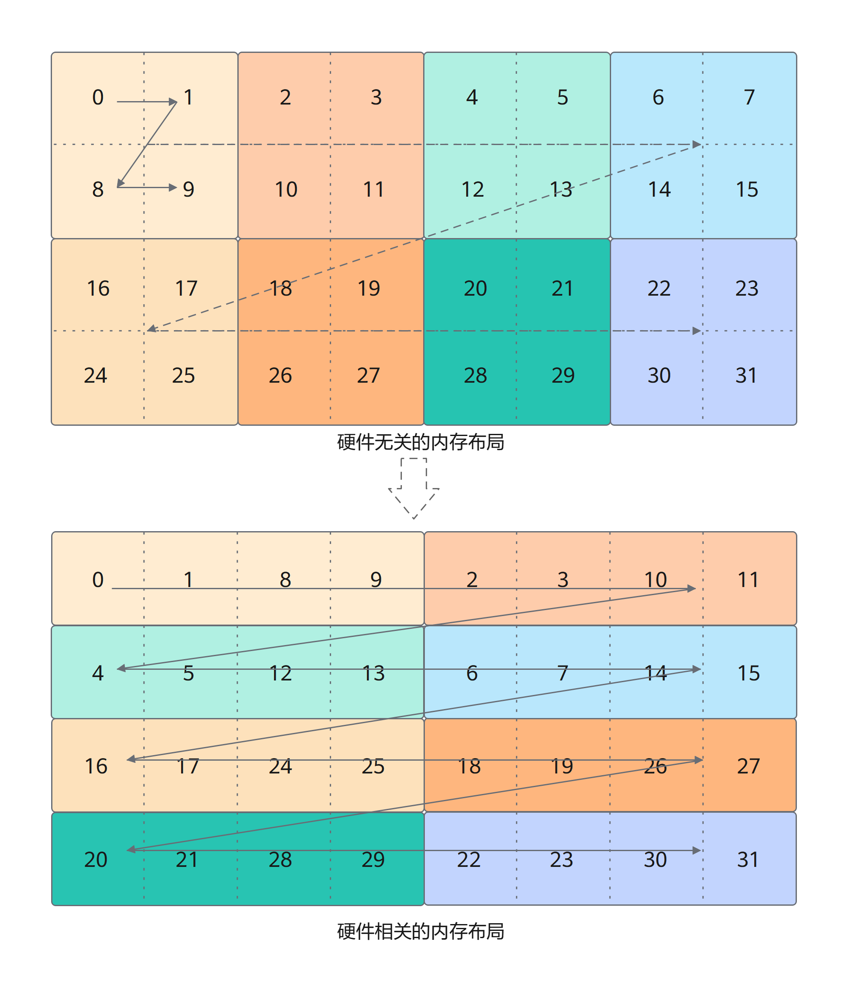

**图 10** 常量折叠流程示意图<a name="fig836316691917"></a><a id="常量折叠流程示意图"></a>

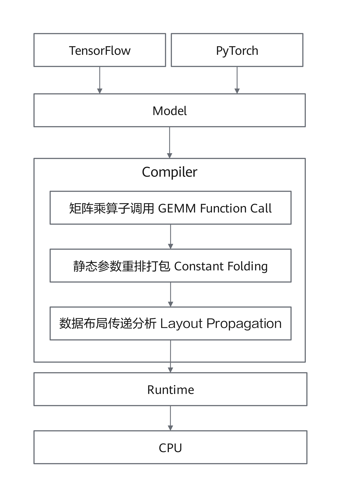

功能配置的详细说明请参见《<a href="./quick_start.md">快速入门</a>》。

## TensorFlow Serving 线程调度优化特性（Legacy）

>  **说明：**
> 本特性已冻结在独立Legacy补丁中，仅支持直接应用到官方TensorFlow `v2.15.0`基线，不属于当前维护的默认Profile，也不保证与其他特性补丁兼容。

### 简介

本章节介绍了TensorFlow Serving线程调度优化特性的基本概念和实现原理。

为提升TensorFlow Serving（以下简称TF Serving）推理性能，鲲鹏BoostKit提出了TensorFlow Serving线程调度优化方案。传统TensorFlow使用算子间的线程池并行计算不同的算子，虽可实现没有数据依赖的算子的并发执行，但在高并发场景下，多Session共享算子间线程池会导致任务抢占，严重降低整图计算效率。针对这一痛点，鲲鹏BoostKit TensorFlow Serving线程调度优化特性改进了算子调度算法，并加入了其他线程管理优化，有效提升了高并发场景下的模型推理吞吐量。

TensorFlow Serving线程调度优化特性以Patch的方式实现，并合入了openEuler组织的sra\_tensorflow\_adapter开源仓库，基于TF Serving/TensorFlow 2.15版本新增以下两种特性开关：

- 算子批量调度（--batch\_op\_scheduling）：使能算子调度优化和XLA线程池管理优化特性。如果单核推理时延可满足业务要求，可配置该选项提升推理并发能力和吞吐量。
- 线程亲和性隔离（--task\_affinity\_isolation）提供以下两种隔离方式。使用TensorFlow调度方式运行时，推荐设置为顺序绑核；与--batch\_op\_scheduling选项同时使能，并开启超线程时，推荐设置为交叉绑核。

  - 顺序绑核，TensorFlow计算线程绑定到前K个核，TF Serving通信线程绑定到其余核。
  - 交叉绑核，适用于开启超线程的场景，将TensorFlow线程绑定到物理核，TF Serving通信线程绑定到虚拟核。

>  **说明：**
> XLA（Accelerated Linear Algebra）是TensorFlow中的优化编译器，用于加速线性代数操作的执行。XLA通过将TensorFlow的计算图转换成高效的、低级别的硬件指令，从而提升计算性能。

### 软件架构

TF Serving软件架构如[**图 11** TF Serving软件架构](#TF-Serving软件架构_1)所示，模块功能如[**表 1** TF Serving软件模块功能介绍](#TF-Serving软件模块功能介绍)所示。

**图 11** TF Serving软件架构<a name="fig9660112419318"></a><a id="TF-Serving软件架构_1"></a>

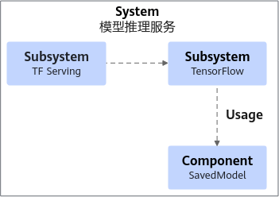

**表 1** TF Serving软件模块功能介绍<a id="TF-Serving软件模块功能介绍"></a>

<a name="table17527817415"></a>
<table><thead align="left"><tr id="row13527611645"><th class="cellrowborder" valign="top" width="23.02%" id="mcps1.2.3.1.1"><p id="p1452751848"><a name="p1452751848"></a><a name="p1452751848"></a>模块名称</p>
</th>
<th class="cellrowborder" valign="top" width="76.98%" id="mcps1.2.3.1.2"><p id="p3527312418"><a name="p3527312418"></a><a name="p3527312418"></a>描述</p>
</th>
</tr>
</thead>
<tbody><tr id="row9527411342"><td class="cellrowborder" valign="top" width="23.02%" headers="mcps1.2.3.1.1 "><p id="p652710118414"><a name="p652710118414"></a><a name="p652710118414"></a>TF Serving</p>
</td>
<td class="cellrowborder" valign="top" width="76.98%" headers="mcps1.2.3.1.2 "><p id="p12527316419"><a name="p12527316419"></a><a name="p12527316419"></a>专为TensorFlow模型部署设计的高性能推理服务端。</p>
</td>
</tr>
<tr id="row552715117416"><td class="cellrowborder" valign="top" width="23.02%" headers="mcps1.2.3.1.1 "><p id="p652710113419"><a name="p652710113419"></a><a name="p652710113419"></a>TensorFlow</p>
</td>
<td class="cellrowborder" valign="top" width="76.98%" headers="mcps1.2.3.1.2 "><p id="p3527201147"><a name="p3527201147"></a><a name="p3527201147"></a>开源的机器学习框架，主要用于深度学习模型的训练和推理。</p>
</td>
</tr>
<tr id="row1552751643"><td class="cellrowborder" valign="top" width="23.02%" headers="mcps1.2.3.1.1 "><p id="p175272111416"><a name="p175272111416"></a><a name="p175272111416"></a>SavedModel</p>
</td>
<td class="cellrowborder" valign="top" width="76.98%" headers="mcps1.2.3.1.2 "><p id="p185271018417"><a name="p185271018417"></a><a name="p185271018417"></a>TensorFlow提供的一种标准化的模型保存格式，训练好的模型能够在不同的TensorFlow环境中进行导入、推理和再训练。</p>
</td>
</tr>
</tbody>
</table>

### 应用场景

TensorFlow Serving线程调度优化特性对不同推理场景提供了灵活有效的选项。

- 对于高并发粗排模型推理场景优化效果明显，表现在吞吐量的提升和推理时延大幅下降。
- 对于并发不高且时延敏感的场景，合理配置线程管理参数也能达到优化效果。

### 原理描述

首先介绍TF Serving推理时使用的线程池，以更好理解本特性的工作原理，从而根据实际场景决定特性的开关和设置。

**图 12** TF Serving线程池运行视图<a name="fig158087456394"></a><a id="TF Serving线程池运行视图"></a>

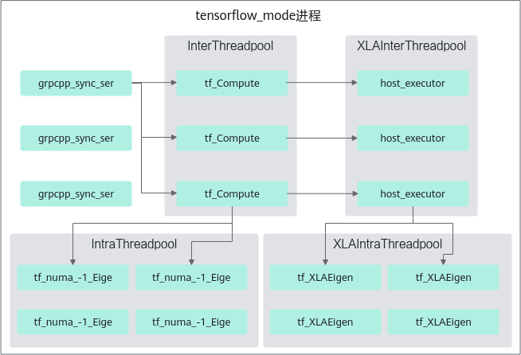

TF Serving用于推理的线程大致分为两类：通信线程和计算线程。

通信线程：

- grpcpp\_sync\_ser线程，处理客户端推理请求，包含请求解析、启动推理、请求返回等任务。

计算线程：

- tf\_Compute线程，处理算子间的并行计算任务。
- tf\_numa\_-1\_Eige线程，处理算子内部的并行计算任务。

当开启XLA特性时，将创建用于XLA计算的线程：

- host\_executor线程，处理XLA算子间的并行计算任务。
- tf\_XLAEigen线程，处理XLA算子内部的并行计算任务。

整体推理请求流程如[**图 13** 推理请求处理流程图](#推理请求处理流程图)所示。

**图 13** 推理请求处理流程图<a name="fig1746025495015"></a><a id="推理请求处理流程图"></a>

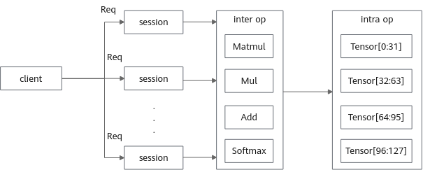

客户端发送推理请求到grpcpp\_sync\_ser线程解析，然后启动Session执行推理，tf\_Compute/host\_executor线程并行执行不同的算子，tf\_numa\_-1\_Eige/tf\_XLAEigen线程执行算子内部的并发计算。

鲲鹏BoostKit改进了算子调度算法，采用算子批量调度，改进后，整体推理流程如[**图 14** 优化后推理流程图](#优化后推理流程图)所示。

**图 14** 优化后推理流程图<a name="fig1321324116542"></a><a id="优化后推理流程图"></a>

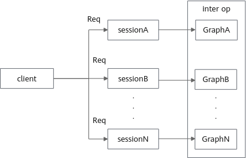

客户端发送推理请求到grpcpp\_sync\_ser线程解析，并启动Session执行推理，算子按顺序在tf\_Compute线程串行执行计算，取消了算子内部的并发计算。

改进后，减少了Session间推理任务的互相干扰，使得单个Session能够以更低的时延完成推理，并增强了TF Serving的并发性能。同时注意到通信线程和计算线程处理的是不同类型的任务，可以设置线程亲和性进行隔离，也能获得一定的性能收益。

线程调度特性支持的功能：

- 算子批量调度，通过--batch\_op\_scheduling配置，提升高并发场景下的吞吐量。
- 优化XLA线程池管理，与算子批量调度功能同步使能，将XLA算子调度到当前线程，减少线程上下文切换开销。
- 支持线程亲和性隔离，通过--task\_affinity\_isolation配置，可以将通信线程和计算线程绑定在不同的CPU核心上。

功能配置的详细说明请参见《<a href="./quick_start.md">快速入门</a>》。

## 修订记录

| 发布日期 | 修订记录 |
| ---- | ---- |
| 2026-09-30 | 第三次正式发布。 <ul><li>新增KDNN SparseMatmul多线程优化特性介绍内容。</li><li>新增kembedding算子库EmbeddingTableLookup算子特性介绍内容。</li></ul> |
| 2026-06-30 | 第二次正式发布。 <ul><li>TensorFlow ANNC图编译优化特性增加常量折叠优化特性介绍内容。</li><li>新增TensorFlow ANNC静态图融合特性，增加对应特性介绍，软件架构等内容。</li></ul> |
| 2026-03-30 | 第一次正式发布。 <ul><li>新增TensorFlow KDNN线程直通特性，增加对应特性介绍，软件架构等内容。</li></ul>|
