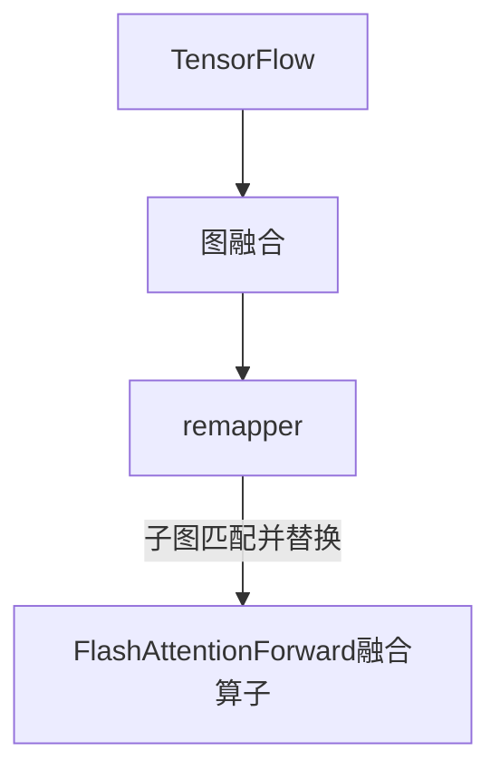
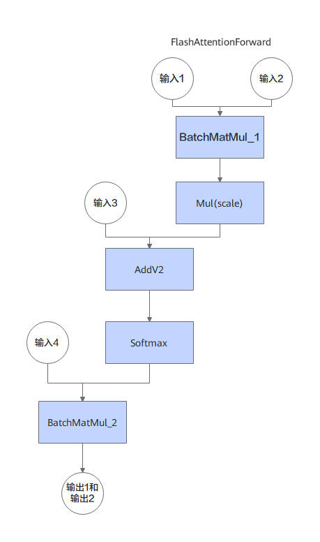
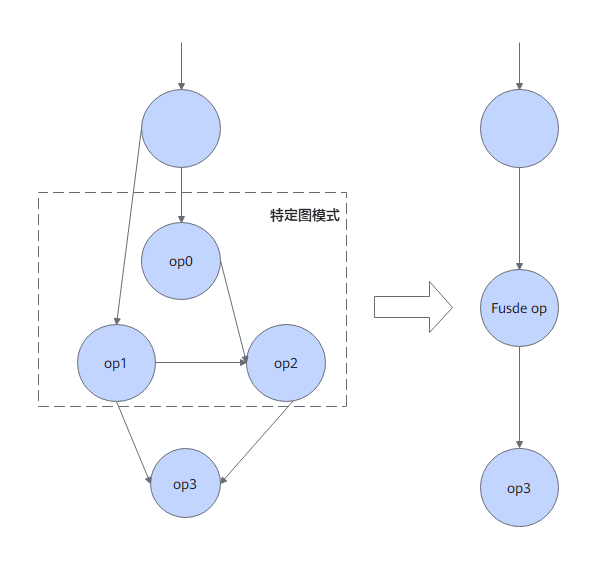

# 特性介绍

## TensorFlow FAGO静态图融合

### 简介

本章节介绍了TensorFlow FAGO静态图融合优化特性的基本概念和实现原理。

为提升TensorFlow推理性能，鲲鹏BoostKit提出了TensorFlow FAGO静态图融合优化方案。鲲鹏BoostKit提供了FlashAttentionForword自定义算子，在图优化阶段利用remapper机制将符合特定特征的计算子图替换为自定义算子。静态图融合通过消除中间内存开销、优化访存逻辑等，实现端到端的性能提升。

FAGO静态图融合特性开关通过代码补丁的方式接入TensorFlow，基于TensorFlow 2.20版本增加。
开启FAGO静态图融合特性条件下，如果计算图子图符合特定结构并且输入输出满足约束，会在图优化阶段将符合要求的子图替换为对应的自定义算子。

### 软件架构

FAGO静态图融合软件架构图如[图1](#fig1)所示。

**图 1**  ANNC静态图融合软件架构图

### 支持自定义算子规格及使用约束

本节介绍当前已经支持自定义算子及使用约束。

#### FlashAttentionForward算子

**原生子图结构**

**输入输出约束**

| 输入名称 | 数据类型    | 形状    |
| -------- | ----------- | ------- |
| 输入1    | float       | 3维张量 |
| 输入2    | float       | 3维张量 |
| 输入3    | float       | 3维张量 |
| 输入4    | float       | 2维张量 |

| 输出名称 | 数据类型 | 形状    |
| -------- | -------- | ------- |
| 输出1    | float    | 3维张量 |
| 输出2    | float    | 2维张量 |

>  **说明：**
> 开启FlashAttentionForward算子融合条件下，如果存在符合要求的子图则会在图优化阶段替换为对应的自定义算子，否则使用TensorFlow原生接口。

### 应用场景

TensorFlow FAGO静态图融合主要在高并发推理场景中使用，表现在推理时延大幅下降。

### 原理描述

本节针对FAGO静态图融合优化特性进行描述，以帮助用户更好地使用。

使能FAGO静态图融合后，会在图优化阶段将符合要求的子图替换为对应的自定义算子，进而减少中间内存开销、优化访存逻辑等，实现端到端的性能提升。

**图 2**  算子融合原理图

## 修订记录

| 发布日期 | 修订记录 |
| ---- | ---- |
| 2026-09-30 | 第一次正式发布。 <ul><li>新增TensorFlow FAGO静态图融合特性，增加对应特性介绍，软件架构等内容。</li></ul>|
